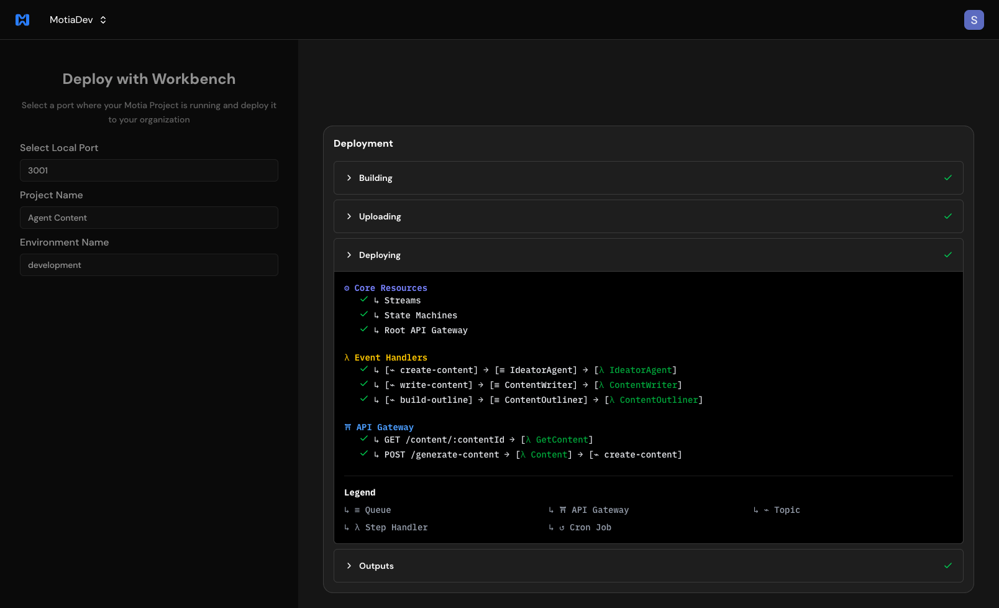
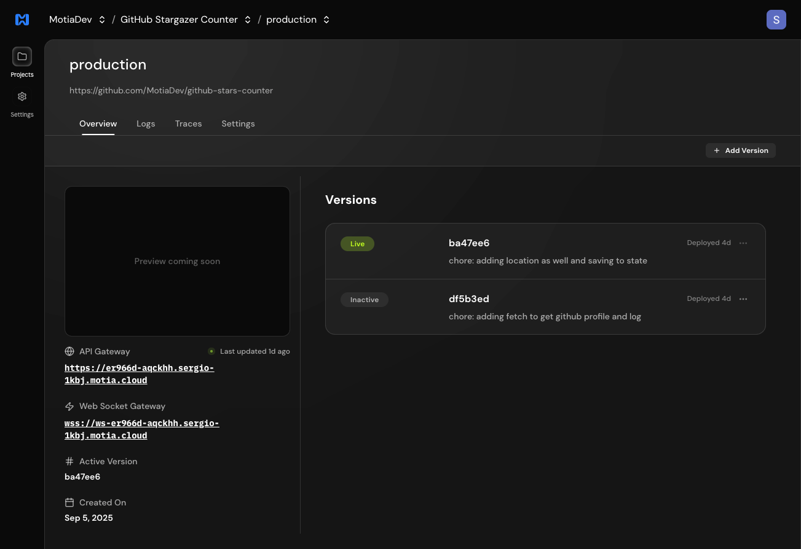
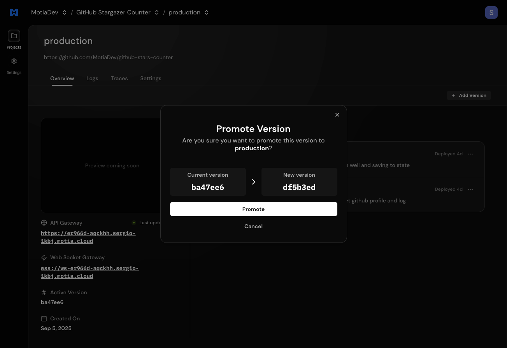
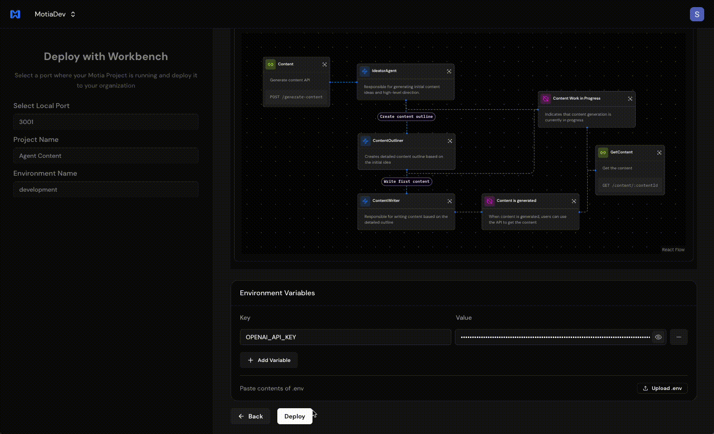
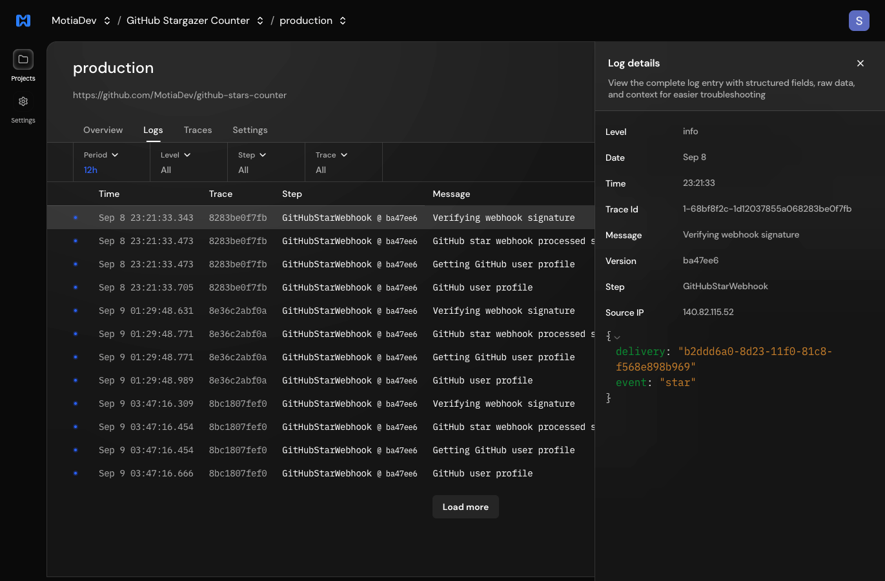
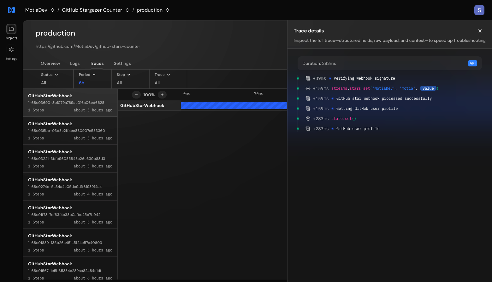
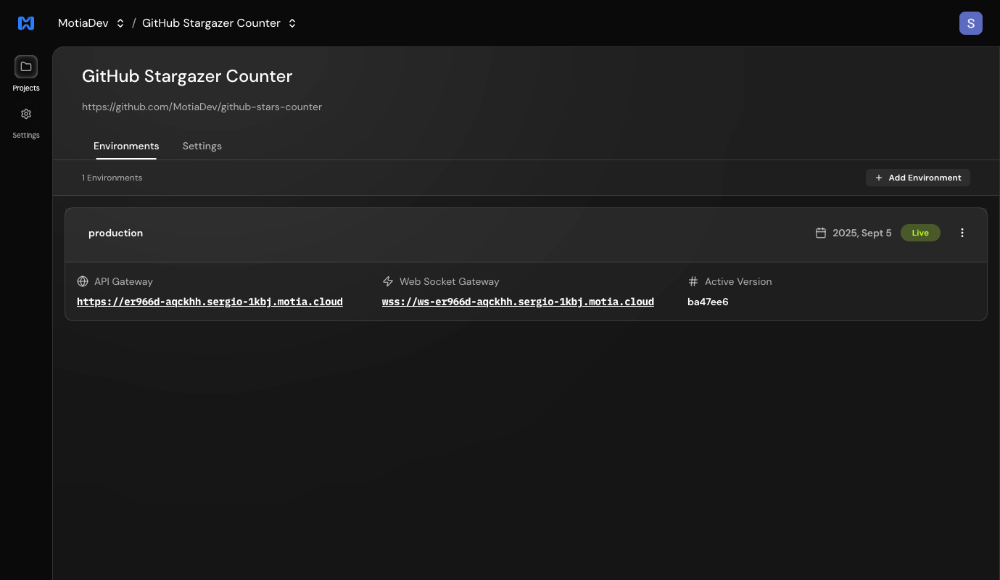

Motia Cloud is the easiest way to deploy your Motia Project to a live environment.
Quickly deploy your project to a live environment with one click. Then confidently
roll up updates, roll back to a previous stable version, and scale your project with ease.
Manage multiple environments, visualize logs and traces, and keep your project running smoothly.

## Real-time deployment status updates

You can see the deployment status in real-time in the Motia Cloud web interface

## Deployment history

All recent deployments on your project are available in Motia Cloud UI. You can browse them
and promote them to be live in the environment.

## Zero downtime deployments

Every deployment is an atomic deployment, this means that Motia Cloud creates a new infrastructure
with all the Message Queues system isolatedly for each deployment. 

### Why is this important?

- No downtime deployments
- Avoid backwards compatibility issues on message queues: Example, you can change a topic data structure
  without worrying about breaking messages that are flowing during the deployment.

## Instant rollbacks and roll up updates

With one button you can rollback to a previous deployment. This allows you to be confident
on deployments, if anything fails, quickly rollback to a previous stable version.

## One-click deployment

Deploy your project from workbench to a live environment with one click.

## Observability

Have the same experience you have with Workbench locally in cloud. Such as:

- Logs visualization
- Tracing tool

### Logs visualization

You can see the logs of your project in the Motia Cloud web interface.

### Tracing tool

Tracing tool to quickly visualize the flow of requests through the system.

## Multiple environments support

Motia Cloud supports creating multiple environments for your projects.

## Scalability

- Horizontal scaling individually for each step
- Retry mechanisms for event steps built-in (3 retries by default)

## Learn how to deploy

Learn how to deploy your project to Motia Cloud in the [Deployment](/docs/concepts/deployment/motia-cloud/deployment) page.