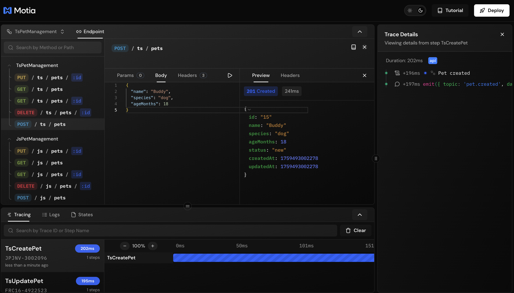

Motia is a backend framework built around a single core primitive: **everything is a Step**.

Want an API? That's a Step.  
Need a background job? That's a Step.  
Scheduled task? Also a Step.

Write each Step in whatever language makes sense - TypeScript, Python, or JavaScript. They all run together, share the same state, and talk through events.

## How It Works

Every Step is just a file with two parts:

**1. Config** → When and how it runs  
**2. Handler** → What it does

<Tabs items={['TypeScript', 'Python', 'JavaScript']}>
<Tab value='TypeScript'>

```typescript title="steps/my-step.step.ts"
import { ApiRouteConfig, Handlers } from 'motia'

// Config - when it runs
export const config: ApiRouteConfig = {
  name: 'MyStep',
  type: 'api',
  path: '/endpoint',
  method: 'POST',
  emits: ['task.done']
}

// Handler - what it does
export const handler: Handlers['MyStep'] = async (req, { emit, logger }) => {
  logger.info('Processing request')
  
  await emit({
    topic: 'task.done',
    data: { result: 'success' }
  })
  
  return { status: 200, body: { success: true } }
}
```

</Tab>
<Tab value='Python'>

```python title="steps/my_step.py"
# Config - when it runs
config = {
    "name": "MyStep",
    "type": "api",
    "path": "/endpoint",
    "method": "POST",
    "emits": ["task.done"]
}

# Handler - what it does
async def handler(req, context):
    context.logger.info("Processing request")
    
    await context.emit({
        "topic": "task.done",
        "data": {"result": "success"}
    })
    
    return {"status": 200, "body": {"success": True}}
```

</Tab>
<Tab value='JavaScript'>

```javascript title="steps/my-step.step.js"
// Config - when it runs
const config = {
  name: 'MyStep',
  type: 'api',
  path: '/endpoint',
  method: 'POST',
  emits: ['task.done']
}

// Handler - what it does
const handler = async (req, { emit, logger }) => {
  logger.info('Processing request')
  
  await emit({
    topic: 'task.done',
    data: { result: 'success' }
  })
  
  return { status: 200, body: { success: true } }
}

module.exports = { config, handler }
```

</Tab>
</Tabs>

👉 Drop this file in your `steps/` folder and Motia finds it automatically. No registration, no imports, no setup.

[Learn more about Steps →](/docs/concepts/steps)

---

## Event-Driven Architecture

Steps don't call each other. They **emit** and **subscribe** to events.

This means:
- Your API can trigger a background job without waiting for it
- Steps run independently and retry on failure
- You can add new Steps without touching existing ones
- Everything is traceable from start to finish

**Example:** An API emits an event, a background Step picks it up:

```typescript
// API Step emits
await emit({ topic: 'user.created', data: { email } })

// Event Step subscribes and processes
config = {
  type: 'event',
  subscribes: ['user.created']
}
```

That's it. No coupling, no dependencies.

---

## Project Structure & Auto-Discovery

Motia automatically discovers Steps - no manual registration required.

### Basic Structure

<Files>
<Folder name="my-project" defaultOpen>
  <Folder name="steps" defaultOpen>
    <Folder name="api">
      <File name="create-user.step.ts" />
      <File name="get-user.step.ts" />
    </Folder>
    <Folder name="events">
      <File name="send-email.step.ts" />
      <File name="process-data_step.py" />
    </Folder>
    <Folder name="cron">
      <File name="daily-report.step.ts" />
    </Folder>
    <Folder name="streams">
      <File name="notifications.stream.ts" />
    </Folder>
  </Folder>
  <File name="config.yml" />
  <File name=".env" />
  <File name="package.json" />
  <File name="requirements.txt" />
  <File name="tsconfig.json" />
</Folder>
</Files>

<Callout type="info">
The `steps/` directory is the heart of your Motia application. All your workflow logic lives here, and Motia automatically discovers any file following the naming pattern.
</Callout>

### Auto-Discovery Rules

Motia scans the `steps/` directory and automatically registers files that:

1. ✅ **Match naming pattern:**
   - TypeScript: `.step.ts`
   - JavaScript: `.step.js`
   - Python: `_step.py` (note: underscore before `step`)

2. ✅ **Export a `config` object** with Step configuration

3. ✅ **Export a `handler` function** with business logic

**No imports. No registration. Just create the file and Motia finds it.**

---

## Multi-Language Support

Every Step can be in a different language. They all run in the same process and share everything.

**Currently Supported:**
- **TypeScript** → `.step.ts`
- **Python** → `_step.py`
- **JavaScript** → `.step.js`

**Coming Soon:**
- Ruby → `.step.rb`
- C# → `.step.cs`
- Go → `.step.go`
- And many more...

**Example project:**

<Files>
<Folder name="my-app" defaultOpen>
  <Folder name="steps" defaultOpen>
    <File name="api-endpoint.step.ts" />
    <File name="ml-inference_step.py" />
    <File name="send-email.step.js" />
  </Folder>
</Folder>
</Files>

All three Steps work together. TypeScript API emits an event → Python processes with ML → JavaScript sends the result.

---

## Core Concepts

### State Management
Persistent key-value storage that works across all Steps and languages.

```typescript
await state.set('users', 'user-123', { name: 'John' })
const user = await state.get('users', 'user-123')
```

[Learn about State →](/docs/development-guide/state-management)

### Real-Time Streams
Push live updates to connected clients (browsers, mobile apps).

```typescript
await streams.notifications.set('user-123', 'notif-1', {
  message: 'Order shipped!',
  timestamp: new Date().toISOString()
})
```

Clients receive updates instantly.

[Learn about Streams →](/docs/development-guide/streams)

### Context Object
Every handler gets a context object with everything you need:

| Property | What It Does |
|----------|--------------|
| `logger` | Structured logging |
| `emit` | Trigger other Steps |
| `state` | Persistent storage |
| `streams` | Real-time updates |
| `traceId` | Request tracing |

---

## Development Tool - Workbench



Visual interface for testing APIs, building and debugging flows:

- See your entire flow as a beautiful diagram
- Test API endpoints in the browser
- Watch logs in real-time
- Inspect state as it changes

[Learn about Workbench →](/docs/concepts/workbench)

---

## What's Next?

<Cards>
  <Card href="/docs/concepts/steps" title="📦 Steps">
    Deep dive into Steps - the only primitive you need
  </Card>
  
  <Card href="/docs/getting-started/quick-start" title="🚀 Quick Start">
    Build your first app in 5 minutes
  </Card>
</Cards>