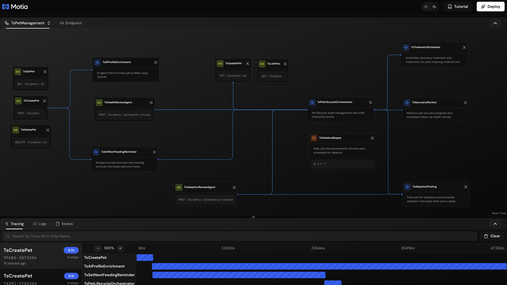
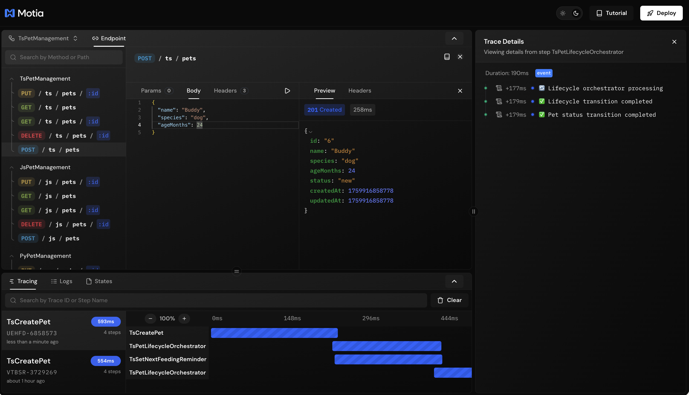
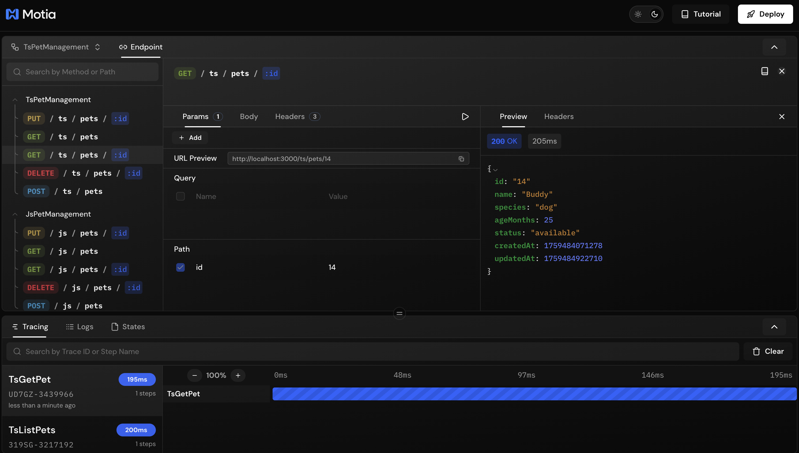
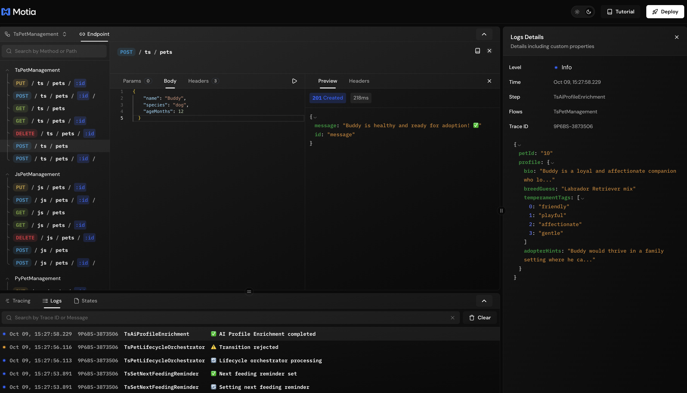
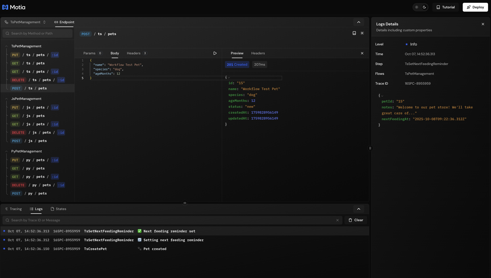
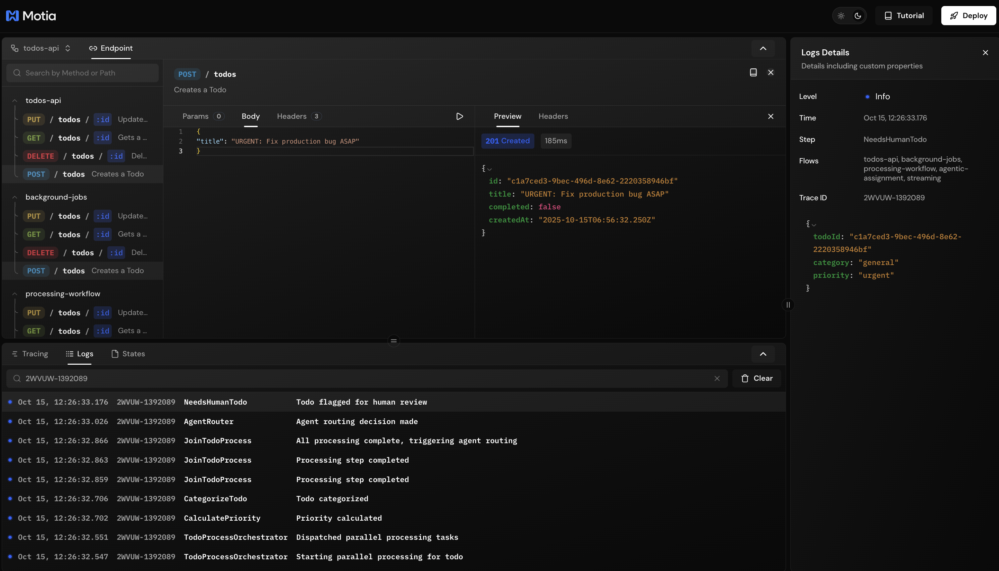
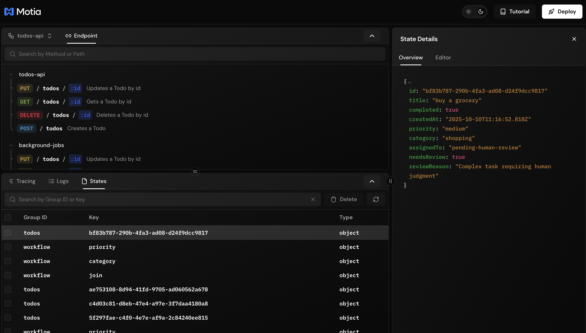
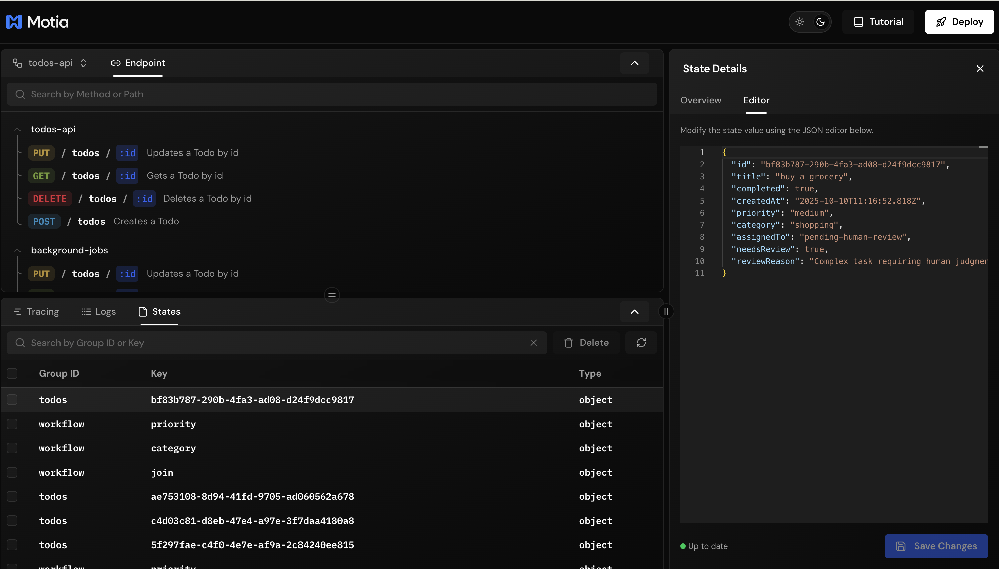

Workbench is where you'll spend most of your time building with Motia. Think of it as your mission control: you can see your entire backend as a visual diagram, test APIs instantly, watch logs stream in real-time, and trace exactly what happens during each request.


---

## Getting Started

Fire up the Workbench:

<Tabs items={['npm', 'yarn', 'pnpm', 'bun']}>
  <Tab value="pnpm">
  ```bash
  pnpm run dev
  ```
  </Tab>
  <Tab value="yarn">
  ```bash
  yarn dev
  ```
  </Tab>
  <Tab value="npm">
  ```bash
  npm run dev
  ```
  </Tab>
  <Tab value="bun">
  ```bash
  bun run dev
  ```
  </Tab>
</Tabs>

This starts two things:
- Your backend server (with all your Steps running)
- The Workbench interface at `http://localhost:3000`

Changes to your Steps reload automatically. No restart needed.

---

## Two Views: Flows & Endpoints

### Flow View – See Your Backend as a Diagram

The flow view shows your entire backend as an interactive graph. Every Step becomes a node, and the connections between them show how data flows through your system.



**What you see:**
- **API endpoints** (green nodes with a link icon) - entry points to your backend
- **Event Steps** (blue nodes) - background jobs that run when events are emitted
- **Cron Steps** (orange nodes) - scheduled tasks that run on a timer
- **Connections** (dotted lines) - show which Steps trigger which other Steps

Hover over any node to see what it does. Click the settings icon to jump to that Step's code.

This view is perfect for understanding how your backend works at a glance, or for showing your flow to teammates.

**Want to customize how your Steps look?** You can create custom UI components for any Step. Add icons, change colors, or build completely custom node designs. Perfect for making flows more intuitive or sharing with non-technical teammates.

👉 [Learn about Steps →](/docs/concepts/steps) • [Customize your flow visualization →](/docs/development-guide/customizing-flows)

---

### Endpoint View – Test Your APIs

Switch to the Endpoint view to test your API endpoints without leaving the browser. No Postman, no curl. Just point, click, and send.



**Left sidebar:** All your API endpoints, organized by language. If you have Steps in TypeScript, JavaScript, and Python, they'll be grouped automatically (like `TsPetManagement`, `JsPetManagement`, `PyPetManagement`). Search by method or path.

**Center panel:** Your testing interface with three tabs:

- **Params** - Fill in path params (like `:id`) and query params. You get a live URL preview too.
- **Body** - Write your JSON request body with syntax highlighting
- **Headers** - Add custom headers if you need them

Hit the play button and you'll instantly see:
- Status code (200, 201, 404, etc.)
- Response time
- Full response body



**Params tab** makes it easy to fill in path parameters. If your endpoint is `GET /pets/:id`, you'll see an input for `id`. Fill it in, and the URL preview updates automatically.

#### Testing Streaming Endpoints

When you test an endpoint that uses streams, the response panel updates in real-time as data arrives. Perfect for testing AI agents, progress updates, or any real-time data flow.



You'll see each chunk of data appear as it's streamed from your backend. The Logs Details panel on the right shows the full context of what was streamed.

👉 [Learn more about Streams →](/docs/development-guide/streams)

---

## Debug Panel – Tracing, Logs & State

At the bottom of the screen, you'll find three tabs that help you understand what's happening inside your backend.

### Tracing – See Execution Timeline


Every request gets a unique trace ID. The tracing panel shows you a visual timeline of every Step that ran, how long each one took, and in what order they executed.

**What you see:**
- Each Step as a horizontal bar
- How long it took (in milliseconds)
- When it started relative to the request
- The full execution chain from start to finish

Click any trace to see the full details in the right panel, including which events were emitted and which Steps they triggered.

This is a lifesaver when debugging workflows. You can instantly see if a Step is slow, or if something isn't triggering when it should.

👉 [Learn more about Observability →](/docs/development-guide/observability)

---

### Logs – Real-Time Feed



The Logs tab shows every `logger.info()`, `logger.warn()`, and `logger.error()` call from your Steps, in real-time.

**Features:**
- **Timestamped** - know exactly when each log happened
- **Step name** - see which Step produced each log
- **Contextual** - click any log to see the full details (step name, trace ID, custom properties)



**Filtering logs:** Type a trace ID in the search box to see only logs from that specific request. This is incredibly useful when debugging a workflow. You can follow the entire execution path of a single request through all your Steps.

The right panel shows detailed information about the selected log, including custom properties you've passed to `logger.info()`.

👉 [Learn more about Observability →](/docs/development-guide/observability)

---

### States – Inspect & Edit Data

The States tab shows you everything stored with `state.set()`. This is your window into the persistent data your workflows are using.



**What you see:**
- **Group ID** - typically the trace ID or workflow identifier
- **Key** - the state key name
- **Type** - data type (object, string, number, etc.)

**Search and filter:** Use the search bar to find specific state keys or group IDs. When you have hundreds of state entries, this makes finding what you need instant.

Click any state entry to see its full value in the right panel.

#### State Details Panel


The **Overview** tab shows the full JSON value of the state entry with syntax highlighting. Perfect for quickly inspecting what data is stored.



The **Editor** tab lets you modify state values directly in the Workbench. Edit the JSON, hit **Save Changes**, and your update is persisted immediately. This is super handy for:
- Testing how your workflow behaves with different data
- Fixing corrupted state during development
- Manually updating values without writing code

You can also **Delete** state entries using the button in the toolbar.

👉 [Learn more about State Management →](/docs/development-guide/state-management)

---

## Trace Details Panel

When you click a trace or a log, a panel slides in from the right showing the full context:


- **Duration** - how long the entire request took
- **Step-by-step breakdown** - every Step that ran, with timestamps and status indicators
- **Events emitted** - see exactly which events were triggered and when

This panel is your go-to for understanding "what happened during this request?"

---

## Header

At the top of the Workbench:

- **Theme toggle** (sun/moon icon) - switch between light and dark mode
- **Tutorial** - opens the interactive tutorial (if your project has one)
- **Deploy** - quick link to deploy your app to Motia Cloud

---

## Hot Reload

Change a Step file, hit save, and the Workbench refreshes automatically. No need to restart the server or reload the page. This makes for an incredibly fast feedback loop.

---

## Customizing Your Flow Visualization

The default Step visualization is great for developers, but sometimes you want something more polished. Maybe you're:
- Sharing flows with product managers who don't need to see code
- Building a demo and want branded, beautiful diagrams
- Creating visual documentation for your team

You can override how any Step looks by creating a `.tsx` or `.jsx` file next to your Step file. Use built-in components like `EventNode`, `ApiNode`, and `CronNode`, or build completely custom React components from scratch.

**What you can do:**
- Add custom icons and images to Steps
- Change colors and styling to match your brand
- Display additional context right in the node
- Create NOOP Steps to represent external systems or manual processes
- Hide code complexity and show clean, intuitive cards

👉 [Full guide to customizing flows →](/docs/development-guide/customizing-flows)

## Remember

Workbench isn't just a UI. It's a development tool designed to make building backends faster and less painful. Use it to:

- **Visualize** your flows to understand how your backend fits together
- **Test** APIs without switching to another tool
- **Debug** with tracing and logs to see exactly what's happening
- **Iterate** quickly with hot reload

---

## What's Next?

👉 [Build your first app →](/docs/getting-started/build-your-first-motia-app)  
👉 [Learn about State →](/docs/development-guide/state-management)  
👉 [Learn about Streams →](/docs/development-guide/streams)
