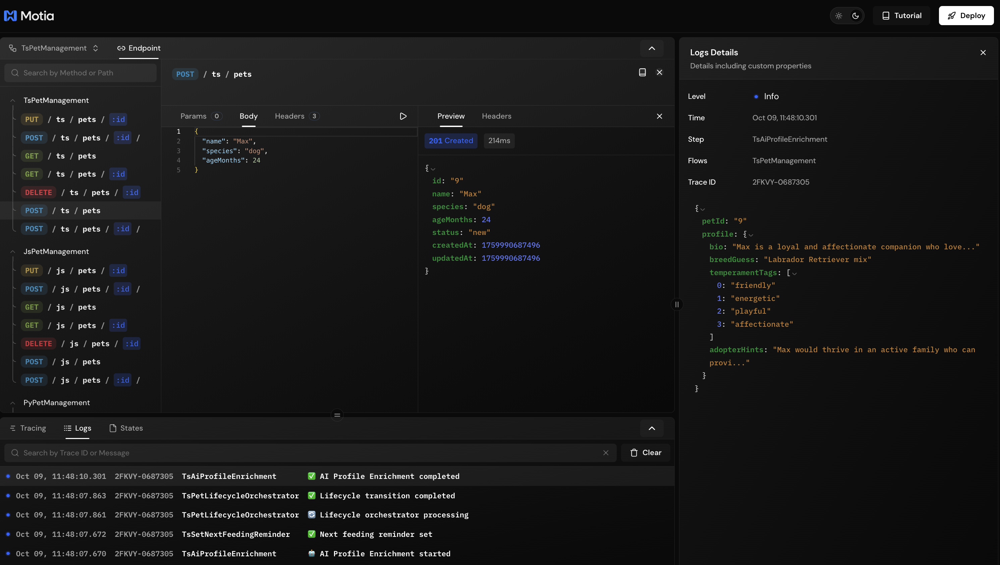

Your app is running. But what's actually happening inside?
- Is that API getting hit?
- Did the event emit?
- Why did that Step fail?
- Which user triggered this flow?

Motia gives you everything you need to answer these questions.

---

## Logging

Every Step has a `logger` in the context. Use it to see what's happening.

### Log Levels

| Level | When to use it |
| ----- | -------------- |
| `info` | Normal stuff - "User created", "Order processed" |
| `warn` | Something's weird but not broken - "High API usage", "Slow response" |
| `error` | Things broke - Failed API calls, exceptions, crashes |
| `debug` | Deep debugging - Raw data, internal state, timing info |

---

## How to Log

<Tabs items={['TypeScript', 'Python', 'JavaScript']}>
  <Tab value='TypeScript'>
    ```typescript
    export const handler: Handlers['ProcessOrder'] = async (input, { logger }) => {
      // Simple message
      logger.info('Processing order')

      // With context data
      logger.info('Order created', {
        orderId: input.id,
        total: input.total
      })

      // Errors
      try {
        await chargeCard(input.paymentMethod)
      } catch (error) {
        logger.error('Payment failed', {
          error: error.message,
          orderId: input.id
        })
      }

      // Warnings for unusual situations
      if (input.total > 1000) {
        logger.warn('Large order', {
          total: input.total,
          threshold: 1000
        })
      }

      // Debug info (only shows with --debug flag)
      logger.debug('Raw input', { input })
    }
    ```
  </Tab>
  <Tab value='Python'>
    ```python
    async def handler(input, context):
        # Simple message
        context.logger.info('Processing order')

        # With context data
        context.logger.info('Order created', {
            'order_id': input.get("id"),
            'total': input.get("total")
        })

        # Errors
        try:
            await charge_card(input.get("payment_method"))
        except Exception as error:
            context.logger.error('Payment failed', {
                'error': str(error),
                'order_id': input.get("id")
            })

        # Warnings for unusual situations
        if input.get("total", 0) > 1000:
            context.logger.warn('Large order', {
                'total': input.get("total"),
                'threshold': 1000
            })

        # Debug info (only shows with --debug flag)
        context.logger.debug('Raw input', {'input': input})
    ```
  </Tab>
  <Tab value='JavaScript'>
    ```javascript
    const handler = async (input, { logger }) => {
      // Simple message
      logger.info('Processing order')

      // With context data
      logger.info('Order created', {
        orderId: input.id,
        total: input.total
      })

      // Errors
      try {
        await chargeCard(input.paymentMethod)
      } catch (error) {
        logger.error('Payment failed', {
          error: error.message,
          orderId: input.id
        })
      }

      // Warnings for unusual situations
      if (input.total > 1000) {
        logger.warn('Large order', {
          total: input.total,
          threshold: 1000
        })
      }

      // Debug info (only shows with --debug flag)
      logger.debug('Raw input', { input })
    }
    ```
  </Tab>
</Tabs>

👉 Always add context data to your logs. `{ orderId: '123' }` is way more useful than just a message.

---

## Where to See Logs

Start your app:

```bash
npm run dev
```

Logs appear in **two places**:

### 1. Your Terminal

See logs right where you ran `npm run dev`:

```
[INFO] Processing order { orderId: '123', total: 99.99 }
[INFO] Order created { orderId: '123' }
[INFO] Payment successful
```

### 2. Workbench

Open [http://localhost:3000](http://localhost:3000) and click on your flow. Logs show up in real-time with:
- Timestamps
- Which Step logged it
- The trace ID (to follow a request through the entire flow)
- Full context data



---

## Tracing

Every request gets a unique `traceId`. This lets you follow a single request through your entire flow.

```typescript
export const handler: Handlers['CreateOrder'] = async (req, { logger, traceId }) => {
  logger.info('Order started', { traceId })
  
  // traceId stays the same across all Steps in this flow
  await emit({ 
    topic: 'process.payment', 
    data: { orderId: '123' } 
  })
  
  return { status: 200, body: { traceId } }
}
```

**In Workbench:**
- Click any log entry
- See all logs with the same `traceId`
- Follow the request from start to finish

---

## Debug Mode

Want more detailed logs?

```bash
npm run dev -- --debug
```

This enables `debug` level logs. You'll see everything - raw inputs, internal state, timing info.

**In production:** Don't use debug mode (it's slow and logs everything).

---

## Tips for Better Logs

### Use Objects, Not Strings

**Good:**
```typescript
logger.info('Payment processed', {
  paymentId: '123',
  amount: 100,
  status: 'success'
})
```

**Bad:**
```typescript
logger.info(`Payment 123 processed: amount=100`)
```

Why? Objects are searchable, filterable, and easier to parse.

### Track Performance

```typescript
export const handler: Handlers['ProcessOrder'] = async (input, { logger }) => {
  const start = performance.now()

  await processOrder(input)

  logger.info('Order processed', {
    duration: performance.now() - start,
    orderId: input.id
  })
}
```

### Log Errors Properly

```typescript
try {
  await riskyOperation()
} catch (error) {
  logger.error('Operation failed', {
    error: error.message,
    stack: error.stack,
    input: input.id  // Don't log sensitive data!
  })
  throw error  // Re-throw so Motia can retry
}
```

---

## Debugging Workflows

**Problem:** Something's not working, but where?

**Steps to debug:**

1. **Check terminal logs** - See which Steps ran
2. **Open Workbench** at [http://localhost:3000](http://localhost:3000)
3. **Click your flow** - See the visual diagram
4. **Expand logs panel** - See all logs in chronological order
5. **Click a log** - Filter by that `traceId` to follow the request
6. **Check each Step** - See where it failed

### Common Issues

**API not responding?**
- Check if the Step ran: Look for logs with your Step's name
- Check the response: Look for `status: 200` in logs

**Event not firing?**
- Check if `emit()` was called: Search logs for "emit"
- Check the topic name: Make sure it matches `subscribes: ['topic']`

**Step not running?**
- Check if it's discovered: Look for `[CREATED] Step` in startup logs
- Check the file name: Must contain `.step.` or `_step`

---

## Remember

- **Log everything important** - But not everything (no sensitive data!)
- **Use `traceId`** - Follow requests through your entire flow
- **Check Workbench** - Visual debugging is easier
- **Use objects** - Don't log strings, log objects
- **Debug mode** - Only for development, never in production

---
