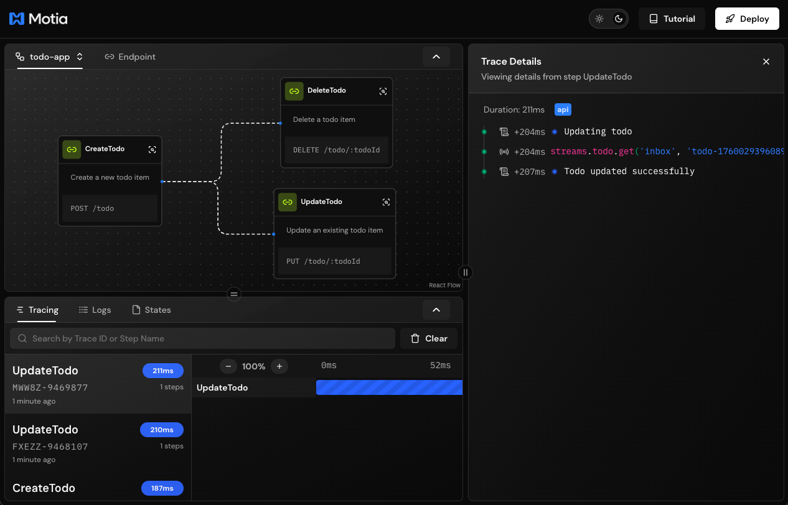
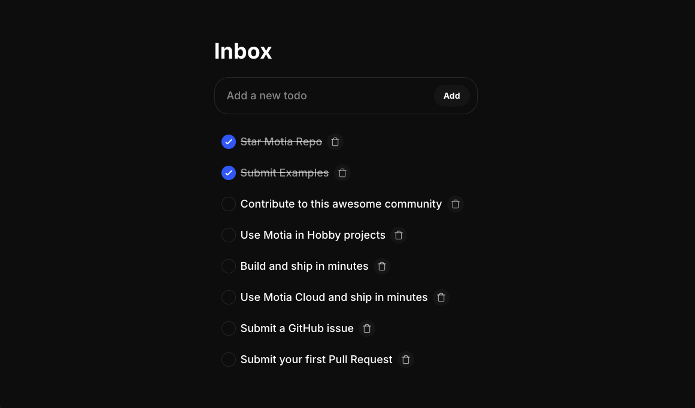

## Why Streams?

Building modern apps means dealing with long-running tasks - AI responses that stream in word by word, file processing that takes time, or chat messages that need to appear instantly.

Without Streams, you'd need to:
- Build polling logic on the frontend
- Set up WebSocket infrastructure manually
- Manage connection states and reconnection
- Handle data synchronization yourself

With Motia Streams, you get all of this out of the box. Just define what data you want to stream, and Motia handles the rest.

## Some Use Cases for Streams

- **AI/LLM responses** → Stream ChatGPT responses as they generate
- **Chat applications** → Real-time messaging and typing indicators
- **Long processes** → Video processing, data exports, batch operations
- **Live dashboards** → Real-time metrics and notifications
- **Collaborative tools** → Real-time updates across multiple users

---

## Creating a Stream

Streams are just files. Create a `.stream.ts` file in your `steps/` folder and export a config.

<Tabs items={['TypeScript', 'Python', 'JavaScript']}>
<Tab value='TypeScript'>

```typescript title="steps/chat-messages.stream.ts"
import { StreamConfig } from 'motia'
import { z } from 'zod'

export const config: StreamConfig = {
  name: 'chatMessage',
  schema: z.object({
    id: z.string(),
    userId: z.string(),
    message: z.string(),
    timestamp: z.string()
  }),
  baseConfig: {
    storageType: 'default'
  }
}
```

</Tab>
<Tab value='Python'>

```python title="steps/chat_messages_stream.py"
from pydantic import BaseModel

class ChatMessage(BaseModel):
    id: str
    user_id: str
    message: str
    timestamp: str

config = {
    "name": "chatMessage",
    "schema": ChatMessage.model_json_schema(),
    "baseConfig": {"storageType": "default"}
}
```

</Tab>
<Tab value='JavaScript'>

```javascript title="steps/chat-messages.stream.js"
const config = {
  name: 'chatMessage',
  schema: {
    type: 'object',
    properties: {
      id: { type: 'string' },
      userId: { type: 'string' },
      message: { type: 'string' },
      timestamp: { type: 'string' }
    },
    required: ['id', 'userId', 'message', 'timestamp']
  },
  baseConfig: {
    storageType: 'default'
  }
}

module.exports = { config }
```

</Tab>
</Tabs>

👉 That's it. Motia auto-discovers the stream and makes it available as `context.streams.chatMessage` in all your handlers.

---

## Using Streams in Steps

Once you've defined a stream, you can use it in any Step through `context.streams`.

### Stream Methods

Every stream has these methods:

| Method | What it does |
|--------|-------------|
| `set(groupId, id, data)` | Create or update an item |
| `get(groupId, id)` | Get a single item |
| `delete(groupId, id)` | Remove an item |
| `getGroup(groupId)` | Get all items in a group |
| `send(channel, event)` | Send ephemeral events (typing, reactions, etc.) |

**Think of it like this:**
- `groupId` = Which room/conversation/user
- `id` = Which specific item in that room
- `data` = The actual data matching your schema

---

## Real Example: Todo App with Real-Time Sync

Let's build a todo app where all connected clients see updates instantly.

<Callout type="info">
  This is a real, working example from the [Motia Examples Repository](https://github.com/MotiaDev/motia-examples/tree/main/examples/realtime-todo-app). You can clone it and run it locally!
</Callout>

**Step 1:** Create the stream definition

```typescript title="steps/todo.stream.ts"
import { StreamConfig } from 'motia'
import { z } from 'zod'

const todoSchema = z.object({
  id: z.string(),
  description: z.string(),
  createdAt: z.string(),
  dueDate: z.string().optional(),
  completedAt: z.string().optional()
})

export const config: StreamConfig = {
  name: 'todo',
  schema: todoSchema,
  baseConfig: { storageType: 'default' }
}

export type Todo = z.infer<typeof todoSchema>
```

**Step 2:** Create an API endpoint that uses streams

```typescript title="steps/create-todo.step.ts"
import { ApiRouteConfig, Handlers } from 'motia'
import { z } from 'zod'
import { Todo } from './todo.stream'

export const config: ApiRouteConfig = {
  type: 'api',
  name: 'CreateTodo',
  method: 'POST',
  path: '/todo',
  bodySchema: z.object({
    description: z.string(),
    dueDate: z.string().optional()
  }),
  responseSchema: {
    200: z.object({
      id: z.string(),
      description: z.string(),
      createdAt: z.string(),
      dueDate: z.string().optional(),
      completedAt: z.string().optional()
    }),
    400: z.object({ error: z.string() })
  },
  emits: []
}

export const handler: Handlers['CreateTodo'] = async (req, { logger, streams }) => {
  logger.info('Creating new todo', { body: req.body })

  const { description, dueDate } = req.body
  const todoId = `todo-${Date.now()}-${Math.random().toString(36).substring(2, 9)}`

  if (!description) {
    return { status: 400, body: { error: 'Description is required' } }
  }

  const newTodo: Todo = {
    id: todoId,
    description,
    createdAt: new Date().toISOString(),
    dueDate,
    completedAt: undefined
  }

  // Store in the 'inbox' group - all clients watching this group see the update!
  const todo = await streams.todo.set('inbox', todoId, newTodo)

  logger.info('Todo created successfully', { todoId })

  return { status: 200, body: todo }
}
```

**What happens here:**
1. Client calls `POST /todo` with a description
2. Server creates the todo and calls `streams.todo.set('inbox', todoId, newTodo)`
3. **Instantly**, all clients subscribed to the `inbox` group receive the new todo
4. No polling, no refresh needed

👉 Every time you call `streams.todo.set()`, connected clients receive the update instantly. No polling needed.

---

## Testing Streams in Workbench

Testing real-time features can be tricky. Workbench makes it easy.

**How to test:**

1. Make sure your API Step returns the stream object:

```typescript
return { status: 200, body: todo } // result from streams.todo.set()
```

2. Open [http://localhost:3000/endpoints](http://localhost:3000/endpoints)
3. Watch the stream update in real-time



👉 Workbench automatically detects stream responses and subscribes to them for you.

---

## Using Streams in Your Frontend

Once you have streams working on the backend, connect them to your React app.

### Install

```bash
npm install @motiadev/stream-client-react
```

### Setup Provider

Wrap your app with the provider:

```tsx title="App.tsx"
import { MotiaStreamProvider } from '@motiadev/stream-client-react'

function App() {
  return (
    <MotiaStreamProvider address="ws://localhost:3000">
      {/* Your app */}
    </MotiaStreamProvider>
  )
}
```

### Subscribe to Stream Updates

```tsx title="App.tsx"
import { useStreamGroup } from '@motiadev/stream-client-react'
import { useTodoEndpoints, type Todo } from './hook/useTodoEndpoints'

function App() {
  const { createTodo, updateTodo, deleteTodo } = useTodoEndpoints()
  
  // Subscribe to all todos in the 'inbox' group
  const { data: todos } = useStreamGroup<Todo>({ 
    groupId: 'inbox', 
    streamName: 'todo' 
  })

  const handleAddTodo = async (description: string) => {
    await createTodo(description)
    // No need to manually update UI - stream does it automatically!
  }

  return (
    <div>
      <h1>Inbox</h1>
      {todos.map((todo) => (
        <div key={todo.id}>{todo.description}</div>
      ))}
    </div>
  )
}
```

**How it works:**
1. `useStreamGroup()` subscribes to all items in the `inbox` group
2. When server calls `streams.todo.set('inbox', todoId, newTodo)`, the `todos` array updates automatically
3. React re-renders with the new data
4. Works across all connected clients!



👉 Every time you call `createTodo()`, connected clients receive the update instantly. No polling needed.

---

## Ephemeral Events

Sometimes you need to send temporary events that don't need to be stored - like typing indicators, reactions, or online status.

Use `streams.<name>.send()` for this:

<Tabs items={['TypeScript', 'Python', 'JavaScript']}>
<Tab value='TypeScript'>

```typescript
// Send typing indicator
await streams.chatMessage.send(
  { groupId: channelId }, // No id = broadcasts to all subscribers in group
  { type: 'typing', data: { userId: 'user-123', isTyping: true } }
)

// Send reaction to specific message
await streams.chatMessage.send(
  { groupId: channelId, id: messageId }, // With id = only subscribers to this item get it
  { type: 'reaction', data: { emoji: '👍', userId: 'user-123' } }
)
```

</Tab>
<Tab value='Python'>

```python
# Send typing indicator
await context.streams.chatMessage.send(
    {"groupId": channel_id},  # No id = broadcasts to all subscribers in group
    {"type": "typing", "data": {"userId": "user-123", "isTyping": True}}
)

# Send reaction to specific message
await context.streams.chatMessage.send(
    {"groupId": channel_id, "id": message_id},  # With id = only subscribers to this item get it
    {"type": "reaction", "data": {"emoji": "👍", "userId": "user-123"}}
)
```

</Tab>
<Tab value='JavaScript'>

```javascript
// Send typing indicator
await streams.chatMessage.send(
  { groupId: channelId }, // No id = broadcasts to all subscribers in group
  { type: 'typing', data: { userId: 'user-123', isTyping: true } }
)

// Send reaction to specific message
await streams.chatMessage.send(
  { groupId: channelId, id: messageId }, // With id = only subscribers to this item get it
  { type: 'reaction', data: { emoji: '👍', userId: 'user-123' } }
)
```

</Tab>
</Tabs>

**Difference from `set()`:**
- `set()` → Stores data, clients sync to it
- `send()` → Fire-and-forget events, not stored

---

## Remember

- **Streams = Real-time state** that clients subscribe to
- **Every `set()` call** pushes updates to connected clients instantly
- **Use `send()`** for temporary events like typing indicators
- **Test in Workbench** before building your frontend
- **No polling needed** - WebSocket connection handles everything

---

## What's Next?

<Cards>
  <Card href="/docs/development-guide/state-management" title="📦 State Management">
    Learn about persistent storage across Steps
  </Card>
  
  <Card href="/docs/concepts/steps" title="🔄 Steps">
    Deep dive into building with Steps
  </Card>
</Cards>