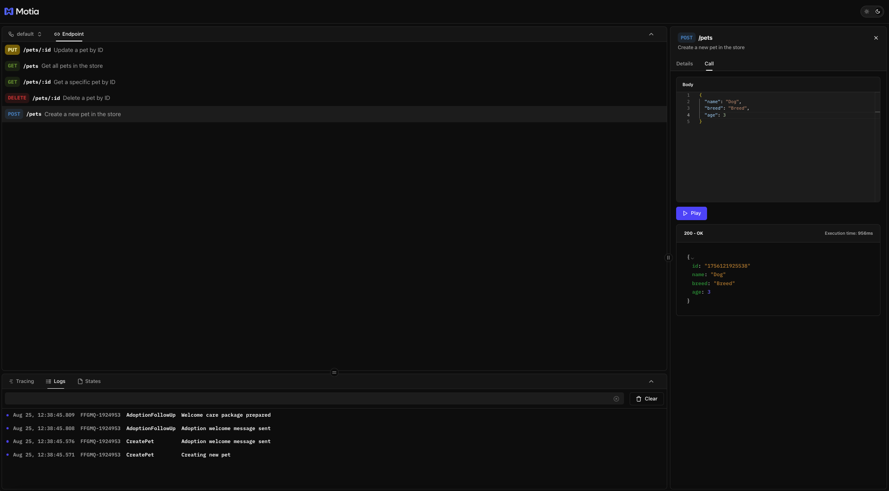
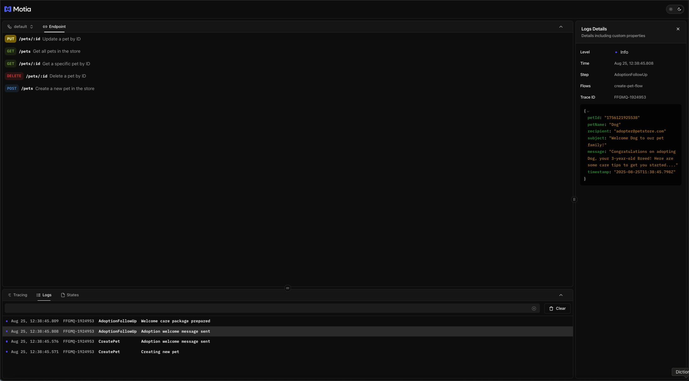
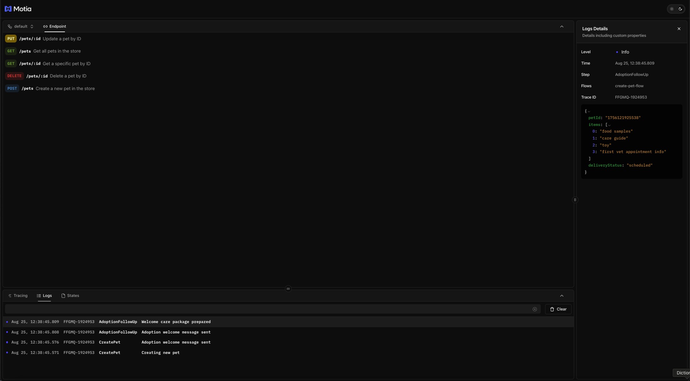
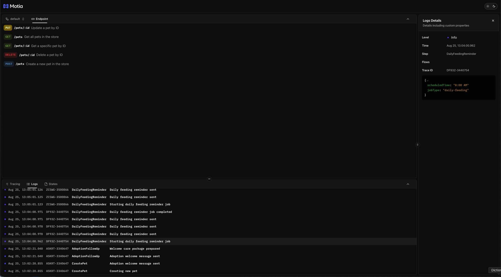
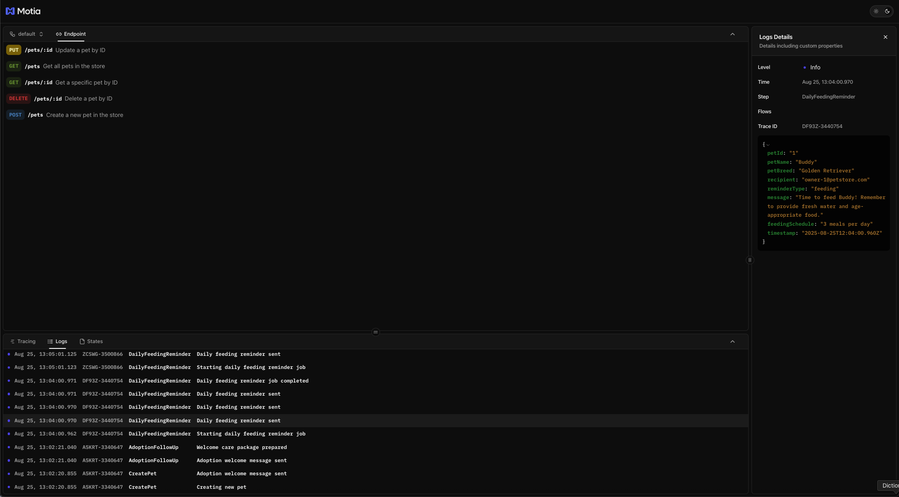
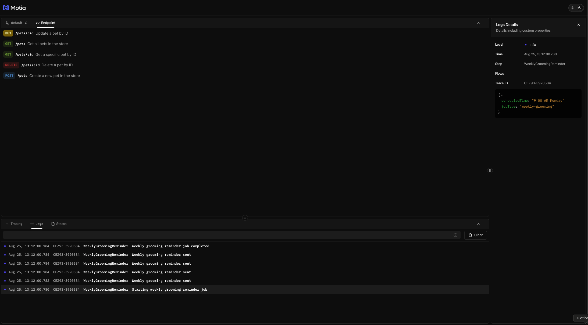
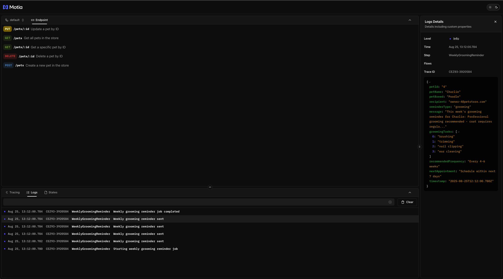
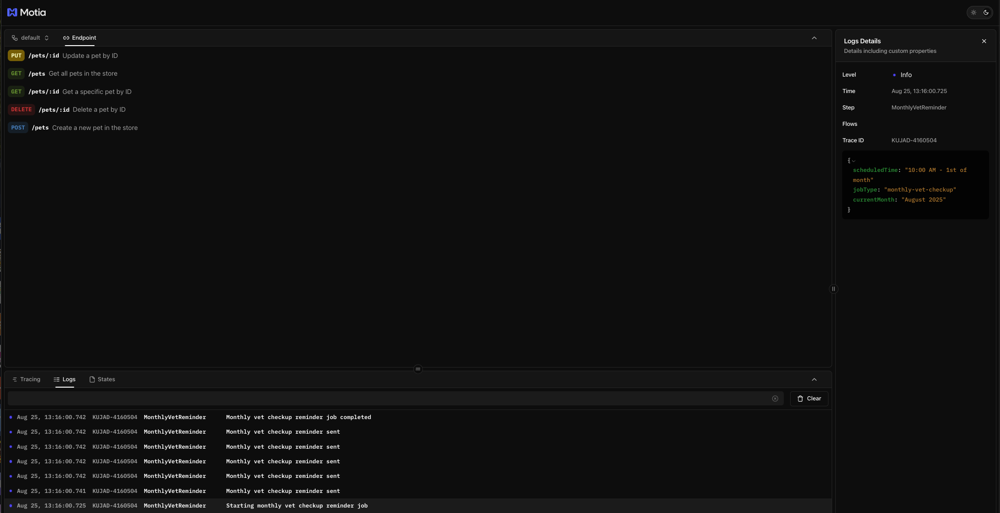
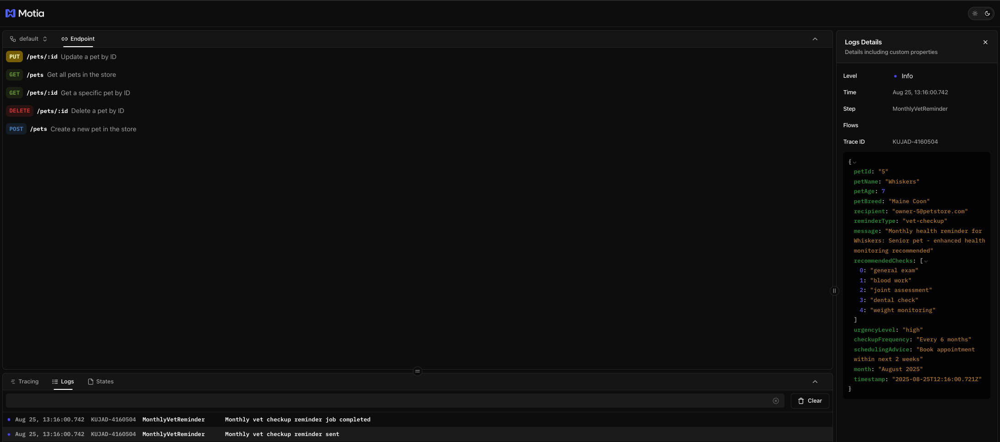

In our previous tutorial, you built a complete REST API for managing pets with full CRUD operations. When users create pets through your API, the system responds immediately. But what about ongoing pet care? Real pet stores need to send feeding reminders, schedule grooming, and track vet checkups.

Now we'll extend your pet store API to handle these ongoing tasks automatically using background jobs. You'll learn how to trigger tasks when pets are created and schedule recurring reminders, all without blocking your API responses or requiring external services.

## Background Job Concepts You'll Use

Before we start building, let's cover the key concepts for adding background jobs to your pet store API:

- **Event Step** – A step that listens for specific events (like "pet-created") and processes tasks asynchronously when those events occur.
- **Cron Step** – A step that runs on a schedule (daily, weekly, monthly) to handle recurring tasks like sending reminders.
- **Event Emission** – How your API steps trigger background jobs by emitting events after completing their main task.
- **Job Scheduling** – Using cron expressions to define when scheduled jobs should run (e.g., every day at 8 AM).
- **Simulated Notifications** – Logging structured messages that represent real-world notifications without external dependencies.

## Background Job Architecture

Your pet store will use two types of background jobs working together:

| Job Type | Trigger | Purpose | Motia Step Type |
|----------|---------|---------|-----------------|
| **Adoption Follow-up** | When pet is created via API | Send immediate welcome message to new pet owner | Event Step |
| **Daily Feeding Reminders** | Every day at 8 AM | Remind owners to feed their pets | Cron Step |
| **Weekly Grooming Notifications** | Every Monday at 9 AM | Remind owners about grooming appointments | Cron Step |
| **Monthly Vet Checkups** | First day of month at 10 AM | Alert owners about veterinary checkups | Cron Step |

### The Flow

When someone creates a pet through your REST API:

1. **API responds immediately** with the created pet data
2. **Event gets emitted** with the new pet information
3. **Adoption follow-up job runs** and logs a welcome message
4. **Scheduled jobs continue running** independently to send ongoing care reminders

This architecture keeps your API fast while ensuring pets get proper ongoing care through automated reminders.

## Step 1: Add Event Emission to Your Pet API

First, we need to modify your existing `POST /pets` endpoint from Tutorial 1 to emit events when pets are created. This will trigger the background jobs.

Open your existing **`steps/create-pet.step.ts`** file and update it:

<Tabs items={['TS', 'JS', 'Python']}>
  <Tab value="TS">
    ```typescript
    import { ApiRouteConfig, Handlers } from 'motia'
    import { z } from 'zod'

    export const config: ApiRouteConfig = {
      type: 'api',
      name: 'CreatePet',
      description: 'Create a new pet in the store',
      method: 'POST',
      path: '/pets',
      
      bodySchema: z.object({
        name: z.string(),
        breed: z.string(),
        age: z.number(),
      }),

      responseSchema: {
        200: z.object({
          id: z.string(),
          name: z.string(),
          breed: z.string(),
          age: z.number(),
        }),
      },
      // Add this line to emit events
      emits: ['pet-created'],
    }

    export const handler: Handlers['CreatePet'] = async (req, { logger, emit }) => {
      logger.info('Creating new pet', { body: req.body })

      const newPet = {
        id: Date.now().toString(),
        ...req.body,
      }

      logger.info("Adoption welcome message sent", {
        petName: "Buddy",
        message: "Welcome to our pet store! Here are care instructions for Buddy.",
        recipient: "adopter@example.com", // fake email
      });

      // Emit event to trigger background jobs
      await emit({
        topic: 'pet-created',
        data: newPet,
      })

      return {
        status: 200,
        body: newPet,
      }
    }
    ```
  </Tab>
  <Tab value="JS">
    ```javascript
    const { z } = require('zod')

    exports.config = {
      type: 'api',
      name: 'CreatePet',
      description: 'Create a new pet in the store',
      method: 'POST',
      path: '/pets',
      
      bodySchema: z.object({
        name: z.string(),
        breed: z.string(),
        age: z.number(),
      }),

      responseSchema: {
        200: z.object({
          id: z.string(),
          name: z.string(),
          breed: z.string(),
          age: z.number(),
        }),
      },

      // Add this line to emit events
      emits: ['pet-created'],
    }

    exports.handler = async (req, { logger, emit }) => {
      logger.info('Creating new pet', { body: req.body })

      const newPet = {
        id: Date.now().toString(),
        ...req.body,
      }

      // Emit event to trigger background jobs
      await emit({
        topic: 'pet-created',
        data: newPet,
      })

      return {
        status: 200,
        body: newPet,
      }
    }
    ```
  </Tab>
  <Tab value="Python">
    ```python
    from pydantic import BaseModel
    import time

    class PetRequest(BaseModel):
        name: str
        breed: str
        age: int

    class PetResponse(BaseModel):
        id: str
        name: str
        breed: str
        age: int

    config = {
        'type': 'api',
        'name': 'CreatePet',
        'description': 'Create a new pet in the store',
        'method': 'POST',
        'path': '/pets',
        'bodySchema': PetRequest.model_json_schema(),
        'responseSchema': {
            '200': PetResponse.model_json_schema()
        },
        # Add this line to emit events
        'emits': ['pet-created']
    }

    async def handler(req, context):
        context.logger.info('Creating new pet', {'body': req.get('body')})
        
        new_pet = {
            'id': str(int(time.time() * 1000)),
            **req.get('body')
        }

        context.logger.info("Adoption welcome message sent", {
            'petName': 'Buddy',
            'message': 'Welcome to our pet store! Here are care instructions for Buddy.',
            'recipient': 'adopter@example.com'  # fake email
        })
        
        # Emit event to trigger background jobs
        await context.emit({
            'topic': 'pet-created',
            'data': new_pet
        })
        
        return {
            'status': 200,
            'body': new_pet
        }
    ```
  </Tab>
</Tabs>

The key changes are:
- Added `emits: ['pet-created']` to the configuration
- Added `emit` to the handler parameters  
- Added `await emit()` call after creating the pet

Now when you create a pet, your API will emit a `pet-created` event that background jobs can listen for.



## Step 2: Create the Adoption Follow-up Background Job

Now let's create an event step that listens for the `pet-created` event and sends a welcome message to the new pet owner.

Create a new file for the adoption follow-up job:

**File:** `steps/adoption-followup.step.ts`

<Tabs items={['TS', 'JS', 'Python']}>
  <Tab value="TS">
    ```typescript
    import { EventConfig, Handlers } from 'motia'

    export const config: EventConfig = {
      type: 'event',
      name: 'AdoptionFollowUp',
      description: 'Send welcome message when a pet is created',
      subscribes: ['pet-created'],
    }

    export const handler: Handlers['AdoptionFollowUp'] = async (input, { logger }) => {
      const { id, name, breed, age } = input

      logger.info('Adoption welcome message sent', {
        petId: id,
        petName: name,
        recipient: 'adopter@petstore.com',
        subject: `Welcome ${name} to our pet family!`,
        message: `Congratulations on adopting ${name}, your ${age}-year-old ${breed}! Here are some care tips to get you started...`,
        timestamp: new Date().toISOString()
      })

      logger.info('Welcome care package prepared', {
        petId: id,
        items: ['food samples', 'care guide', 'toy', 'first vet appointment info'],
        deliveryStatus: 'scheduled'
      })
    }
    ```
  </Tab>
  <Tab value="JS">
    ```javascript
    exports.config = {
      type: 'event',
      name: 'AdoptionFollowUp',
      description: 'Send welcome message when a pet is created',
      subscribes: ['pet-created'],
    }

    exports.handler = async (input, { logger }) => {
      const { id, name, breed, age } = input

      logger.info('Adoption welcome message sent', {
        petId: id,
        petName: name,
        recipient: 'adopter@petstore.com',
        subject: `Welcome ${name} to our pet family!`,
        message: `Congratulations on adopting ${name}, your ${age}-year-old ${breed}! Here are some care tips to get you started...`,
        timestamp: new Date().toISOString()
      })

      logger.info('Welcome care package prepared', {
        petId: id,
        items: ['food samples', 'care guide', 'toy', 'first vet appointment info'],
        deliveryStatus: 'scheduled'
      })
    }
    ```
  </Tab>
  <Tab value="Python">
    ```python
    from datetime import datetime

    config = {
        'type': 'event',
        'name': 'AdoptionFollowUp',
        'description': 'Send welcome message when a pet is created',
        'subscribes': ['pet-created']
    }

    async def handler(input_data, context):
        pet_id = input_data.get('id')
        name = input_data.get('name')
        breed = input_data.get('breed')
        age = input_data.get('age')

        context.logger.info('Adoption welcome message sent', {
            'petId': pet_id,
            'petName': name,
            'recipient': 'adopter@petstore.com',
            'subject': f'Welcome {name} to our pet family!',
            'message': f'Congratulations on adopting {name}, your {age}-year-old {breed}! Here are some care tips to get you started...',
            'timestamp': datetime.now().isoformat()
        })

        context.logger.info('Welcome care package prepared', {
            'petId': pet_id,
            'items': ['food samples', 'care guide', 'toy', 'first vet appointment info'],
            'deliveryStatus': 'scheduled'
        })
    ```
  </Tab>
</Tabs>

This event step demonstrates how background jobs work:
- **Subscribes to `pet-created`** - Automatically runs when the API emits this event
- **Processes immediately** - Runs as soon as a pet is created
- **Simulates real tasks** - Logs welcome message and care package preparation
- **No external dependencies** - Uses only Motia's built-in logging

When you create a pet via the API, you'll see these welcome messages appear in your logs automatically.

Adoption Followup Message


Welcome Care Package



## Step 3: Create Daily Feeding Reminders

Now let's create a cron step that runs every day to remind pet owners about feeding their pets.

Create a new file for the daily feeding reminders:

**File:** `steps/daily-feeding-reminder.step.ts`

<Tabs items={['TS', 'JS', 'Python']}>
  <Tab value="TS">
    ```typescript
    import { CronConfig, Handlers } from 'motia'

    export const config: CronConfig = {
      type: 'cron',
      name: 'DailyFeedingReminder',
      description: 'Send daily feeding reminders for all pets',
      cron: '* * * * *', // Every day at 8:00 AM
    }

    export const handler: Handlers['DailyFeedingReminder'] = async ({ logger, state }) => {
      logger.info('Starting daily feeding reminder job', {
        scheduledTime: '8:00 AM',
        jobType: 'daily-feeding'
      })

      // In a real app, you'd fetch pets from your database
      // For now, we'll simulate having pets in the system
      const pets = [
        { id: '1', name: 'Buddy', breed: 'Golden Retriever', age: 3 },
        { id: '2', name: 'Max', breed: 'German Shepherd', age: 5 },
        { id: '3', name: 'Luna', breed: 'Persian Cat', age: 2 }
      ]

      for (const pet of pets) {
        logger.info('Daily feeding reminder sent', {
          petId: pet.id,
          petName: pet.name,
          petBreed: pet.breed,
          recipient: `owner-${pet.id}@petstore.com`,
          reminderType: 'feeding',
          message: `Time to feed ${pet.name}! Remember to provide fresh water and age-appropriate food.`,
          feedingSchedule: pet.breed.includes('Cat') ? '2 meals per day' : '3 meals per day',
          timestamp: new Date().toISOString()
        })
      }

      logger.info('Daily feeding reminder job completed', {
        totalPets: pets.length,
        remindersApproved: pets.length
      })
    }
    ```
  </Tab>
  <Tab value="JS">
    ```javascript
    exports.config = {
      type: 'cron',
      name: 'DailyFeedingReminder',
      description: 'Send daily feeding reminders for all pets',
      cron: '0 8 * * *', // Every day at 8:00 AM
    }

    exports.handler = async ({ logger, state }) => {
      logger.info('Starting daily feeding reminder job', {
        scheduledTime: '8:00 AM',
        jobType: 'daily-feeding'
      })

      // In a real app, you'd fetch pets from your database
      const pets = [
        { id: '1', name: 'Buddy', breed: 'Golden Retriever', age: 3 },
        { id: '2', name: 'Max', breed: 'German Shepherd', age: 5 },
        { id: '3', name: 'Luna', breed: 'Persian Cat', age: 2 }
      ]

      for (const pet of pets) {
        logger.info('Daily feeding reminder sent', {
          petId: pet.id,
          petName: pet.name,
          petBreed: pet.breed,
          recipient: `owner-${pet.id}@petstore.com`,
          reminderType: 'feeding',
          message: `Time to feed ${pet.name}! Remember to provide fresh water and age-appropriate food.`,
          feedingSchedule: pet.breed.includes('Cat') ? '2 meals per day' : '3 meals per day',
          timestamp: new Date().toISOString()
        })
      }

      logger.info('Daily feeding reminder job completed', {
        totalPets: pets.length,
        remindersApproved: pets.length
      })
    }
    ```
  </Tab>
  <Tab value="Python">
    ```python
    from datetime import datetime

    config = {
        'type': 'cron',
        'name': 'DailyFeedingReminder',
        'description': 'Send daily feeding reminders for all pets',
        'cron': '0 8 * * *'  # Every day at 8:00 AM
    }

    async def handler(context):
        context.logger.info('Starting daily feeding reminder job', {
            'scheduledTime': '8:00 AM',
            'jobType': 'daily-feeding'
        })

        # In a real app, you'd fetch pets from your database
        pets = [
            {'id': '1', 'name': 'Buddy', 'breed': 'Golden Retriever', 'age': 3},
            {'id': '2', 'name': 'Max', 'breed': 'German Shepherd', 'age': 5},
            {'id': '3', 'name': 'Luna', 'breed': 'Persian Cat', 'age': 2}
        ]

        for pet in pets:
            feeding_schedule = '2 meals per day' if 'Cat' in pet['breed'] else '3 meals per day'
            
            context.logger.info('Daily feeding reminder sent', {
                'petId': pet['id'],
                'petName': pet['name'],
                'petBreed': pet['breed'],
                'recipient': f"owner-{pet['id']}@petstore.com",
                'reminderType': 'feeding',
                'message': f"Time to feed {pet['name']}! Remember to provide fresh water and age-appropriate food.",
                'feedingSchedule': feeding_schedule,
                'timestamp': datetime.now().isoformat()
            })

        context.logger.info('Daily feeding reminder job completed', {
            'totalPets': len(pets),
            'remindersApproved': len(pets)
        })
    ```
  </Tab>
</Tabs>

This cron step demonstrates scheduled job patterns:
- **Runs on schedule** - `cron: '0 8 * * *'` means every day at 8 AM
- **Processes all pets** - Loops through each pet to send reminders
- **Different feeding schedules** - Cats get 2 meals, dogs get 3 meals per day
- **Structured logging** - Each reminder is logged with detailed information

This job will run automatically every morning, ensuring all pets get their daily feeding reminders.

Daily Notification Job starting


Daily Notification Job completion



## Step 4: Create Weekly Grooming Notifications

Let's create a cron step that runs every Monday to remind pet owners about grooming appointments.

Create a new file for the weekly grooming notifications:

**File:** `steps/weekly-grooming-reminder.step.ts`

<Tabs items={['TS', 'JS', 'Python']}>
  <Tab value="TS">
    ```typescript
    import { CronConfig, Handlers } from 'motia'

    export const config: CronConfig = {
      type: 'cron',
      name: 'WeeklyGroomingReminder',
      description: 'Send weekly grooming reminders for all pets',
      cron: '0 9 * * 1', // Every Monday at 9:00 AM
    }

    export const handler: Handlers['WeeklyGroomingReminder'] = async ({ logger, state }) => {
      logger.info('Starting weekly grooming reminder job', {
        scheduledTime: '9:00 AM Monday',
        jobType: 'weekly-grooming'
      })

      // In a real app, you'd fetch pets from your database
      const pets = [
        { id: '1', name: 'Buddy', breed: 'Golden Retriever', age: 3 },
        { id: '2', name: 'Max', breed: 'German Shepherd', age: 5 },
        { id: '3', name: 'Luna', breed: 'Persian Cat', age: 2 },
        { id: '4', name: 'Charlie', breed: 'Poodle', age: 4 }
      ]

      for (const pet of pets) {
        const groomingNeeds = getGroomingNeeds(pet.breed)
        
        logger.info('Weekly grooming reminder sent', {
          petId: pet.id,
          petName: pet.name,
          petBreed: pet.breed,
          recipient: `owner-${pet.id}@petstore.com`,
          reminderType: 'grooming',
          message: `This week's grooming reminder for ${pet.name}: ${groomingNeeds.message}`,
          groomingTasks: groomingNeeds.tasks,
          recommendedFrequency: groomingNeeds.frequency,
          nextAppointment: 'Schedule within next 7 days',
          timestamp: new Date().toISOString()
        })
      }

      logger.info('Weekly grooming reminder job completed', {
        totalPets: pets.length,
        remindersApproved: pets.length
      })
    }

    function getGroomingNeeds(breed: string) {
      if (breed.includes('Poodle')) {
        return {
          message: 'Professional grooming recommended - coat requires regular trimming',
          tasks: ['brushing', 'trimming', 'nail clipping', 'ear cleaning'],
          frequency: 'Every 4-6 weeks'
        }
      } else if (breed.includes('Cat')) {
        return {
          message: 'Basic grooming maintenance needed',
          tasks: ['brushing', 'nail trimming'],
          frequency: 'Every 2 weeks'
        }
      } else {
        return {
          message: 'Regular grooming helps maintain healthy coat and skin',
          tasks: ['brushing', 'bathing', 'nail clipping'],
          frequency: 'Every 6-8 weeks'
        }
      }
    }
    ```
  </Tab>
  <Tab value="JS">
    ```javascript
    exports.config = {
      type: 'cron',
      name: 'WeeklyGroomingReminder',
      description: 'Send weekly grooming reminders for all pets',
      cron: '0 9 * * 1', // Every Monday at 9:00 AM
    }

    exports.handler = async ({ logger, state }) => {
      logger.info('Starting weekly grooming reminder job', {
        scheduledTime: '9:00 AM Monday',
        jobType: 'weekly-grooming'
      })

      const pets = [
        { id: '1', name: 'Buddy', breed: 'Golden Retriever', age: 3 },
        { id: '2', name: 'Max', breed: 'German Shepherd', age: 5 },
        { id: '3', name: 'Luna', breed: 'Persian Cat', age: 2 },
        { id: '4', name: 'Charlie', breed: 'Poodle', age: 4 }
      ]

      for (const pet of pets) {
        const groomingNeeds = getGroomingNeeds(pet.breed)
        
        logger.info('Weekly grooming reminder sent', {
          petId: pet.id,
          petName: pet.name,
          petBreed: pet.breed,
          recipient: `owner-${pet.id}@petstore.com`,
          reminderType: 'grooming',
          message: `This week's grooming reminder for ${pet.name}: ${groomingNeeds.message}`,
          groomingTasks: groomingNeeds.tasks,
          recommendedFrequency: groomingNeeds.frequency,
          nextAppointment: 'Schedule within next 7 days',
          timestamp: new Date().toISOString()
        })
      }

      logger.info('Weekly grooming reminder job completed', {
        totalPets: pets.length,
        remindersApproved: pets.length
      })
    }

    function getGroomingNeeds(breed) {
      if (breed.includes('Poodle')) {
        return {
          message: 'Professional grooming recommended - coat requires regular trimming',
          tasks: ['brushing', 'trimming', 'nail clipping', 'ear cleaning'],
          frequency: 'Every 4-6 weeks'
        }
      } else if (breed.includes('Cat')) {
        return {
          message: 'Basic grooming maintenance needed',
          tasks: ['brushing', 'nail trimming'],
          frequency: 'Every 2 weeks'
        }
      } else {
        return {
          message: 'Regular grooming helps maintain healthy coat and skin',
          tasks: ['brushing', 'bathing', 'nail clipping'],
          frequency: 'Every 6-8 weeks'
        }
      }
    }
    ```
  </Tab>
  <Tab value="Python">
    ```python
    from datetime import datetime

    config = {
        'type': 'cron',
        'name': 'WeeklyGroomingReminder',
        'description': 'Send weekly grooming reminders for all pets',
        'cron': '0 9 * * 1'  # Every Monday at 9:00 AM
    }

    async def handler(context):
        context.logger.info('Starting weekly grooming reminder job', {
            'scheduledTime': '9:00 AM Monday',
            'jobType': 'weekly-grooming'
        })

        pets = [
            {'id': '1', 'name': 'Buddy', 'breed': 'Golden Retriever', 'age': 3},
            {'id': '2', 'name': 'Max', 'breed': 'German Shepherd', 'age': 5},
            {'id': '3', 'name': 'Luna', 'breed': 'Persian Cat', 'age': 2},
            {'id': '4', 'name': 'Charlie', 'breed': 'Poodle', 'age': 4}
        ]

        for pet in pets:
            grooming_needs = get_grooming_needs(pet['breed'])
            
            context.logger.info('Weekly grooming reminder sent', {
                'petId': pet['id'],
                'petName': pet['name'],
                'petBreed': pet['breed'],
                'recipient': f"owner-{pet['id']}@petstore.com",
                'reminderType': 'grooming',
                'message': f"This week's grooming reminder for {pet['name']}: {grooming_needs['message']}",
                'groomingTasks': grooming_needs['tasks'],
                'recommendedFrequency': grooming_needs['frequency'],
                'nextAppointment': 'Schedule within next 7 days',
                'timestamp': datetime.now().isoformat()
            })

        context.logger.info('Weekly grooming reminder job completed', {
            'totalPets': len(pets),
            'remindersApproved': len(pets)
        })

    def get_grooming_needs(breed):
        if 'Poodle' in breed:
            return {
                'message': 'Professional grooming recommended - coat requires regular trimming',
                'tasks': ['brushing', 'trimming', 'nail clipping', 'ear cleaning'],
                'frequency': 'Every 4-6 weeks'
            }
        elif 'Cat' in breed:
            return {
                'message': 'Basic grooming maintenance needed',
                'tasks': ['brushing', 'nail trimming'],
                'frequency': 'Every 2 weeks'
            }
        else:
            return {
                'message': 'Regular grooming helps maintain healthy coat and skin',
                'tasks': ['brushing', 'bathing', 'nail clipping'],
                'frequency': 'Every 6-8 weeks'
            }
    ```
  </Tab>
</Tabs>

This weekly cron step shows more advanced scheduling:
- **Runs every Monday** - `cron: '0 9 * * 1'` means 9 AM on day 1 (Monday) of every week
- **Breed-specific grooming** - Different pets have different grooming needs
- **Detailed task lists** - Shows specific grooming tasks for each breed type
- **Helper function** - Demonstrates code organization within steps

This job ensures all pets get appropriate grooming reminders based on their specific needs.

Weekly Notification Job starting


Weekly Notification Job completion


## Step 5: Create Monthly Vet Checkup Alerts

Finally, let's create a cron step that runs on the first day of every month to remind pet owners about veterinary checkups.

Create a new file for the monthly vet checkup alerts:

**File:** `steps/monthly-vet-reminder.step.ts`

<Tabs items={['TS', 'JS', 'Python']}>
  <Tab value="TS">
    ```typescript
    import { CronConfig, Handlers } from 'motia'

    export const config: CronConfig = {
      type: 'cron',
      name: 'MonthlyVetReminder',
      description: 'Send monthly veterinary checkup reminders for all pets',
      cron: '0 10 1 * *', // First day of every month at 10:00 AM
    }

    export const handler: Handlers['MonthlyVetReminder'] = async ({ logger, state }) => {
      const currentMonth = new Date().toLocaleDateString('en-US', { month: 'long', year: 'numeric' })
      
      logger.info('Starting monthly vet checkup reminder job', {
        scheduledTime: '10:00 AM - 1st of month',
        jobType: 'monthly-vet-checkup',
        currentMonth
      })

      // In a real app, you'd fetch pets from your database
      const pets = [
        { id: '1', name: 'Buddy', breed: 'Golden Retriever', age: 3 },
        { id: '2', name: 'Max', breed: 'German Shepherd', age: 5 },
        { id: '3', name: 'Luna', breed: 'Persian Cat', age: 2 },
        { id: '4', name: 'Charlie', breed: 'Poodle', age: 4 },
        { id: '5', name: 'Whiskers', breed: 'Maine Coon', age: 7 }
      ]

      for (const pet of pets) {
        const vetNeeds = getVetCheckupNeeds(pet.age, pet.breed)
        
        logger.info('Monthly vet checkup reminder sent', {
          petId: pet.id,
          petName: pet.name,
          petAge: pet.age,
          petBreed: pet.breed,
          recipient: `owner-${pet.id}@petstore.com`,
          reminderType: 'vet-checkup',
          message: `Monthly health reminder for ${pet.name}: ${vetNeeds.message}`,
          recommendedChecks: vetNeeds.checks,
          urgencyLevel: vetNeeds.urgency,
          checkupFrequency: vetNeeds.frequency,
          schedulingAdvice: 'Book appointment within next 2 weeks',
          month: currentMonth,
          timestamp: new Date().toISOString()
        })
      }

      logger.info('Monthly vet checkup reminder job completed', {
        totalPets: pets.length,
        remindersApproved: pets.length,
        month: currentMonth
      })
    }

    function getVetCheckupNeeds(age: number, breed: string) {
      if (age >= 7) {
        return {
          message: 'Senior pet - enhanced health monitoring recommended',
          checks: ['general exam', 'blood work', 'joint assessment', 'dental check', 'weight monitoring'],
          urgency: 'high',
          frequency: 'Every 6 months'
        }
      } else if (age <= 1) {
        return {
          message: 'Young pet - vaccination and growth monitoring needed',
          checks: ['vaccinations', 'growth assessment', 'parasite prevention', 'nutrition counseling'],
          urgency: 'high',
          frequency: 'Every 3-4 months'
        }
      } else if (breed.includes('Cat')) {
        return {
          message: 'Adult cat - routine preventive care',
          checks: ['general exam', 'dental check', 'parasite prevention', 'weight check'],
          urgency: 'medium',
          frequency: 'Annually'
        }
      } else {
        return {
          message: 'Adult dog - standard wellness checkup',
          checks: ['general exam', 'vaccinations', 'heartworm test', 'dental assessment'],
          urgency: 'medium',
          frequency: 'Annually'
        }
      }
    }
    ```
  </Tab>
  <Tab value="JS">
    ```javascript
    exports.config = {
      type: 'cron',
      name: 'MonthlyVetReminder',
      description: 'Send monthly veterinary checkup reminders for all pets',
      cron: '0 10 1 * *', // First day of every month at 10:00 AM
    }

    exports.handler = async ({ logger, state }) => {
      const currentMonth = new Date().toLocaleDateString('en-US', { month: 'long', year: 'numeric' })
      
      logger.info('Starting monthly vet checkup reminder job', {
        scheduledTime: '10:00 AM - 1st of month',
        jobType: 'monthly-vet-checkup',
        currentMonth
      })

      const pets = [
        { id: '1', name: 'Buddy', breed: 'Golden Retriever', age: 3 },
        { id: '2', name: 'Max', breed: 'German Shepherd', age: 5 },
        { id: '3', name: 'Luna', breed: 'Persian Cat', age: 2 },
        { id: '4', name: 'Charlie', breed: 'Poodle', age: 4 },
        { id: '5', name: 'Whiskers', breed: 'Maine Coon', age: 7 }
      ]

      for (const pet of pets) {
        const vetNeeds = getVetCheckupNeeds(pet.age, pet.breed)
        
        logger.info('Monthly vet checkup reminder sent', {
          petId: pet.id,
          petName: pet.name,
          petAge: pet.age,
          petBreed: pet.breed,
          recipient: `owner-${pet.id}@petstore.com`,
          reminderType: 'vet-checkup',
          message: `Monthly health reminder for ${pet.name}: ${vetNeeds.message}`,
          recommendedChecks: vetNeeds.checks,
          urgencyLevel: vetNeeds.urgency,
          checkupFrequency: vetNeeds.frequency,
          schedulingAdvice: 'Book appointment within next 2 weeks',
          month: currentMonth,
          timestamp: new Date().toISOString()
        })
      }

      logger.info('Monthly vet checkup reminder job completed', {
        totalPets: pets.length,
        remindersApproved: pets.length,
        month: currentMonth
      })
    }

    function getVetCheckupNeeds(age, breed) {
      if (age >= 7) {
        return {
          message: 'Senior pet - enhanced health monitoring recommended',
          checks: ['general exam', 'blood work', 'joint assessment', 'dental check', 'weight monitoring'],
          urgency: 'high',
          frequency: 'Every 6 months'
        }
      } else if (age <= 1) {
        return {
          message: 'Young pet - vaccination and growth monitoring needed',
          checks: ['vaccinations', 'growth assessment', 'parasite prevention', 'nutrition counseling'],
          urgency: 'high',
          frequency: 'Every 3-4 months'
        }
      } else if (breed.includes('Cat')) {
        return {
          message: 'Adult cat - routine preventive care',
          checks: ['general exam', 'dental check', 'parasite prevention', 'weight check'],
          urgency: 'medium',
          frequency: 'Annually'
        }
      } else {
        return {
          message: 'Adult dog - standard wellness checkup',
          checks: ['general exam', 'vaccinations', 'heartworm test', 'dental assessment'],
          urgency: 'medium',
          frequency: 'Annually'
        }
      }
    }
    ```
  </Tab>
  <Tab value="Python">
    ```python
    from datetime import datetime

    config = {
        'type': 'cron',
        'name': 'MonthlyVetReminder',
        'description': 'Send monthly veterinary checkup reminders for all pets',
        'cron': '0 10 1 * *'  # First day of every month at 10:00 AM
    }

    async def handler(context):
        current_month = datetime.now().strftime('%B %Y')
        
        context.logger.info('Starting monthly vet checkup reminder job', {
            'scheduledTime': '10:00 AM - 1st of month',
            'jobType': 'monthly-vet-checkup',
            'currentMonth': current_month
        })

        pets = [
            {'id': '1', 'name': 'Buddy', 'breed': 'Golden Retriever', 'age': 3},
            {'id': '2', 'name': 'Max', 'breed': 'German Shepherd', 'age': 5},
            {'id': '3', 'name': 'Luna', 'breed': 'Persian Cat', 'age': 2},
            {'id': '4', 'name': 'Charlie', 'breed': 'Poodle', 'age': 4},
            {'id': '5', 'name': 'Whiskers', 'breed': 'Maine Coon', 'age': 7}
        ]

        for pet in pets:
            vet_needs = get_vet_checkup_needs(pet['age'], pet['breed'])
            
            context.logger.info('Monthly vet checkup reminder sent', {
                'petId': pet['id'],
                'petName': pet['name'],
                'petAge': pet['age'],
                'petBreed': pet['breed'],
                'recipient': f"owner-{pet['id']}@petstore.com",
                'reminderType': 'vet-checkup',
                'message': f"Monthly health reminder for {pet['name']}: {vet_needs['message']}",
                'recommendedChecks': vet_needs['checks'],
                'urgencyLevel': vet_needs['urgency'],
                'checkupFrequency': vet_needs['frequency'],
                'schedulingAdvice': 'Book appointment within next 2 weeks',
                'month': current_month,
                'timestamp': datetime.now().isoformat()
            })

        context.logger.info('Monthly vet checkup reminder job completed', {
            'totalPets': len(pets),
            'remindersApproved': len(pets),
            'month': current_month
        })

    def get_vet_checkup_needs(age, breed):
        if age >= 7:
            return {
                'message': 'Senior pet - enhanced health monitoring recommended',
                'checks': ['general exam', 'blood work', 'joint assessment', 'dental check', 'weight monitoring'],
                'urgency': 'high',
                'frequency': 'Every 6 months'
            }
        elif age <= 1:
            return {
                'message': 'Young pet - vaccination and growth monitoring needed',
                'checks': ['vaccinations', 'growth assessment', 'parasite prevention', 'nutrition counseling'],
                'urgency': 'high',
                'frequency': 'Every 3-4 months'
            }
        elif 'Cat' in breed:
            return {
                'message': 'Adult cat - routine preventive care',
                'checks': ['general exam', 'dental check', 'parasite prevention', 'weight check'],
                'urgency': 'medium',
                'frequency': 'Annually'
            }
        else:
            return {
                'message': 'Adult dog - standard wellness checkup',
                'checks': ['general exam', 'vaccinations', 'heartworm test', 'dental assessment'],
                'urgency': 'medium',
                'frequency': 'Annually'
            }
    ```
  </Tab>
</Tabs>

This monthly cron step demonstrates the most complex scheduling pattern:
- **Runs monthly** - `cron: '0 10 1 * *'` means 10 AM on the 1st day of every month
- **Age-based care** - Senior pets (7+) get enhanced monitoring, young pets need frequent checkups
- **Urgency levels** - Different pets have different health priorities
- **Comprehensive logging** - Includes month context and detailed health recommendations

Monthly Notification Job starting


Monthly Notification Job completion


This ensures all pets receive appropriate veterinary care based on their age and breed characteristics.
