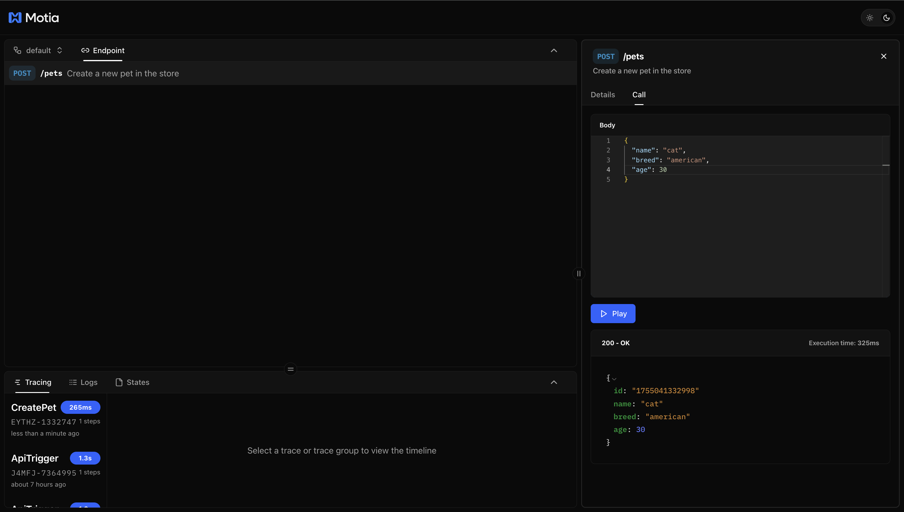
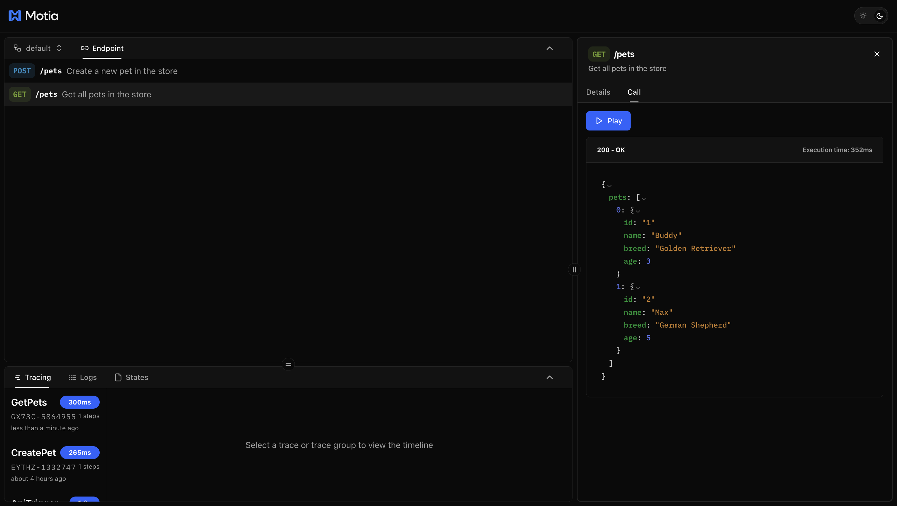
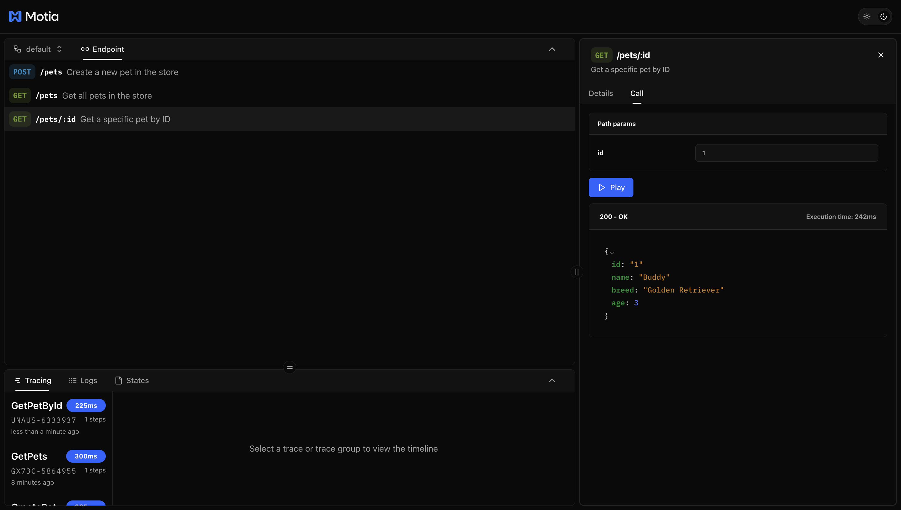
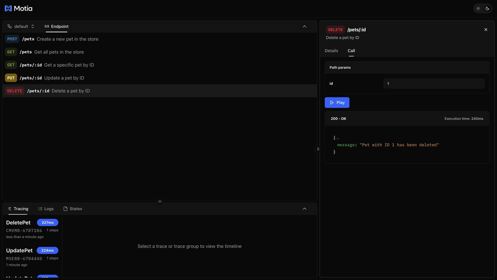

If you haven't already, follow the [Quick Start Guide](/docs/getting-started/quick-start) to create a Motia project. This tutorial assumes you have a working project with the development server running.

REST APIs are one of the fundamental foundations of most modern web architectures, especially for client-server communication. They allow clients to interact with your backend through standard HTTP methods like GET, POST, PUT, and DELETE. In Motia, creating APIs is straightforward, you define endpoints as API Steps.
This guide will walk you through building a complete REST API in Motia. You'll learn how to create HTTP endpoints, validate requests, handle responses, and implement full CRUD operations for a pet store application.

## REST API Concepts You'll Use

Before we start building, let's cover the key concepts for creating REST APIs in Motia:

- **API Step** – A file that defines an HTTP endpoint with validation schemas and request handling logic.
- **HTTP Methods** – GET (retrieve), POST (create), PUT (update), DELETE (remove) operations on resources.
- **Response Handling** – Returning proper HTTP status codes and structured JSON responses.
- **Path Parameters** – Dynamic URL segments like `/pets/:id` to identify specific resources.

## API Step Structure

Every API endpoint in Motia consists of two parts that work together:

| Component | Type | Description |
|-----------|------|-------------|
| **`ApiRouteConfig`** | `object` | Configuration object that defines the HTTP endpoint structure, including the path, method, and validation schemas. This is where you specify what your API endpoint looks like and how it validates requests. |
| **`Handlers[StepName]`** | `function` | The handler function that contains your business logic. It receives the HTTP request and returns an HTTP response with the appropriate status code and data. |

## Building a Pet Store REST API

Now that you understand the core parts of an API endpoint, let's build a complete REST API for a pet store.

We'll create a Pet Store API with full CRUD operations:
- `GET /pet` - List all pets
- `POST /pets` - Create a new pet
- `GET /pets/:id` - Get a specific pet by ID
- `PUT /pets/:id` - Update a pet's information
- `DELETE /pets/:id` - Remove a pet

This covers all the essential REST API patterns you'll use in real applications.

## Create Your First API Endpoint

Let's start by creating a simple endpoint to add new pets to our store.

### Creating the Add Pet API

We'll create a `POST /pets` endpoint that accepts pet information and stores it. This endpoint will demonstrate key REST API concepts like request validation and response handling.

Create a new file for your first endpoint:

**File:** `steps/create-pet.step.ts`

<Tabs items={['TS', 'JS', 'Python']}>
  <Tab value="TS">
    ```typescript
    import { ApiRouteConfig, Handlers } from 'motia'
    import { z } from 'zod'

    export const config: ApiRouteConfig = {
      type: 'api',
      name: 'CreatePet',
      description: 'Create a new pet in the store',
      method: 'POST',
      path: '/pets',
      
      bodySchema: z.object({
        name: z.string(),
        breed: z.string(),
        age: z.number(),
      }),

      responseSchema: {
        200: z.object({
          id: z.string(),
          name: z.string(),
          breed: z.string(),
          age: z.number(),
        }),
      },
    }

    export const handler: Handlers['CreatePet'] = async (req, { logger }) => {
      logger.info('Creating new pet', { body: req.body })

      // In a real app, you will save to a database
      const newPet = {
        id: Date.now().toString(),
        ...req.body,
      }

      return {
        status: 200,
        body: newPet,
      }
    }
    ```
  </Tab>
  <Tab value="JS">
    ```javascript
    const { z } = require('zod')

    exports.config = {
      type: 'api',
      name: 'CreatePet',
      description: 'Create a new pet in the store',
      method: 'POST',
      path: '/pets',
      
      bodySchema: z.object({
        name: z.string(),
        breed: z.string(),
        age: z.number(),
      }),

      responseSchema: {
        200: z.object({
          id: z.string(),
          name: z.string(),
          breed: z.string(),
          age: z.number(),
        }),
      },
    }

    exports.handler = async (req, { logger }) => {
      logger.info('Creating new pet', { body: req.body })

      // In a real app, you will save to a database
      const newPet = {
        id: Date.now().toString(),
        ...req.body,
      }

      return {
        status: 200,
        body: newPet,
      }
    }
    ```
  </Tab>
  <Tab value="Python">
    ```python
    from pydantic import BaseModel
    import time

    class PetRequest(BaseModel):
        name: str
        breed: str
        age: int

    class PetResponse(BaseModel):
        id: str
        name: str
        breed: str
        age: int

    config = {
        'type': 'api',
        'name': 'CreatePet',
        'description': 'Create a new pet in the store',
        'method': 'POST',
        'path': '/pets',
        'bodySchema': PetRequest.model_json_schema(),
        'responseSchema': {
            '200': PetResponse.model_json_schema()
        }
    }

    async def handler(req, context):
        context.logger.info('Creating new pet', {'body': req.get('body')})
        
        # In a real app, you will save to a database
        new_pet = {
            'id': str(int(time.time() * 1000)),
            **req.get('body')
        }
        
        return {
            'status': 200,
            'body': new_pet
        }
    ```
  </Tab>
</Tabs>

The most fundamental part of any API endpoint is defining what HTTP method it accepts and where it lives:

```typescript
method: 'POST',
path: '/pets',
```
This configuration tells Motia to create a POST endpoint at /pets. When your development server is running, users can send requests to http://localhost:3000/pets to create new pets. The POST method is the standard HTTP method for creating new resources in REST APIs.



##  Adding More CRUD Operations

Now that we have a working POST endpoint, let's build out the complete REST API with all CRUD operations. We'll add endpoints to retrieve, update, and delete pets.

### Get All Pets - `GET /pets`

Create a new file to list all pets in the store:

**File:** `steps/get-pets.step.ts`

<Tabs items={['TS', 'JS', 'Python']}>
  <Tab value="TS">
    ```typescript
    import { ApiRouteConfig, Handlers } from 'motia'
    import { z } from 'zod'

    export const config: ApiRouteConfig = {
      type: 'api',
      name: 'GetPets',
      description: 'Get all pets in the store',
      method: 'GET',
      path: '/pets',
      
      responseSchema: {
        200: z.array(z.object({
          id: z.string(),
          name: z.string(),
          breed: z.string(),
          age: z.number(),
        })),
      },
    }

    export const handler: Handlers['GetPets'] = async (req, { logger }) => {
      logger.info('Retrieving all pets')

      // In a real app, you'd fetch from a database
      const pets = [
        { id: "1", name: "Buddy", breed: "Golden Retriever", age: 3 },
        { id: "2", name: "Max", breed: "German Shepherd", age: 5 },
      ]

      return {
        status: 200,
        body: pets,
      }
    }
    ```
  </Tab>
  <Tab value="JS">
    ```javascript
    const { z } = require('zod')

    exports.config = {
      type: 'api',
      name: 'GetPets',
      description: 'Get all pets in the store',
      method: 'GET',
      path: '/pets',
      
      responseSchema: {
        200: z.array(z.object({
          id: z.string(),
          name: z.string(),
          breed: z.string(),
          age: z.number(),
        })),
      },
    }

    exports.handler = async (req, { logger }) => {
      logger.info('Retrieving all pets')

      // In a real app, you'd fetch from a database
      const pets = [
        { id: "1", name: "Buddy", breed: "Golden Retriever", age: 3 },
        { id: "2", name: "Max", breed: "German Shepherd", age: 5 },
      ]

      return {
        status: 200,
        body: pets,
      }
    }
    ```
  </Tab>
  <Tab value="Python">
    ```python
    from pydantic import BaseModel
    from typing import List

    class PetResponse(BaseModel):
        id: str
        name: str
        breed: str
        age: int

    config = {
        'type': 'api',
        'name': 'GetPets',
        'description': 'Get all pets in the store',
        'method': 'GET',
        'path': '/pets',
        'responseSchema': {
            '200': {
                'type': 'array',
                'items': PetResponse.model_json_schema()
            }
        }
    }

    async def handler(req, context):
        context.logger.info('Retrieving all pets')
        
        # In a real app, you'd fetch from a database
        pets = [
            {'id': '1', 'name': 'Buddy', 'breed': 'Golden Retriever', 'age': 3},
            {'id': '2', 'name': 'Max', 'breed': 'German Shepherd', 'age': 5},
        ]
        
        return {
            'status': 200,
            'body': pets
        }
    ```
  </Tab>
</Tabs>



### Get Pet by ID - `GET /pets/:id`

Create a new file to retrieve a specific pet:

**File:** `steps/get-pet-by-id.step.ts`

<Tabs items={['TS', 'JS', 'Python']}>
  <Tab value="TS">
    ```typescript
    import { ApiRouteConfig, Handlers } from 'motia'
    import { z } from 'zod'

    export const config: ApiRouteConfig = {
      type: 'api',
      name: 'GetPetById',
      description: 'Get a specific pet by ID',
      method: 'GET',
      path: '/pets/:id',
      
      responseSchema: {
        200: z.object({
          id: z.string(),
          name: z.string(),
          breed: z.string(),
          age: z.number(),
        }),
        404: z.object({
          error: z.string(),
        }),
      },
    }

    export const handler: Handlers['GetPetById'] = async (req, { logger }) => {
      const petId = req.pathParams.id
      logger.info('Retrieving pet by ID', { petId })

      // In a real app, you'd search your database
      const pets = [
        { id: "1", name: "Buddy", breed: "Golden Retriever", age: 3 },
        { id: "2", name: "Max", breed: "German Shepherd", age: 5 },
      ]

      const pet = pets.find(p => p.id === petId)

      if (!pet) {
        return {
          status: 404,
          body: { error: 'Pet not found' },
        }
      }

      return {
        status: 200,
        body: pet,
      }
    }
    ```
  </Tab>
  <Tab value="JS">
    ```javascript
    const { z } = require('zod')

    exports.config = {
      type: 'api',
      name: 'GetPetById',
      description: 'Get a specific pet by ID',
      method: 'GET',
      path: '/pets/:id',
      
      responseSchema: {
        200: z.object({
          id: z.string(),
          name: z.string(),
          breed: z.string(),
          age: z.number(),
        }),
        404: z.object({
          error: z.string(),
        }),
      },
    }

    exports.handler = async (req, { logger }) => {
      const petId = req.pathParams.id
      logger.info('Retrieving pet by ID', { petId })

      // In a real app, you'd search your database
      const pets = [
        { id: "1", name: "Buddy", breed: "Golden Retriever", age: 3 },
        { id: "2", name: "Max", breed: "German Shepherd", age: 5 },
      ]

      const pet = pets.find(p => p.id === petId)

      if (!pet) {
        return {
          status: 404,
          body: { error: 'Pet not found' },
        }
      }

      return {
        status: 200,
        body: pet,
      }
    }
    ```
  </Tab>
  <Tab value="Python">
    ```python
    from pydantic import BaseModel

    class PetResponse(BaseModel):
        id: str
        name: str
        breed: str
        age: int

    class ErrorResponse(BaseModel):
        error: str

    config = {
        'type': 'api',
        'name': 'GetPetById',
        'description': 'Get a specific pet by ID',
        'method': 'GET',
        'path': '/pets/:id',
        'responseSchema': {
            '200': PetResponse.model_json_schema(),
            '404': ErrorResponse.model_json_schema()
        }
    }

    async def handler(req, context):
        pet_id = req.get('pathParams', {}).get('id')
        context.logger.info('Retrieving pet by ID', {'petId': pet_id})
        
        # In a real app, you'd search your database
        pets = [
            {'id': '1', 'name': 'Buddy', 'breed': 'Golden Retriever', 'age': 3},
            {'id': '2', 'name': 'Max', 'breed': 'German Shepherd', 'age': 5},
        ]
        
        pet = next((p for p in pets if p['id'] == pet_id), None)
        
        if not pet:
            return {
                'status': 404,
                'body': {'error': 'Pet not found'}
            }
        
        return {
            'status': 200,
            'body': pet
        }
    ```
  </Tab>
</Tabs>


### Update Pet - `PUT /pets/:id`

Create a new file to update existing pets:

**File:** `steps/update-pet.step.ts`

<Tabs items={['TS', 'JS', 'Python']}>
  <Tab value="TS">
    ```typescript
    import { ApiRouteConfig, Handlers } from 'motia'
    import { z } from 'zod'

    export const config: ApiRouteConfig = {
      type: 'api',
      name: 'UpdatePet',
      description: 'Update a pet by ID',
      method: 'PUT',
      path: '/pets/:id',
      
      bodySchema: z.object({
        name: z.string(),
        breed: z.string(),
        age: z.number(),
      }),

      responseSchema: {
        200: z.object({
          id: z.string(),
          name: z.string(),
          breed: z.string(),
          age: z.number(),
        }),
        404: z.object({
          error: z.string(),
        }),
      },
    }

    export const handler: Handlers['UpdatePet'] = async (req, { logger }) => {
      const petId = req.pathParams.id
      logger.info('Updating pet', { petId, body: req.body })

      // In a real app, you'd update your database
      const pets = [
        { id: "1", name: "Buddy", breed: "Golden Retriever", age: 3 },
        { id: "2", name: "Max", breed: "German Shepherd", age: 5 },
      ]

      const petIndex = pets.findIndex(p => p.id === petId)

      if (petIndex === -1) {
        return {
          status: 404,
          body: { error: 'Pet not found' },
        }
      }

      const updatedPet = {
        id: petId,
        ...req.body,
      }

      return {
        status: 200,
        body: updatedPet,
      }
    }
    ```
  </Tab>
  <Tab value="JS">
    ```javascript
    const { z } = require('zod')

    exports.config = {
      type: 'api',
      name: 'UpdatePet',
      description: 'Update a pet by ID',
      method: 'PUT',
      path: '/pets/:id',
      
      bodySchema: z.object({
        name: z.string(),
        breed: z.string(),
        age: z.number(),
      }),

      responseSchema: {
        200: z.object({
          id: z.string(),
          name: z.string(),
          breed: z.string(),
          age: z.number(),
        }),
        404: z.object({
          error: z.string(),
        }),
      },
    }

    exports.handler = async (req, { logger }) => {
      const petId = req.pathParams.id
      logger.info('Updating pet', { petId, body: req.body })

      // In a real app, you'd update your database
      const pets = [
        { id: "1", name: "Buddy", breed: "Golden Retriever", age: 3 },
        { id: "2", name: "Max", breed: "German Shepherd", age: 5 },
      ]

      const petIndex = pets.findIndex(p => p.id === petId)

      if (petIndex === -1) {
        return {
          status: 404,
          body: { error: 'Pet not found' },
        }
      }

      const updatedPet = {
        id: petId,
        ...req.body,
      }

      return {
        status: 200,
        body: updatedPet,
      }
    }
    ```
  </Tab>
  <Tab value="Python">
    ```python
    from pydantic import BaseModel

    class PetRequest(BaseModel):
        name: str
        breed: str
        age: int

    class PetResponse(BaseModel):
        id: str
        name: str
        breed: str
        age: int

    class ErrorResponse(BaseModel):
        error: str

    config = {
        'type': 'api',
        'name': 'UpdatePet',
        'description': 'Update a pet by ID',
        'method': 'PUT',
        'path': '/pets/:id',
        'bodySchema': PetRequest.model_json_schema(),
        'responseSchema': {
            '200': PetResponse.model_json_schema(),
            '404': ErrorResponse.model_json_schema()
        }
    }

    async def handler(req, context):
        pet_id = req.get('pathParams', {}).get('id')
        context.logger.info('Updating pet', {'petId': pet_id, 'body': req.get('body')})
        
        # In a real app, you'd update your database
        pets = [
            {'id': '1', 'name': 'Buddy', 'breed': 'Golden Retriever', 'age': 3},
            {'id': '2', 'name': 'Max', 'breed': 'German Shepherd', 'age': 5},
        ]
        
        pet_index = next((i for i, p in enumerate(pets) if p['id'] == pet_id), -1)
        
        if pet_index == -1:
            return {
                'status': 404,
                'body': {'error': 'Pet not found'}
            }
        
        updated_pet = {
            'id': pet_id,
            **req.get('body')
        }
        
        return {
            'status': 200,
            'body': updated_pet
        }
    ```
  </Tab>
</Tabs>

### Delete Pet - `DELETE /pets/:id`

Create a new file to remove pets from the store:

**File:** `steps/delete-pet.step.ts`

<Tabs items={['TS', 'JS', 'Python']}>
  <Tab value="TS">
    ```typescript
    import { ApiRouteConfig, Handlers } from 'motia'
    import { z } from 'zod'

    export const config: ApiRouteConfig = {
      type: 'api',
      name: 'DeletePet',
      description: 'Delete a pet by ID',
      method: 'DELETE',
      path: '/pets/:id',
      
      responseSchema: {
        200: z.object({
          message: z.string(),
        }),
        404: z.object({
          error: z.string(),
        }),
      },
    }

    export const handler: Handlers['DeletePet'] = async (req, { logger }) => {
      const petId = req.pathParams.id
      logger.info('Deleting pet', { petId })

      // In a real app, you'd remove from your database
      const pets = [
        { id: "1", name: "Buddy", breed: "Golden Retriever", age: 3 },
        { id: "2", name: "Max", breed: "German Shepherd", age: 5 },
      ]

      const petExists = pets.some(p => p.id === petId)

      if (!petExists) {
        return {
          status: 404,
          body: { error: 'Pet not found' },
        }
      }

      return {
        status: 200,
        body: { message: `Pet with ID ${petId} has been deleted` },
      }
    }
    ```
  </Tab>
  <Tab value="JS">
    ```javascript
    const { z } = require('zod')

    exports.config = {
      type: 'api',
      name: 'DeletePet',
      description: 'Delete a pet by ID',
      method: 'DELETE',
      path: '/pets/:id',
      
      responseSchema: {
        200: z.object({
          message: z.string(),
        }),
        404: z.object({
          error: z.string(),
        }),
      },
    }

    exports.handler = async (req, { logger }) => {
      const petId = req.pathParams.id
      logger.info('Deleting pet', { petId })

      // In a real app, you'd remove from your database
      const pets = [
        { id: "1", name: "Buddy", breed: "Golden Retriever", age: 3 },
        { id: "2", name: "Max", breed: "German Shepherd", age: 5 },
      ]

      const petExists = pets.some(p => p.id === petId)

      if (!petExists) {
        return {
          status: 404,
          body: { error: 'Pet not found' },
        }
      }

      return {
        status: 200,
        body: { message: `Pet with ID ${petId} has been deleted` },
      }
    }
    ```
  </Tab>
  <Tab value="Python">
    ```python
    from pydantic import BaseModel

    class DeleteResponse(BaseModel):
        message: str

    class ErrorResponse(BaseModel):
        error: str

    config = {
        'type': 'api',
        'name': 'DeletePet',
        'description': 'Delete a pet by ID',
        'method': 'DELETE',
        'path': '/pets/:id',
        'responseSchema': {
            '200': DeleteResponse.model_json_schema(),
            '404': ErrorResponse.model_json_schema()
        }
    }

    async def handler(req, context):
        pet_id = req.get('pathParams', {}).get('id')
        context.logger.info('Deleting pet', {'petId': pet_id})
        
        # In a real app, you'd remove from your database
        pets = [
            {'id': '1', 'name': 'Buddy', 'breed': 'Golden Retriever', 'age': 3},
            {'id': '2', 'name': 'Max', 'breed': 'German Shepherd', 'age': 5},
        ]
        
        pet_exists = any(p['id'] == pet_id for p in pets)
        
        if not pet_exists:
            return {
                'status': 404,
                'body': {'error': 'Pet not found'}
            }
        
        return {
            'status': 200,
            'body': {'message': f'Pet with ID {pet_id} has been deleted'}
        }
    ```
  </Tab>
</Tabs>



## Testing the Complete REST API
You now have a full CRUD REST API. Here are all the endpoints you can test:

- `POST /pets` - Create a new pet
- `GET /pets` - List all pets
- `GET /pets/:id` - Get a specific pet
- `PUT /pets/:id` - Update a pet
- `DELETE /pets/:id` - Delete a pet

You can test each endpoint using the Workbench interface or with curl commands. This covers all the essential patterns you'll need for building REST APIs.