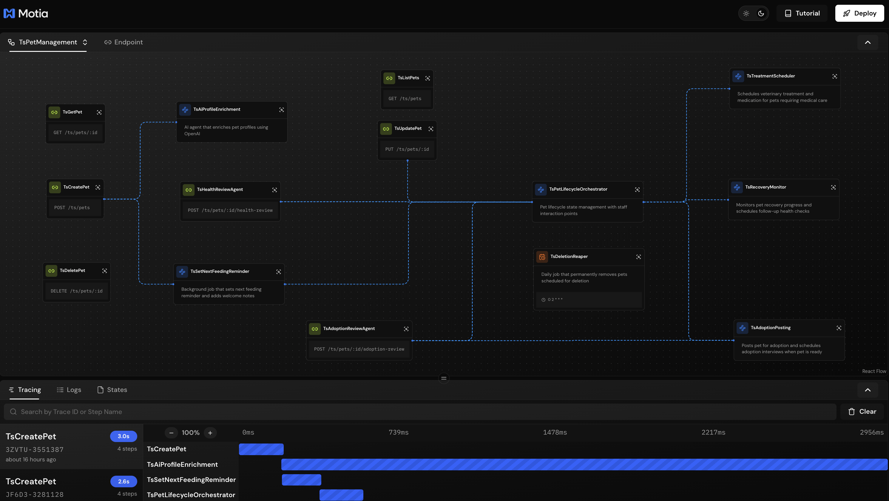
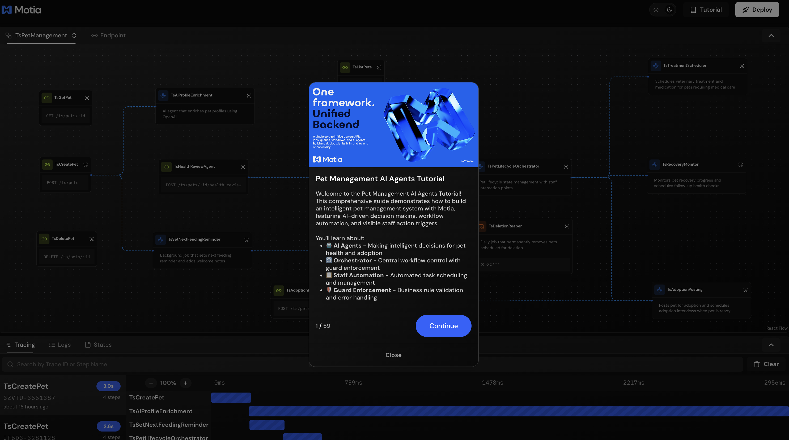
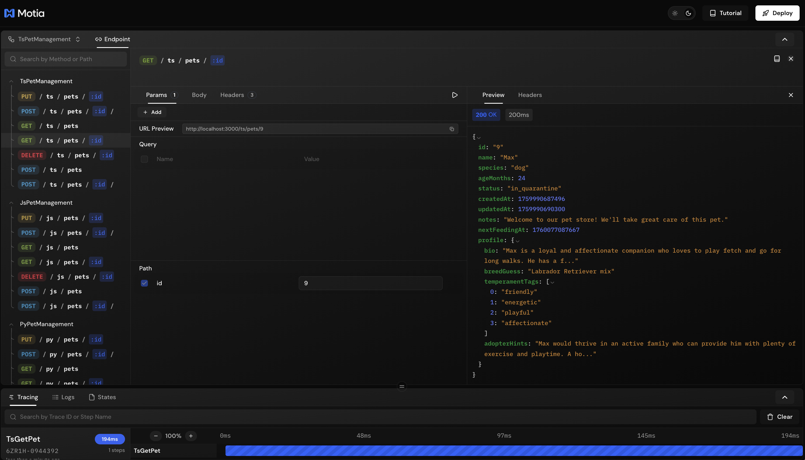
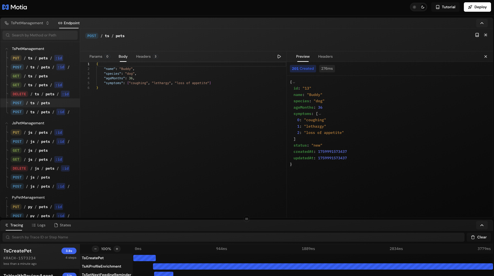
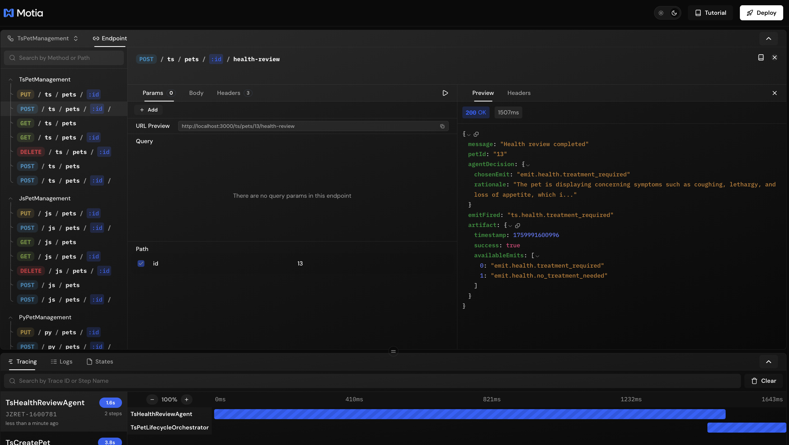

## What You'll Build

An intelligent pet management system with agentic workflows that automate decisions and enrich data:

- **AI Profile Enrichment** - Automatically generates detailed pet profiles using AI
- **Health Review Agentic Step** - Makes intelligent health decisions based on symptoms
- **Adoption Review Agentic Step** - Assesses adoption readiness and data completeness
- **Orchestrator Integration** - AI decisions that drive real workflow changes


---

## Getting Started

Clone the example repository:

```bash
git clone https://github.com/MotiaDev/build-your-first-app.git
cd build-your-first-app
git checkout ai-agents
```

Install dependencies:

```bash
npm install
```

Set up your OpenAI API key in `.env`:

```bash
OPENAI_API_KEY=your_api_key_here
```

<Callout type="warning">
**Important!** This tutorial requires an OpenAI API key. Get yours at [platform.openai.com/api-keys](https://platform.openai.com/api-keys). Without it, the agentic workflows won't work.
</Callout>

Start the Workbench:

```bash
npm run dev
```

Your Workbench will be available at `http://localhost:3000`.

---

## Project Structure

<Folder name="my-pet-api" defaultOpen>
  <Folder name="steps" defaultOpen>
    <Folder name="typescript">
      <File name="create-pet.step.ts" />
      <File name="ai-profile-enrichment.step.ts" />
      <File name="health-review-agent.step.ts" />
      <File name="adoption-review-agent.step.ts" />
      <File name="pet-lifecycle-orchestrator.step.ts" />
      <File name="agent-decision-framework.ts" />
      <File name="ts-store.ts" />
    </Folder>
    <Folder name="javascript">
      <File name="create-pet.step.js" />
      <File name="ai-profile-enrichment.step.js" />
      <File name="health-review-agent.step.js" />
      <File name="adoption-review-agent.step.js" />
      <File name="pet-lifecycle-orchestrator.step.js" />
      <File name="agent-decision-framework.js" />
      <File name="js-store.js" />
    </Folder>
    <Folder name="python">
      <File name="create_pet_step.py" />
      <File name="ai_profile_enrichment_step.py" />
      <File name="health_review_agent_step.py" />
      <File name="adoption_review_agent_step.py" />
      <File name="pet_lifecycle_orchestrator_step.py" />
    </Folder>
  </Folder>
  <Folder name="services">
    <File name="pet_store.py" />
    <File name="types.py" />
  </Folder>
  <File name=".env" />
  <File name="package.json" />
  <File name="requirements.txt" />
  <File name="types.d.ts" />
</Folder>

<Callout type="info">
Files like `features.json` and `tutorial.tsx` are only for the interactive tutorial and are not part of Motia's project structure.
</Callout>

All code examples in this guide are available in the [build-your-first-app](https://github.com/MotiaDev/build-your-first-app/tree/ai-agents) repository.

You can follow this guide to learn how to build agentic workflows with Motia step by step, or you can clone the repository and dive into our Interactive Tutorial to learn by doing directly in the Workbench.



---

## Understanding Agentic Workflows

You've built APIs, background jobs, and workflows that orchestrate your pet shelter. But what about decisions that aren't black and white? Should this pet's symptoms require treatment? Is this profile ready for the adoption page?

That's where agentic workflows come in. They're smart assistants that make judgment calls based on context - the kind of decisions that would normally need a human to review every single case.

In our pet shelter, we use two flavors:
- **Content generators** write engaging pet profiles automatically
- **Decision makers** evaluate health symptoms and choose whether treatment is needed
- **Data reviewers** assess if adoption information is complete

The difference from traditional code? Instead of writing hundreds of if-else rules for every possible symptom combination, you describe what matters to the AI. It reads the context and makes an informed call.

When a pet arrives with "coughing, lethargy, loss of appetite" - the AI evaluates these symptoms together and decides if treatment is needed. No hardcoded rules. Just intelligent analysis of the situation.

---

## Creating Your First Agentic Step

Let's start with a content generation agentic step that automatically enriches pet profiles when they're created.

### Step 1: Set Up Pet Creation to Emit Events

First, update your pet creation endpoint to emit events that will trigger the agentic step.

<Callout type="info">
View on GitHub:
- [TypeScript](https://github.com/MotiaDev/build-your-first-app/blob/ai-agents/steps/typescript/create-pet.step.ts)
- [Python](https://github.com/MotiaDev/build-your-first-app/blob/ai-agents/steps/python/create_pet_step.py)
- [JavaScript](https://github.com/MotiaDev/build-your-first-app/blob/ai-agents/steps/javascript/create-pet.step.js)
</Callout>

<Tabs items={['TypeScript', 'Python', 'JavaScript']}>
  <Tab value="TypeScript">
    ```typescript title="steps/typescript/create-pet.step.ts"
    import { ApiRouteConfig, Handlers } from 'motia'
    import { z } from 'zod'
    import { TSStore } from './ts-store'

    const createPetSchema = z.object({
      name: z.string().min(1, 'Name is required').trim(),
      species: z.enum(['dog', 'cat', 'bird', 'other']),
      ageMonths: z.number().int().min(0, 'Age must be a positive number')
    })

    export const config: ApiRouteConfig = {
      type: 'api',
      name: 'TsCreatePet',
      path: '/ts/pets',
      method: 'POST',
      emits: ['ts.pet.created', 'ts.feeding.reminder.enqueued'],
      flows: ['TsPetManagement']
    }

    export const handler: Handlers['TsCreatePet'] = async (req, { emit, logger }) => {
      try {
        const validatedData = createPetSchema.parse(req.body)
        
        const pet = TSStore.create({ 
          name: validatedData.name, 
          species: validatedData.species, 
          ageMonths: validatedData.ageMonths 
        })
        
        if (logger) {
          logger.info('🐾 Pet created', { petId: pet.id, name: pet.name, species: pet.species, status: pet.status })
        }
        
        if (emit) {
          await (emit as any)({
            topic: 'ts.pet.created',
            data: { petId: pet.id, event: 'pet.created', name: pet.name, species: validatedData.species }
          })
          
          await (emit as any)({
            topic: 'ts.feeding.reminder.enqueued',
            data: { petId: pet.id, enqueuedAt: Date.now() }
          })
        }

      return { status: 201, body: pet }
        
      } catch (error) {
        if (error instanceof z.ZodError) {
          return {
            status: 400,
            body: {
              message: 'Validation error',
              errors: error.errors
            }
          }
        }
        
        return {
          status: 500,
          body: { message: 'Internal server error' }
        }
      }
    }
    ```
  </Tab>
  <Tab value="Python">
    ```python title="steps/python/create_pet_step.py"
    config = {
        "type": "api",
        "name": "PyCreatePet",
        "path": "/py/pets",
        "method": "POST",
        "emits": ["py.pet.created", "py.feeding.reminder.enqueued"],
        "flows": ["PyPetManagement"]
    }

    async def handler(req, ctx=None):
        logger = getattr(ctx, 'logger', None) if ctx else None
        emit = getattr(ctx, 'emit', None) if ctx else None
        
        try:
            import sys
            import os
            import time
            sys.path.append(os.path.join(os.path.dirname(__file__), '..'))
            from services import pet_store
        except ImportError:
            return {"status": 500, "body": {"message": "Import error"}}
        
        b = (req.get("body") or {})
        name = b.get("name")
        species = b.get("species")
        age = b.get("ageMonths")

        if not isinstance(name, str) or not name.strip():
            return {"status": 400, "body": {"message": "Invalid name"}}
        if species not in ["dog","cat","bird","other"]:
            return {"status": 400, "body": {"message": "Invalid species"}}
        try:
            age_val = int(age)
        except Exception:
            return {"status": 400, "body": {"message": "Invalid ageMonths"}}

        pet = pet_store.create(name, species, age_val)
        
        if logger:
            logger.info('🐾 Pet created', {
                'petId': pet['id'], 
                'name': pet['name'], 
                'species': pet['species'], 
                'status': pet['status']
            })
        
        if emit:
            await emit({
                'topic': 'py.pet.created',
                'data': {'petId': pet['id'], 'event': 'pet.created', 'name': pet['name'], 'species': pet['species']}
            })
            
            await emit({
                'topic': 'py.feeding.reminder.enqueued',
                'data': {'petId': pet['id'], 'enqueuedAt': int(time.time() * 1000)}
            })

        return {"status": 201, "body": pet}
    ```
  </Tab>
  <Tab value="JavaScript">
    ```javascript title="steps/javascript/create-pet.step.js"
    const { create } = require('./js-store')

    exports.config = {
      type: 'api',
      name: 'JsCreatePet',
      path: '/js/pets',
      method: 'POST',
      emits: ['js.pet.created', 'js.feeding.reminder.enqueued'],
      flows: ['JsPetManagement']
    }

    exports.handler = async (req, context) => {
      const { emit, logger } = context || {}
      const b = req.body || {}
      const name = typeof b.name === 'string' && b.name.trim()
      const speciesOk = ['dog','cat','bird','other'].includes(b.species)
      const ageOk = Number.isFinite(b.ageMonths)

      if (!name || !speciesOk || !ageOk) {
        return { status: 400, body: { message: 'Invalid payload: {name, species, ageMonths}' } }
      }

      const pet = create({ name, species: b.species, ageMonths: Number(b.ageMonths) })

      if (logger) {
        logger.info('🐾 Pet created', { petId: pet.id, name: pet.name, species: pet.species, status: pet.status })
      }
      
      if (emit) {
        await emit({
          topic: 'js.pet.created',
          data: { petId: pet.id, event: 'pet.created', name: pet.name, species: pet.species }
        })
        
        await emit({
          topic: 'js.feeding.reminder.enqueued',
          data: { petId: pet.id, enqueuedAt: Date.now() }
        })
      }

      return { status: 201, body: pet }
    }
    ```
  </Tab>
</Tabs>

The API endpoint now emits an event after creating a pet. The response returns immediately while the agentic step processes asynchronously in the background.

---

### Step 2: Create the AI Profile Enrichment Agentic Step

Now let's create the agentic step that listens for new pets and enriches their profiles with AI-generated content.

<Callout type="info">
View on GitHub:
- [TypeScript](https://github.com/MotiaDev/build-your-first-app/blob/ai-agents/steps/typescript/ai-profile-enrichment.step.ts)
- [Python](https://github.com/MotiaDev/build-your-first-app/blob/ai-agents/steps/python/ai_profile_enrichment_step.py)
- [JavaScript](https://github.com/MotiaDev/build-your-first-app/blob/ai-agents/steps/javascript/ai-profile-enrichment.step.js)
</Callout>

<Tabs items={['TypeScript', 'Python', 'JavaScript']}>
  <Tab value="TypeScript">
    ```typescript title="steps/typescript/ai-profile-enrichment.step.ts"
    // steps/typescript/ai-profile-enrichment.step.ts
    import { EventConfig, Handlers } from 'motia';
    import { TSStore, PetProfile } from './ts-store';

    export const config = {
      type: 'event',
      name: 'TsAiProfileEnrichment',
      description: 'Agentic step that enriches pet profiles using OpenAI',
      subscribes: ['ts.pet.created'],
      emits: [],
      flows: ['TsPetManagement']
    };

    export const handler: Handlers['TsAiProfileEnrichment'] = async (input, { logger }) => {
      const { petId, name, species } = input;

      if (logger) {
        logger.info('🤖 AI Profile Enrichment started', { petId, name, species });
      }

      try {
        const apiKey = process.env.OPENAI_API_KEY;
        if (!apiKey) {
          throw new Error('OPENAI_API_KEY environment variable is not set');
        }

        const prompt = `Generate a pet profile for adoption purposes. Pet details:
- Name: ${name}
- Species: ${species}

Please provide a JSON response with these fields:
- bio: A warm, engaging 2-3 sentence description that would appeal to potential adopters
- breedGuess: Your best guess at the breed or breed mix (be specific but realistic)
- temperamentTags: An array of 3-5 personality traits (e.g., "friendly", "energetic", "calm")
- adopterHints: Practical advice for potential adopters (family type, living situation, care needs)

Keep it positive, realistic, and adoption-focused.`;

        const response = await fetch('https://api.openai.com/v1/chat/completions', {
          method: 'POST',
          headers: {
            'Authorization': `Bearer ${apiKey}`,
            'Content-Type': 'application/json',
          },
          body: JSON.stringify({
            model: 'gpt-3.5-turbo',
            messages: [
              {
                role: 'system',
                content: 'You are a pet adoption specialist who creates compelling, accurate pet profiles. Always respond with valid JSON only.'
              },
              {
                role: 'user',
                content: prompt
              }
            ],
            max_tokens: 500,
            temperature: 0.7,
          }),
        });

        if (!response.ok) {
          throw new Error(`OpenAI API error: ${response.status} ${response.statusText}`);
        }

        const data = await response.json();
        const aiResponse = data.choices[0]?.message?.content;

        if (!aiResponse) {
          throw new Error('No response from OpenAI API');
        }

        let profile: PetProfile;
        try {
          profile = JSON.parse(aiResponse);
        } catch (parseError) {
          profile = {
            bio: `${name} is a wonderful ${species} looking for a loving home. This pet has a unique personality and would make a great companion.`,
            breedGuess: species === 'dog' ? 'Mixed Breed' : species === 'cat' ? 'Domestic Shorthair' : 'Mixed Breed',
            temperamentTags: ['friendly', 'loving', 'loyal'],
            adopterHints: `${name} would do well in a caring home with patience and love.`
          };
          
          if (logger) {
            logger.warn('⚠️ AI response parsing failed, using fallback profile', { petId, parseError: parseError instanceof Error ? parseError.message : String(parseError) });
          }
        }

        const updatedPet = TSStore.updateProfile(petId, profile);
        
        if (!updatedPet) {
          throw new Error(`Pet not found: ${petId}`);
        }

        if (logger) {
          logger.info('✅ AI Profile Enrichment completed', { 
            petId, 
            profile: {
              bio: profile.bio.substring(0, 50) + '...',
              breedGuess: profile.breedGuess,
              temperamentTags: profile.temperamentTags,
              adopterHints: profile.adopterHints.substring(0, 50) + '...'
            }
          });
        }

      } catch (error: any) {
        if (logger) {
          logger.error('❌ AI Profile Enrichment failed', { 
            petId, 
            error: error.message 
          });
        }

        const fallbackProfile: PetProfile = {
          bio: `${name} is a lovely ${species} with a unique personality, ready to find their forever home.`,
          breedGuess: species === 'dog' ? 'Mixed Breed' : species === 'cat' ? 'Domestic Shorthair' : 'Mixed Breed',
          temperamentTags: ['friendly', 'adaptable'],
          adopterHints: `${name} is looking for a patient and loving family.`
        };

        TSStore.updateProfile(petId, fallbackProfile);
      }
    };
    ```
  </Tab>
  <Tab value="Python">
    ```python title="steps/python/ai_profile_enrichment_step.py"
    import json
    import os
    import asyncio
    import urllib.request
    import urllib.parse
    import urllib.error
    import time

    config = {
        "type": "event",
        "name": "PyAiProfileEnrichment",
        "description": "Agentic step that enriches pet profiles using OpenAI",
        "subscribes": ["py.pet.created"],
        "emits": [],
        "flows": ["PyPetManagement"]
    }

    async def handler(input_data, ctx=None):
        logger = getattr(ctx, 'logger', None) if ctx else None
        emit = getattr(ctx, 'emit', None) if ctx else None
        
        pet_id = input_data.get('petId')
        name = input_data.get('name')
        species = input_data.get('species')

        if logger:
            logger.info('🤖 AI Profile Enrichment started', {'petId': pet_id, 'name': name, 'species': species})

        try:
            import sys
            import os
            sys.path.append(os.path.join(os.path.dirname(__file__), '..'))
            from services import pet_store

            api_key = os.getenv('OPENAI_API_KEY')
            if not api_key:
                raise Exception('OPENAI_API_KEY environment variable is not set')

            prompt = f"""Generate a pet profile for adoption purposes. Pet details:
- Name: {name}
- Species: {species}

Please provide a JSON response with these fields:
- bio: A warm, engaging 2-3 sentence description that would appeal to potential adopters
- breedGuess: Your best guess at the breed or breed mix (be specific but realistic)
- temperamentTags: An array of 3-5 personality traits (e.g., "friendly", "energetic", "calm")
- adopterHints: Practical advice for potential adopters (family type, living situation, care needs)

Keep it positive, realistic, and adoption-focused."""

            request_data = {
                'model': 'gpt-3.5-turbo',
                'messages': [
                    {
                        'role': 'system',
                        'content': 'You are a pet adoption specialist who creates compelling, accurate pet profiles. Always respond with valid JSON only.'
                    },
                    {
                        'role': 'user',
                        'content': prompt
                    }
                ],
                'max_tokens': 500,
                'temperature': 0.7,
            }
            
            request_json = json.dumps(request_data).encode('utf-8')
            
            request = urllib.request.Request(
                    'https://api.openai.com/v1/chat/completions',
                data=request_json,
                    headers={
                    'Authorization': f'Bearer {api_key}',
                        'Content-Type': 'application/json',
                }
            )
            
            try:
                with urllib.request.urlopen(request) as response:
                    if response.status != 200:
                        raise Exception(f'OpenAI API error: {response.status} {response.reason}')
                    
                    response_data = response.read().decode('utf-8')
                    data = json.loads(response_data)
                    ai_response = data.get('choices', [{}])[0].get('message', {}).get('content')

                    if not ai_response:
                        raise Exception('No response from OpenAI API')
            except urllib.error.HTTPError as e:
                raise Exception(f'OpenAI API HTTP error: {e.code} {e.reason}')
            except urllib.error.URLError as e:
                raise Exception(f'OpenAI API URL error: {e.reason}')

            try:
                profile = json.loads(ai_response)
            except json.JSONDecodeError as parse_error:
                profile = {
                    'bio': f'{name} is a wonderful {species} looking for a loving home. This pet has a unique personality and would make a great companion.',
                    'breedGuess': 'Mixed Breed' if species == 'dog' else 'Domestic Shorthair' if species == 'cat' else 'Mixed Breed',
                    'temperamentTags': ['friendly', 'loving', 'loyal'],
                    'adopterHints': f'{name} would do well in a caring home with patience and love.'
                }
                
                if logger:
                    logger.warn('⚠️ AI response parsing failed, using fallback profile', {'petId': pet_id, 'parseError': str(parse_error)})

            updated_pet = pet_store.update_profile(pet_id, profile)
            
            if not updated_pet:
                raise Exception(f'Pet not found: {pet_id}')

            if logger:
                logger.info('✅ AI Profile Enrichment completed', {
                    'petId': pet_id,
                    'profile': {
                        'bio': profile['bio'][:50] + '...',
                        'breedGuess': profile['breedGuess'],
                        'temperamentTags': profile['temperamentTags'],
                        'adopterHints': profile['adopterHints'][:50] + '...'
                    }
                })

        except Exception as error:
            if logger:
                logger.error('❌ AI Profile Enrichment failed', {
                    'petId': pet_id,
                    'error': str(error)
                })

            fallback_profile = {
                'bio': f'{name} is a lovely {species} with a unique personality, ready to find their forever home.',
                'breedGuess': 'Mixed Breed' if species == 'dog' else 'Domestic Shorthair' if species == 'cat' else 'Mixed Breed',
                'temperamentTags': ['friendly', 'adaptable'],
                'adopterHints': f'{name} is looking for a patient and loving family.'
            }

            try:
                import sys
                import os
                sys.path.append(os.path.join(os.path.dirname(__file__), '..'))
                from services import pet_store
                pet_store.update_profile(pet_id, fallback_profile)
            except:
                pass
    ```
  </Tab>
  <Tab value="JavaScript">
    ```javascript title="steps/javascript/ai-profile-enrichment.step.js"
    const { updateProfile } = require('./js-store')

    exports.config = {
      type: 'event',
      name: 'JsAiProfileEnrichment',
      description: 'Agentic step that enriches pet profiles using OpenAI',
      subscribes: ['js.pet.created'],
      emits: [],
      flows: ['JsPetManagement']
    }

    exports.handler = async (input, context) => {
      const { emit, logger } = context || {}
      const { petId, name, species } = input

      if (logger) {
        logger.info('🤖 AI Profile Enrichment started', { petId, name, species })
      }

      try {
      const apiKey = process.env.OPENAI_API_KEY
      if (!apiKey) {
          throw new Error('OPENAI_API_KEY environment variable is not set')
        }

        const prompt = `Generate a pet profile for adoption purposes. Pet details:
- Name: ${name}
- Species: ${species}

Please provide a JSON response with these fields:
- bio: A warm, engaging 2-3 sentence description that would appeal to potential adopters
- breedGuess: Your best guess at the breed or breed mix (be specific but realistic)
- temperamentTags: An array of 3-5 personality traits (e.g., "friendly", "energetic", "calm")
- adopterHints: Practical advice for potential adopters (family type, living situation, care needs)

Keep it positive, realistic, and adoption-focused.`

        const response = await fetch('https://api.openai.com/v1/chat/completions', {
          method: 'POST',
          headers: {
            'Authorization': `Bearer ${apiKey}`,
            'Content-Type': 'application/json',
          },
          body: JSON.stringify({
            model: 'gpt-3.5-turbo',
            messages: [
              {
                role: 'system',
                content: 'You are a pet adoption specialist who creates compelling, accurate pet profiles. Always respond with valid JSON only.'
              },
              {
                role: 'user',
                content: prompt
              }
            ],
            max_tokens: 500,
            temperature: 0.7,
          }),
        })

        if (!response.ok) {
          throw new Error(`OpenAI API error: ${response.status} ${response.statusText}`)
        }

        const data = await response.json()
        const aiResponse = data.choices[0]?.message?.content

        if (!aiResponse) {
          throw new Error('No response from OpenAI API')
        }

        let profile
        try {
          profile = JSON.parse(aiResponse)
        } catch (parseError) {
          profile = {
            bio: `${name} is a wonderful ${species} looking for a loving home. This pet has a unique personality and would make a great companion.`,
            breedGuess: species === 'dog' ? 'Mixed Breed' : species === 'cat' ? 'Domestic Shorthair' : 'Mixed Breed',
            temperamentTags: ['friendly', 'loving', 'loyal'],
            adopterHints: `${name} would do well in a caring home with patience and love.`
          }
          
          if (logger) {
            logger.warn('⚠️ AI response parsing failed, using fallback profile', { petId, parseError: parseError.message })
          }
        }

        const updatedPet = updateProfile(petId, profile)
        
        if (!updatedPet) {
          throw new Error(`Pet not found: ${petId}`)
        }

        if (logger) {
          logger.info('✅ AI Profile Enrichment completed', {
            petId,
            profile: {
              bio: profile.bio.substring(0, 50) + '...',
              breedGuess: profile.breedGuess,
              temperamentTags: profile.temperamentTags,
              adopterHints: profile.adopterHints.substring(0, 50) + '...'
            }
          })
        }

      } catch (error) {
        if (logger) {
          logger.error('❌ AI Profile Enrichment failed', {
            petId,
            error: error.message
          })
        }

        const fallbackProfile = {
          bio: `${name} is a lovely ${species} with a unique personality, ready to find their forever home.`,
          breedGuess: species === 'dog' ? 'Mixed Breed' : species === 'cat' ? 'Domestic Shorthair' : 'Mixed Breed',
          temperamentTags: ['friendly', 'adaptable'],
          adopterHints: `${name} is looking for a patient and loving family.`
        }

        updateProfile(petId, fallbackProfile)
      }
    }
    ```
  </Tab>
</Tabs>

### How This Agentic Step Works

This is a **content generation agentic step** - it enriches data without making workflow decisions:

- **Subscribes** to `pet.created` events
- **Calls OpenAI** with a carefully crafted prompt
- **Parses the response** into structured data
- **Updates the pet** with AI-generated content
- **Has a fallback** if the AI call fails

The key is the prompt engineering - we tell the AI exactly what fields we need and what tone to use. The AI returns JSON that we can parse and store directly.

---

## Testing Your Agentic Step

The best way to test your agentic step is through **Workbench**. It lets you create pets, watch the AI enrichment happen in real-time, and see all the logs in one place.

### Create a Pet

Open Workbench and test the CreatePet endpoint. The AI will automatically start enriching the profile in the background.

<Callout type="tip">
**Prefer using curl?**

```bash
curl -X POST http://localhost:3000/ts/pets \
  -H "Content-Type: application/json" \
  -d '{"name": "Max", "species": "dog", "ageMonths": 24}'
```
</Callout>

Check the logs in Workbench to see the agentic step in action:


You'll see:
1. "Pet created" log from the API endpoint
2. "AI Profile Enrichment started" log
3. "AI Profile Enrichment completed" with generated content

### View the Enriched Profile

Fetch the pet in Workbench to see the AI-generated profile, or use curl:

<Callout type="tip">
**Using curl?**

```bash
curl http://localhost:3000/ts/pets/1
```
</Callout>

You'll get back something like:



---

## Building a Decision-Making Agentic Step

Now let's create an agentic step that doesn't just generate content - it makes decisions that control the workflow. This is called **agentic routing**.

### The Health Review Agentic Step

This agentic step analyzes pet symptoms and decides if treatment is needed. Instead of you writing complex if-else logic, the AI evaluates the context and chooses the appropriate action.

<Callout type="info">
View on GitHub:
- [TypeScript](https://github.com/MotiaDev/build-your-first-app/blob/ai-agents/steps/typescript/health-review-agent.step.ts)
- [Python](https://github.com/MotiaDev/build-your-first-app/blob/ai-agents/steps/python/health_review_agent_step.py)
- [JavaScript](https://github.com/MotiaDev/build-your-first-app/blob/ai-agents/steps/javascript/health-review-agent.step.js)
</Callout>

<Tabs items={['TypeScript', 'Python', 'JavaScript']}>
  <Tab value="TypeScript">
    ```typescript title="steps/typescript/health-review-agent.step.ts"
    // steps/typescript/health-review-agent.step.ts
    import { ApiRouteConfig, Handlers } from 'motia';
    import { TSStore } from './ts-store';
    import { 
      HEALTH_REVIEW_EMITS, 
      buildAgentContext, 
      callAgentDecision,
      getAgentArtifacts
    } from './agent-decision-framework';

    export const config: ApiRouteConfig = {
      type: 'api',
      name: 'TsHealthReviewAgent',
      path: '/ts/pets/:id/health-review',
      method: 'POST',
      emits: ['ts.health.treatment_required', 'ts.health.no_treatment_needed'],
      flows: ['TsPetManagement']
    };

    export const handler: Handlers['TsHealthReviewAgent'] = async (req, { emit, logger }) => {
      const petId = req.pathParams?.id;

      if (!petId) {
        return { status: 400, body: { message: 'Pet ID is required' } };
      }

      const pet = TSStore.get(petId);
      if (!pet) {
        return { status: 404, body: { message: 'Pet not found' } };
      }

      if (logger) {
        logger.info('🏥 Health Review Agent triggered', { 
          petId, 
          currentStatus: pet.status,
          symptoms: pet.symptoms || []
        });
      }

      if (!['healthy', 'in_quarantine', 'available'].includes(pet.status)) {
        return {
          status: 400,
          body: {
            message: 'Health review can only be performed on healthy, quarantined, or available pets',
            currentStatus: pet.status
          }
        };
      }

      const agentContext = buildAgentContext(pet);

      const recentArtifacts = getAgentArtifacts(petId)
        .filter(a => 
          a.agentType === 'health-review' && 
          a.success && 
          a.inputs.currentStatus === pet.status &&
          (Date.now() - a.timestamp) < 60000
        );

      if (recentArtifacts.length > 0) {
        const recent = recentArtifacts[recentArtifacts.length - 1];
        if (logger) {
          logger.info('🔄 Idempotent health review - returning cached decision', {
            petId,
            chosenEmit: recent.parsedDecision.chosenEmit,
            timestamp: recent.timestamp
          });
        }

        return {
          status: 200,
          body: {
            message: 'Health review completed (cached)',
            petId,
            agentDecision: recent.parsedDecision,
            artifact: {
              timestamp: recent.timestamp,
              success: recent.success
            }
          }
        };
      }

      try {
        if (logger) {
          logger.info('🔍 Starting agent decision call', { petId, agentContext });
        }
        
        const artifact = await callAgentDecision(
          'health-review',
          agentContext,
          HEALTH_REVIEW_EMITS,
          logger
        );
        
        if (logger) {
          logger.info('✅ Agent decision call completed', { petId, success: artifact.success });
        }

        if (!artifact.success) {
          if (logger) {
            logger.warn('⚠️ Agent decision failed, but returning error response', {
              petId,
              error: artifact.error
            });
          }
          
          return {
            status: 500,
            body: {
              message: 'Agent decision failed',
              error: artifact.error,
              petId,
              suggestion: 'Check OpenAI API key and try again'
            }
          };
        }

        const chosenEmitDef = HEALTH_REVIEW_EMITS.find(e => e.id === artifact.parsedDecision.chosenEmit);
        if (!chosenEmitDef) {
          return {
            status: 500,
            body: {
              message: 'Invalid emit chosen by agent',
              chosenEmit: artifact.parsedDecision.chosenEmit
            }
          };
        }

        if (emit) {
          (emit as any)({
            topic: chosenEmitDef.topic as 'ts.health.treatment_required' | 'ts.health.no_treatment_needed',
            data: {
              petId,
              event: chosenEmitDef.id.replace('emit.', ''),
              agentDecision: artifact.parsedDecision,
              timestamp: artifact.timestamp,
              context: agentContext
            }
          });

          if (logger) {
            logger.info('✅ Health review emit fired', {
              petId,
              chosenEmit: artifact.parsedDecision.chosenEmit,
              topic: chosenEmitDef.topic,
              rationale: artifact.parsedDecision.rationale
            });
          }
        }

        return {
          status: 200,
          body: {
            message: 'Health review completed',
            petId,
            agentDecision: artifact.parsedDecision,
            emitFired: chosenEmitDef.topic,
            artifact: {
              timestamp: artifact.timestamp,
              success: artifact.success,
              availableEmits: artifact.availableEmits.map(e => e.id)
            }
          }
        };

      } catch (error: any) {
        if (logger) {
          logger.error('❌ Health review agent error', {
            petId,
            error: error.message
          });
        }

        return {
          status: 500,
          body: {
            message: 'Health review failed',
            error: error.message,
            petId
          }
        };
      }
    };
    ```
  </Tab>
  <Tab value="Python">
    ```python title="steps/python/health_review_agent_step.py"
    import sys
    import os
    import time

    sys.path.append(os.path.join(os.path.dirname(__file__), '..'))
    from services import pet_store

    config = {
        "type": "api",
        "name": "PyHealthReviewAgent",
        "path": "/py/pets/:id/health-review",
        "method": "POST",
        "emits": ["py.health.treatment_required", "py.health.no_treatment_needed"],
        "flows": ["PyPetManagement"]
    }

    # Emit Registry - Tools available to health review agent
    HEALTH_REVIEW_EMITS = [
        {
            "id": "emit.health.treatment_required",
            "topic": "py.health.treatment_required",
            "description": "Pet requires medical treatment due to health concerns",
            "orchestratorEffect": "healthy → ill → under_treatment",
            "guards": ["must_be_healthy"]
        },
        {
            "id": "emit.health.no_treatment_needed",
            "topic": "py.health.no_treatment_needed", 
            "description": "Pet is healthy and requires no medical intervention",
            "orchestratorEffect": "stay healthy",
            "guards": ["must_be_healthy"]
        }
    ]

    def build_agent_context(pet):
        return {
            "petId": pet["id"],
            "species": pet["species"],
            "ageMonths": pet["ageMonths"],
            "weightKg": pet.get("weightKg"),
            "symptoms": pet.get("symptoms", []),
            "flags": pet.get("flags", []),
            "profile": pet.get("profile"),
            "currentStatus": pet["status"]
        }

    async def call_agent_decision(agent_type, context, available_emits, logger):
        # ... OpenAI API calling logic ...
        # (See full implementation in the actual file)
        pass

    async def handler(req, ctx=None):
        logger = getattr(ctx, 'logger', None) if ctx else None
        emit = getattr(ctx, 'emit', None) if ctx else None
        pet_id = req.get("pathParams", {}).get("id")

        if not pet_id:
            return {"status": 400, "body": {"message": "Pet ID is required"}}

            pet = pet_store.get(pet_id)
            if not pet:
                return {"status": 404, "body": {"message": "Pet not found"}}

        if logger:
            logger.info('🏥 Health Review Agent triggered', {
                "petId": pet_id,
                "currentStatus": pet["status"],
                "symptoms": pet.get("symptoms", [])
            })

        if pet["status"] not in ["healthy", "in_quarantine"]:
                return {
                "status": 400,
                    "body": {
                    "message": "Health review can only be performed on healthy or quarantined pets",
                    "currentStatus": pet["status"]
                }
            }

        agent_context = build_agent_context(pet)

        try:
            artifact = await call_agent_decision(
                'health-review',
                agent_context,
                HEALTH_REVIEW_EMITS,
                logger
            )

            if not artifact["success"]:
                return {
                    "status": 500,
                    "body": {
                        "message": "Agent decision failed",
                        "error": artifact["error"],
                        "petId": pet_id,
                        "suggestion": "Check OpenAI API key and try again"
                    }
                }

            chosen_emit_def = None
            for emit_def in HEALTH_REVIEW_EMITS:
                if emit_def["id"] == artifact["parsedDecision"]["chosenEmit"]:
                    chosen_emit_def = emit_def
                    break
                    
            if not chosen_emit_def:
                return {
                    "status": 500,
                    "body": {
                        "message": "Invalid emit chosen by agent",
                        "chosenEmit": artifact["parsedDecision"]["chosenEmit"]
                    }
                }

            if emit:
                await emit({
                    "topic": chosen_emit_def["topic"],
                    "data": {
                        "petId": pet_id,
                        "event": chosen_emit_def["id"].replace('emit.', ''),
                        "agentDecision": artifact["parsedDecision"],
                        "timestamp": artifact["timestamp"],
                        "context": agent_context
                    }
                })

            if logger:
                    logger.info('✅ Health review emit fired', {
                    "petId": pet_id,
                        "chosenEmit": artifact["parsedDecision"]["chosenEmit"],
                        "topic": chosen_emit_def["topic"],
                        "rationale": artifact["parsedDecision"]["rationale"]
                })

            return {
                "status": 200,
                "body": {
                    "message": "Health review completed",
                    "petId": pet_id,
                    "agentDecision": artifact["parsedDecision"],
                    "emitFired": chosen_emit_def["topic"],
                    "artifact": {
                        "timestamp": artifact["timestamp"],
                        "success": artifact["success"],
                        "availableEmits": [e["id"] for e in artifact["availableEmits"]]
                    }
                }
            }

        except Exception as error:
            if logger:
                logger.error('❌ Health review agent error', {
                    "petId": pet_id,
                    "error": str(error)
                })

            return {
                "status": 500,
                "body": {
                    "message": "Health review failed",
                    "error": str(error),
                    "petId": pet_id
                }
            }
    ```
  </Tab>
  <Tab value="JavaScript">
    ```javascript title="steps/javascript/health-review-agent.step.js"
    const { get } = require('./js-store')
    const { 
      HEALTH_REVIEW_EMITS, 
      buildAgentContext, 
      callAgentDecision,
      getAgentArtifacts
    } = require('./agent-decision-framework')

    exports.config = {
      type: 'api',
      name: 'JsHealthReviewAgent',
      path: '/js/pets/:id/health-review',
      method: 'POST',
      emits: ['js.health.treatment_required', 'js.health.no_treatment_needed'],
      flows: ['JsPetManagement']
    }

    exports.handler = async (req, context) => {
      const { emit, logger } = context || {}
      const petId = req.pathParams?.id

      if (!petId) {
        return { status: 400, body: { message: 'Pet ID is required' } }
      }

        const pet = get(petId)
        if (!pet) {
        return { status: 404, body: { message: 'Pet not found' } }
      }

      if (logger) {
        logger.info('🏥 Health Review Agent triggered', { 
          petId, 
          currentStatus: pet.status,
          symptoms: pet.symptoms || []
        })
      }

      if (pet.status !== 'healthy' && pet.status !== 'in_quarantine') {
          return {
            status: 400,
            body: {
            message: 'Health review can only be performed on healthy or quarantined pets',
              currentStatus: pet.status
            }
          }
        }

      const agentContext = buildAgentContext(pet)

      const recentArtifacts = getAgentArtifacts(petId)
        .filter(a => 
          a.agentType === 'health-review' && 
          a.success && 
          a.inputs.currentStatus === pet.status &&
          (Date.now() - a.timestamp) < 60000
        )

      if (recentArtifacts.length > 0) {
        const recent = recentArtifacts[recentArtifacts.length - 1]
          if (logger) {
          logger.info('🔄 Idempotent health review - returning cached decision', {
            petId,
            chosenEmit: recent.parsedDecision.chosenEmit,
            timestamp: recent.timestamp
          })
        }

          return {
            status: 200,
            body: {
              message: 'Health review completed (cached)',
            petId,
            agentDecision: recent.parsedDecision,
            artifact: {
              timestamp: recent.timestamp,
              success: recent.success
            }
          }
        }
      }

      try {
        const artifact = await callAgentDecision(
          'health-review',
          agentContext,
          HEALTH_REVIEW_EMITS,
          logger
        )

        if (!artifact.success) {
          return {
            status: 500,
            body: {
              message: 'Agent decision failed',
              error: artifact.error,
              petId
            }
          }
        }

        const chosenEmitDef = HEALTH_REVIEW_EMITS.find(e => e.id === artifact.parsedDecision.chosenEmit)
        if (!chosenEmitDef) {
          return {
            status: 500,
            body: {
              message: 'Invalid emit chosen by agent',
              chosenEmit: artifact.parsedDecision.chosenEmit
            }
          }
        }

        if (emit) {
          await emit({
            topic: chosenEmitDef.topic,
            data: {
              petId,
              agentDecision: artifact.parsedDecision,
              timestamp: artifact.timestamp,
              context: agentContext
            }
          })

        if (logger) {
            logger.info('✅ Health review emit fired', {
            petId,
              chosenEmit: artifact.parsedDecision.chosenEmit,
              topic: chosenEmitDef.topic,
              rationale: artifact.parsedDecision.rationale
          })
          }
        }

        return {
          status: 200,
          body: {
            message: 'Health review completed',
            petId,
            agentDecision: artifact.parsedDecision,
            emitFired: chosenEmitDef.topic,
            artifact: {
              timestamp: artifact.timestamp,
              success: artifact.success,
              availableEmits: artifact.availableEmits.map(e => e.id)
            }
          }
        }

      } catch (error) {
        if (logger) {
          logger.error('❌ Health review agent error', {
            petId,
            error: error.message
          })
        }

        return {
          status: 500,
          body: {
            message: 'Health review failed',
            error: error.message,
            petId
          }
        }
      }
    }
    ```
  </Tab>
</Tabs>

### How Decision-Making Agentic Steps Work

This agentic step is fundamentally different from the enrichment agentic step:

1. **It's an API Step** - Staff trigger it explicitly when they need a decision
2. **It defines an emits registry** - Lists all possible actions the AI can choose from (in `agent-decision-framework.ts/js`)
3. **It calls the AI with context + options** - The AI evaluates and picks one
4. **It fires the chosen emit** - This emit goes to the orchestrator, changing workflow state
5. **It uses idempotency checking** - Caches recent decisions to prevent duplicate AI calls

The framework functions (`buildAgentContext`, `callAgentDecision`, `getAgentArtifacts`) handle the OpenAI call and ensure the AI picks from valid options.

---

## Testing the Health Review Agentic Step

The best way to test decision-making agentic steps is through **Workbench**. You can create pets, trigger the health review, and watch the AI make decisions in real-time.

### Create a Pet

Use Workbench to create a pet. The AI enrichment will automatically trigger.

<Callout type="tip">
**Prefer using curl?**

```bash
curl -X POST http://localhost:3000/ts/pets \
  -H "Content-Type: application/json" \
  -d '{
    "name": "Buddy",
    "species": "dog",
    "ageMonths": 36
  }'
```
</Callout>

### Trigger the Health Review

In Workbench, test the health review endpoint to see the AI make a decision.

<Callout type="tip">
**Using curl?**

```bash
curl -X POST http://localhost:3000/ts/pets/1/health-review \
  -H "Content-Type: application/json"
```
</Callout>



You'll get a response like:

```json
{
  "message": "Health review completed",
  "petId": "1",
  "agentDecision": {
    "chosenEmit": "emit.health.treatment_required",
    "rationale": "The pet shows concerning symptoms including coughing, lethargy, and loss of appetite. These symptoms suggest a potential respiratory infection or illness requiring veterinary attention."
  },
  "emitFired": "ts.health.treatment_required",
  "artifact": {
    "timestamp": 1234567890,
    "success": true,
    "availableEmits": ["emit.health.treatment_required", "emit.health.no_treatment_needed"]
  }
}
```


The AI evaluates the pet's data and makes a decision. The emit it fires will trigger the orchestrator to handle the appropriate state transition.

### Verify the Status Change

Check the pet status in Workbench to see the AI's decision reflected in the workflow state.

<Callout type="tip">
**Using curl?**

```bash
curl http://localhost:3000/ts/pets/1
```
</Callout>


The pet's status has automatically changed based on the AI's decision!

---

## Connecting Agentic Steps to the Orchestrator

The real power comes when your agentic steps integrate with a workflow orchestrator. The orchestrator subscribes to the events emitted by agentic steps and handles the actual state transitions.

The orchestrator configuration shows it subscribes to agentic step events:

<Tabs items={['TypeScript', 'Python', 'JavaScript']}>
  <Tab value="TypeScript">
    ```typescript title="steps/typescript/pet-lifecycle-orchestrator.step.ts"
    export const config = {
      type: 'event',
      name: 'TsPetLifecycleOrchestrator',
      description: 'Pet lifecycle state management with staff interaction points',
      subscribes: [
        'ts.feeding.reminder.completed',
        'ts.pet.status.update.requested',
        'ts.health.treatment_required',       // From Health Review Agentic Step
        'ts.health.no_treatment_needed',      // From Health Review Agentic Step
        'ts.adoption.needs_data',             // From Adoption Review Agentic Step
        'ts.adoption.ready'                   // From Adoption Review Agentic Step
      ],
      emits: [
        'ts.treatment.required',
        'ts.adoption.ready',
        'ts.treatment.completed'
      ],
      flows: ['TsPetManagement']
    }

    // The orchestrator has transition rules that handle agentic step events
    const TRANSITION_RULES: TransitionRule[] = [
      // ... other rules ...
      
      // Agentic step-driven health transitions
      {
        from: ["healthy", "in_quarantine"],
        to: "ill",
        event: "health.treatment_required",
        description: "Agent assessment - pet requires medical treatment"
      },
      {
        from: ["healthy", "in_quarantine"],
        to: "healthy",
        event: "health.no_treatment_needed",
        description: "Agent assessment - pet remains healthy"
      },
      // Agentic step-driven adoption transitions
      {
        from: ["healthy"],
        to: "healthy",
        event: "adoption.needs_data",
        description: "Agent assessment - pet needs additional data before adoption",
        flagAction: { action: 'add', flag: 'needs_data' }
      },
      {
        from: ["healthy"],
        to: "available",
        event: "adoption.ready",
        description: "Agent assessment - pet ready for adoption",
        guards: ['no_needs_data_flag']
      }
    ]
    ```
  </Tab>
  <Tab value="Python">
    ```python title="steps/python/pet_lifecycle_orchestrator_step.py"
    config = {
        "type": "event",
        "name": "PyPetLifecycleOrchestrator",
        "description": "Pet lifecycle state management with staff interaction points",
        "subscribes": [
            "py.feeding.reminder.completed",
            "py.pet.status.update.requested",
            "py.health.treatment_required",       # From Health Review Agentic Step
            "py.health.no_treatment_needed",      # From Health Review Agentic Step
            "py.adoption.needs_data",             # From Adoption Review Agentic Step
            "py.adoption.ready"                   # From Adoption Review Agentic Step
        ],
        "emits": [
            "py.treatment.required",
            "py.adoption.ready",
            "py.treatment.completed"
        ],
        "flows": ["PyPetManagement"]
    }

    # Transition rules that handle agentic step events
    TRANSITION_RULES = [
        # ... other rules ...
        
        # Agentic step-driven health transitions
        {
            'from': ['healthy', 'in_quarantine'],
            'to': 'ill',
            'event': 'health.treatment_required',
            'description': 'Agent assessment - pet requires medical treatment'
        },
        {
            'from': ['healthy', 'in_quarantine'],
            'to': 'healthy',
            'event': 'health.no_treatment_needed',
            'description': 'Agent assessment - pet remains healthy'
        },
        # Agentic step-driven adoption transitions
        {
            'from': ['healthy'],
            'to': 'healthy',
            'event': 'adoption.needs_data',
            'description': 'Agent assessment - pet needs additional data before adoption',
            'flagAction': {'action': 'add', 'flag': 'needs_data'}
        },
        {
            'from': ['healthy'],
            'to': 'available',
            'event': 'adoption.ready',
            'description': 'Agent assessment - pet ready for adoption',
            'guards': ['no_needs_data_flag']
        }
    ]
    ```
  </Tab>
  <Tab value="JavaScript">
    ```javascript title="steps/javascript/pet-lifecycle-orchestrator.step.js"
    exports.config = {
      type: 'event',
      name: 'JsPetLifecycleOrchestrator',
      description: 'Pet lifecycle state management with staff interaction points',
      subscribes: [
        'js.feeding.reminder.completed',
        'js.pet.status.update.requested',
        'js.health.treatment_required',       // From Health Review Agentic Step
        'js.health.no_treatment_needed',      // From Health Review Agentic Step
        'js.adoption.needs_data',             // From Adoption Review Agentic Step
        'js.adoption.ready'                   // From Adoption Review Agentic Step
      ],
      emits: [
        'js.treatment.required',
        'js.adoption.ready',
        'js.treatment.completed'
      ],
      flows: ['JsPetManagement']
    }

    // Transition rules that handle agentic step events
    const TRANSITION_RULES = [
      // ... other rules ...
      
      // Agentic step-driven health transitions
      {
        from: ["healthy", "in_quarantine"],
        to: "ill",
        event: "health.treatment_required",
        description: "Agent assessment - pet requires medical treatment"
      },
      {
        from: ["healthy", "in_quarantine"],
        to: "healthy",
        event: "health.no_treatment_needed",
        description: "Agent assessment - pet remains healthy"
      },
      // Agentic step-driven adoption transitions
      {
        from: ["healthy"],
        to: "healthy",
        event: "adoption.needs_data",
        description: "Agent assessment - pet needs additional data before adoption",
        flagAction: { action: 'add', flag: 'needs_data' }
      },
      {
        from: ["healthy"],
        to: "available",
        event: "adoption.ready",
        description: "Agent assessment - pet ready for adoption",
        guards: ['no_needs_data_flag']
      }
    ]
    ```
  </Tab>
</Tabs>

---

🎉 **Congratulations!** You've built intelligent agentic workflows that make decisions and drive workflows. Your pet shelter now has automated intelligence that would have taken hundreds of lines of complex logic to implement manually.

---

## What's Next?

Your pet shelter now has intelligent agentic workflows making decisions! But how do you give users real-time feedback while all this AI processing happens in the background?

In the final guide, we'll add **Real-Time Streaming** to provide live updates as your workflows execute:

- **Stream Configuration** - Define stream schemas for type-safe updates
- **API with Streaming** - Initialize streams and return immediately to clients
- **Background Job Streaming** - Push real-time progress updates as jobs process
- **Agentic Step Streaming** - Stream AI enrichment progress in real-time
- **Multi-Step Streaming** - Multiple steps updating the same stream

Let's complete your system by adding real-time streaming capabilities!

Explore more examples in the [Motia Examples Repository](https://github.com/MotiaDev/motia-examples).


