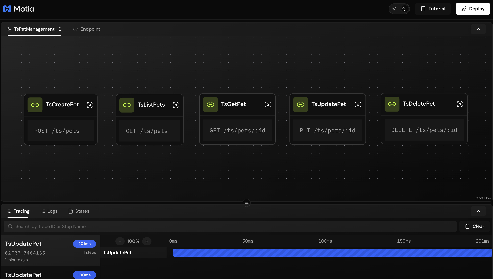
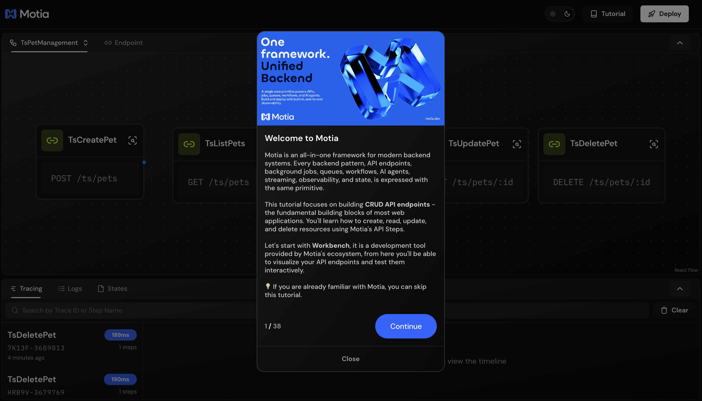
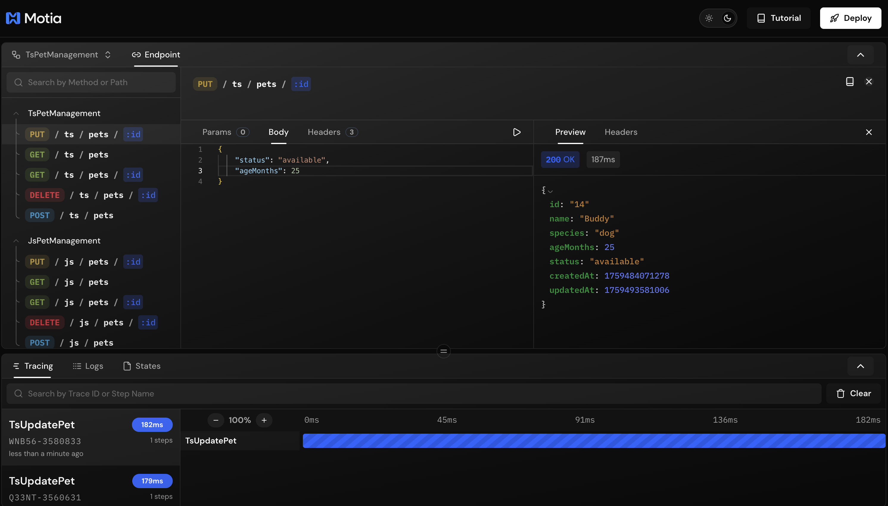
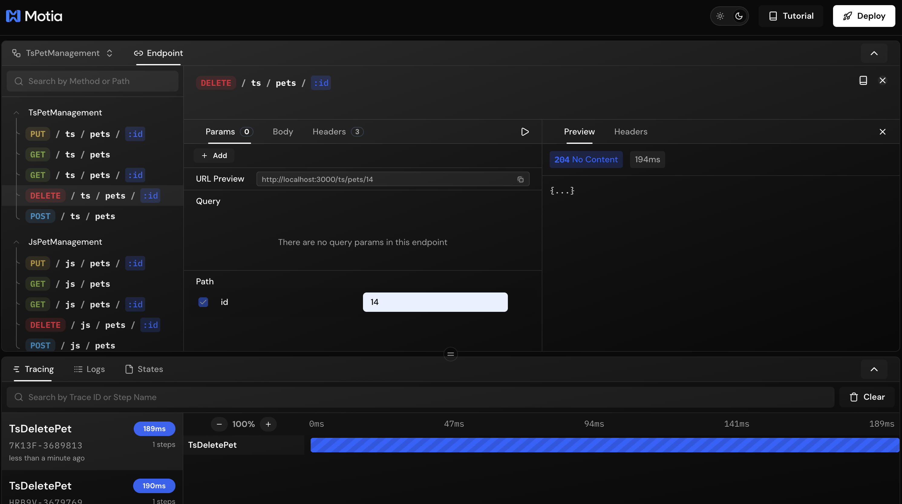

## What You'll Build

A pet management API with these endpoints:

- **POST `/pets`** - Create a new pet
- **GET `/pets`** - List all pets
- **GET `/pets/:id`** - Get a specific pet
- **PUT `/pets/:id`** - Update a pet
- **DELETE `/pets/:id`** - Delete a pet


---

## Getting Started

Clone the example repository:

```bash
git clone https://github.com/MotiaDev/build-your-first-app.git
cd build-your-first-app
git checkout api-endpoints
```

Install dependencies:

```bash
npm install
```

Start the Workbench:

```bash
npm run dev
```

Your Workbench will be available at `http://localhost:3000`.

---

## Project Structure

<Folder name="my-pet-api" defaultOpen>
  <Folder name="steps" defaultOpen>
    <Folder name="typescript">
      <File name="create-pet.step.ts" />
      <File name="get-pets.step.ts" />
      <File name="get-pet.step.ts" />
      <File name="update-pet.step.ts" />
      <File name="delete-pet.step.ts" />
      <File name="ts-store.ts" />
    </Folder>
    <Folder name="javascript">
      <File name="create-pet.step.js" />
      <File name="get-pets.step.js" />
      <File name="get-pet.step.js" />
      <File name="update-pet.step.js" />
      <File name="delete-pet.step.js" />
      <File name="js-store.js" />
    </Folder>
    <Folder name="python">
      <File name="create_pet_step.py" />
      <File name="get_pets_step.py" />
      <File name="get_pet_step.py" />
      <File name="update_pet_step.py" />
      <File name="delete_pet_step.py" />
    </Folder>
  </Folder>
    <Folder name="services">
      <File name="pet_store.py" />
      <File name="types.py" />
    </Folder>
  <File name="package.json" />
  <File name="requirements.txt" />
  <File name="types.d.ts" />
</Folder>

<Callout type="info">
Files like `features.json` and `tutorial.tsx` are only for the interactive tutorial and are not part of Motia's project structure.
</Callout>

All code examples in this guide are available in the [build-your-first-app](https://github.com/MotiaDev/build-your-first-app/tree/api-endpoints) repository.

You can follow this guide to learn how to build a REST API with Motia step by step, or you can clone the repository and dive into our Interactive Tutorial to learn by doing directly in the Workbench.



---

## Creating Your First Endpoint

<Callout type="info">
This tutorial focuses on Motia's capabilities to create complete backend system from APIs to Streaming AI agents step-by-step. Here, we're showcasing writing APIs with Motia Steps - For data persistence, we use a simple JSON file store in the examples. In a real application, you would use a database like PostgreSQL, MongoDB, or any other data store of your choice. The complete store implementation is available in the [GitHub repository](https://github.com/MotiaDev/build-your-first-app/tree/api-endpoints).
</Callout>

### Configuration

Every API endpoint has two parts:

**Config** - Defines when and how the step runs:

| Property | Description |
|----------|-------------|
| `name` | Unique identifier |
| `type` | Set to `'api'` |
| `path` | URL path for the endpoint |
| `method` | HTTP method (GET, POST, PUT, DELETE) |

**Handler** - The function that executes your business logic.

<Callout type="info">
View on GitHub:
- [TypeScript](https://github.com/MotiaDev/build-your-first-app/blob/api-endpoints/steps/typescript/create-pet.step.ts)
- [Python](https://github.com/MotiaDev/build-your-first-app/blob/api-endpoints/steps/python/create_pet_step.py)
- [JavaScript](https://github.com/MotiaDev/build-your-first-app/blob/api-endpoints/steps/javascript/create-pet.step.js)
</Callout>

<Tabs items={['TypeScript', 'Python', 'JavaScript']}>
  <Tab value="TypeScript">
    ```typescript title="steps/typescript/create-pet.step.ts"
    import { ApiRouteConfig, Handlers } from 'motia'
    import { z } from 'zod'
    import { TSStore } from './ts-store'

    const createPetSchema = z.object({
      name: z.string().min(1, 'Name is required'),
      species: z.enum(['dog', 'cat', 'bird', 'other']),
      ageMonths: z.number().int().min(0),
    })

    export const config: ApiRouteConfig = {
      name: 'CreatePet',
      type: 'api',
      path: '/pets',
      method: 'POST',
      bodySchema: createPetSchema,
      flows: ['PetManagement'],
    }

    export const handler: Handlers['CreatePet'] = async (req, { logger }) => {
      const data = createPetSchema.parse(req.body)
      
      // In a real application, this would be a database call
      // e.g., await db.pets.create(data)
      const pet = TSStore.create(data)

      logger.info('Pet created', { petId: pet.id })

      return { status: 201, body: pet }
    }
    ```
  </Tab>
  <Tab value="Python">
    ```python title="steps/python/create_pet_step.py"
    import sys
    import os
    sys.path.insert(0, os.path.join(os.path.dirname(__file__), '..', '..'))
    from services import pet_store

    config = {
        "name": "CreatePet",
        "type": "api",
        "path": "/pets",
        "method": "POST",
        "emits": []
    }

    async def handler(req, ctx=None):
        b = req.get("body") or {}
        name = b.get("name")
        species = b.get("species")
        age = b.get("ageMonths")

        if not isinstance(name, str) or not name.strip():
            return {"status": 400, "body": {"message": "Invalid name"}}
        if species not in ["dog", "cat", "bird", "other"]:
            return {"status": 400, "body": {"message": "Invalid species"}}

        try:
            age_val = int(age)
        except Exception:
            return {"status": 400, "body": {"message": "Invalid ageMonths"}}

        # In a real application, this would be a database call
        # e.g., pet = await db.pets.create(name, species, age_val)
        pet = pet_store.create(name, species, age_val)
        return {"status": 201, "body": pet}
    ```
  </Tab>
  <Tab value="JavaScript">
    ```javascript title="steps/javascript/create-pet.step.js"
    const { create } = require('./js-store')

    const config = {
      name: 'CreatePet',
      type: 'api',
      path: '/pets',
      method: 'POST',
      emits: []
    }

    const handler = async (req) => {
      const b = req.body || {}
      const name = typeof b.name === 'string' && b.name.trim()
      const speciesOk = ['dog', 'cat', 'bird', 'other'].includes(b.species)
      const ageOk = Number.isFinite(b.ageMonths)

      if (!name || !speciesOk || !ageOk) {
        return { status: 400, body: { message: 'Invalid payload' } }
      }

      // In a real application, this would be a database call
      // e.g., const pet = await db.pets.create({ name, species: b.species, ageMonths: Number(b.ageMonths) })
      const pet = create({ name, species: b.species, ageMonths: Number(b.ageMonths) })
      return { status: 201, body: pet }
    }

    module.exports = { config, handler }
    ```
  </Tab>
</Tabs>

## Testing Your API

You can test your endpoints using curl or the Workbench interface.

### Using curl

```bash
# Create a pet
curl -X POST http://localhost:3000/pets \
  -H "Content-Type: application/json" \
  -d '{"name": "Max", "species": "dog", "ageMonths": 24}'
```

### Using Workbench

You can also test your endpoint directly in the Workbench, which provides an interactive interface to test your API endpoints with real requests and see the responses in real-time:


---
## Adding GET Endpoints

### List All Pets

<Callout type="info">
View on GitHub:
- [TypeScript](https://github.com/MotiaDev/build-your-first-app/blob/api-endpoints/steps/typescript/get-pets.step.ts)
- [Python](https://github.com/MotiaDev/build-your-first-app/blob/api-endpoints/steps/python/get_pets_step.py)
- [JavaScript](https://github.com/MotiaDev/build-your-first-app/blob/api-endpoints/steps/javascript/get-pets.step.js)
</Callout>

<Tabs items={['TypeScript', 'Python', 'JavaScript']}>
  <Tab value="TypeScript">
    ```typescript title="steps/typescript/get-pets.step.ts"
    import { ApiRouteConfig, Handlers } from 'motia'
    import { TSStore } from './ts-store'

    export const config: ApiRouteConfig = {
      name: 'GetPets',
      type: 'api',
      path: '/pets',
      method: 'GET',
      flows: ['PetManagement'],
    }

    export const handler: Handlers['GetPets'] = async (req, { logger }) => {
      // In a real application, this would be a database call
      // e.g., const pets = await db.pets.findMany()
      const pets = TSStore.list()
      
      logger.info('Retrieved all pets', { count: pets.length })
      return { status: 200, body: pets }
    }
    ```
  </Tab>
  <Tab value="Python">
    ```python title="steps/python/get_pets_step.py"
    import sys
    import os
    sys.path.insert(0, os.path.join(os.path.dirname(__file__), '..', '..'))
    from services import pet_store

    config = {
        "name": "GetPets",
        "type": "api",
        "path": "/pets",
        "method": "GET",
        "emits": []
    }

    async def handler(req, ctx=None):
        # In a real application, this would be a database call
        # e.g., pets = await db.pets.find_all()
        return {"status": 200, "body": pet_store.list_all()}
    ```
  </Tab>
  <Tab value="JavaScript">
    ```javascript title="steps/javascript/get-pets.step.js"
    const { list } = require('./js-store')

    const config = {
      name: 'GetPets',
      type: 'api',
      path: '/pets',
      method: 'GET',
      emits: []
    }

    const handler = async () => {
      // In a real application, this would be a database call
      // e.g., const pets = await db.pets.findAll()
      return { status: 200, body: list() }
    }

    module.exports = { config, handler }
    ```
  </Tab>
</Tabs>

### Testing List All Pets

Test with curl:

```bash
# List all pets
curl http://localhost:3000/pets
```

Or use the Workbench interface:


---

### Get Single Pet

<Callout type="info">
View on GitHub:
- [TypeScript](https://github.com/MotiaDev/build-your-first-app/blob/api-endpoints/steps/typescript/get-pet.step.ts)
- [Python](https://github.com/MotiaDev/build-your-first-app/blob/api-endpoints/steps/python/get_pet_step.py)
- [JavaScript](https://github.com/MotiaDev/build-your-first-app/blob/api-endpoints/steps/javascript/get-pet.step.js)
</Callout>

<Tabs items={['TypeScript', 'Python', 'JavaScript']}>
  <Tab value="TypeScript">
    ```typescript title="steps/typescript/get-pet.step.ts"
    import { ApiRouteConfig, Handlers } from 'motia'
    import { TSStore } from './ts-store'

    export const config: ApiRouteConfig = {
      name: 'GetPet',
      type: 'api',
      path: '/pets/:id',
      method: 'GET',
      flows: ['PetManagement'],
    }

    export const handler: Handlers['GetPet'] = async (req, { logger }) => {
      // In a real application, this would be a database call
      // e.g., const pet = await db.pets.findById(req.pathParams.id)
      const pet = TSStore.get(req.pathParams.id)

      if (!pet) {
        logger.warn('Pet not found', { id: req.pathParams.id })
        return { status: 404, body: { message: 'Pet not found' } }
      }

      return { status: 200, body: pet }
    }
    ```
  </Tab>
  <Tab value="Python">
    ```python title="steps/python/get_pet_step.py"
    import sys
    import os
    sys.path.insert(0, os.path.join(os.path.dirname(__file__), '..', '..'))
    from services import pet_store

    config = {
        "name": "GetPet",
        "type": "api",
        "path": "/pets/:id",
        "method": "GET",
        "emits": []
    }

    async def handler(req, ctx=None):
        pid = req.get("pathParams", {}).get("id")
        # In a real application, this would be a database call
        # e.g., pet = await db.pets.find_by_id(pid)
        pet = pet_store.get(pid)
        return {"status": 200, "body": pet} if pet else {"status": 404, "body": {"message": "Not found"}}
    ```
  </Tab>
  <Tab value="JavaScript">
    ```javascript title="steps/javascript/get-pet.step.js"
    const { get } = require('./js-store')

    const config = {
      name: 'GetPet',
      type: 'api',
      path: '/pets/:id',
      method: 'GET',
      emits: []
    }

    const handler = async (req) => {
      // In a real application, this would be a database call
      // e.g., const pet = await db.pets.findById(req.pathParams.id)
      const pet = get(req.pathParams.id)
      return pet 
        ? { status: 200, body: pet } 
        : { status: 404, body: { message: 'Not found' } }
    }

    module.exports = { config, handler }
    ```
  </Tab>
</Tabs>

<Callout type="info">
**Testing tip:** When testing GET endpoints with path parameters like `/pets/:id`, switch to the **Params** tab (not Body) to enter the ID value.
</Callout>

The `:id` in the path creates a path parameter accessible via `req.pathParams.id`.

### Testing Get Single Pet

Test with curl:

```bash
# Get specific pet (replace 1 with an actual pet ID)
curl http://localhost:3000/pets/1
```

Or use the Workbench interface:


---

## Adding UPDATE Endpoint

<Callout type="info">
View on GitHub:
- [TypeScript](https://github.com/MotiaDev/build-your-first-app/blob/api-endpoints/steps/typescript/update-pet.step.ts)
- [Python](https://github.com/MotiaDev/build-your-first-app/blob/api-endpoints/steps/python/update_pet_step.py)
- [JavaScript](https://github.com/MotiaDev/build-your-first-app/blob/api-endpoints/steps/javascript/update-pet.step.js)
</Callout>

<Tabs items={['TypeScript', 'Python', 'JavaScript']}>
  <Tab value="TypeScript">
    ```typescript title="steps/typescript/update-pet.step.ts"
    import { ApiRouteConfig, Handlers } from 'motia'
    import { z } from 'zod'
    import { TSStore } from './ts-store'

    const updatePetSchema = z.object({
      name: z.string().min(1).optional(),
      status: z.enum(['available', 'pending', 'adopted']).optional(),
      ageMonths: z.number().int().min(0).optional(),
    })

    export const config: ApiRouteConfig = {
      name: 'UpdatePet',
      type: 'api',
      path: '/pets/:id',
      method: 'PUT',
      bodySchema: updatePetSchema,
      flows: ['PetManagement'],
    }

    export const handler: Handlers['UpdatePet'] = async (req, { logger }) => {
      const updates = updatePetSchema.parse(req.body)
      
      // In a real application, this would be a database call
      // e.g., const pet = await db.pets.update(req.pathParams.id, updates)
      const pet = TSStore.update(req.pathParams.id, updates)

      if (!pet) {
        return { status: 404, body: { message: 'Pet not found' } }
      }

      logger.info('Pet updated', { petId: pet.id })
      return { status: 200, body: pet }
    }
    ```
  </Tab>
  <Tab value="Python">
    ```python title="steps/python/update_pet_step.py"
    import sys
    import os
    sys.path.insert(0, os.path.join(os.path.dirname(__file__), '..', '..'))
    from services import pet_store

    config = {
        "name": "UpdatePet",
        "type": "api",
        "path": "/pets/:id",
        "method": "PUT",
        "emits": []
    }

    async def handler(req, ctx=None):
        pid = req.get("pathParams", {}).get("id")
        b = req.get("body") or {}
        patch = {}

        if isinstance(b.get("name"), str):
            patch["name"] = b["name"]
        if b.get("species") in ["dog", "cat", "bird", "other"]:
            patch["species"] = b["species"]
        if isinstance(b.get("ageMonths"), (int, float)):
            patch["ageMonths"] = int(b["ageMonths"])
        if b.get("status") in ["available", "pending", "adopted"]:
            patch["status"] = b["status"]

        # In a real application, this would be a database call
        # e.g., updated = await db.pets.update(pid, patch)
        updated = pet_store.update(pid, patch)
        return {"status": 200, "body": updated} if updated else {"status": 404, "body": {"message": "Not found"}}
    ```
  </Tab>
  <Tab value="JavaScript">
    ```javascript title="steps/javascript/update-pet.step.js"
    const { update } = require('./js-store')

    const config = {
      name: 'UpdatePet',
      type: 'api',
      path: '/pets/:id',
      method: 'PUT',
      emits: []
    }

    const handler = async (req) => {
      const b = req.body || {}
      const patch = {}

      if (typeof b.name === 'string') patch.name = b.name
      if (['dog', 'cat', 'bird', 'other'].includes(b.species)) patch.species = b.species
      if (Number.isFinite(b.ageMonths)) patch.ageMonths = Number(b.ageMonths)
      if (['available', 'pending', 'adopted'].includes(b.status)) patch.status = b.status

      // In a real application, this would be a database call
      // e.g., const updated = await db.pets.update(req.pathParams.id, patch)
      const updated = update(req.pathParams.id, patch)
      return updated 
        ? { status: 200, body: updated } 
        : { status: 404, body: { message: 'Not found' } }
    }

    module.exports = { config, handler }
    ```
  </Tab>
</Tabs>

### Testing Update Pet

Test with curl:

```bash
# Update a pet (replace 1 with an actual pet ID)
curl -X PUT http://localhost:3000/pets/1 \
  -H "Content-Type: application/json" \
  -d '{"status": "adopted"}'
```

Or use the Workbench interface:



---

## Adding DELETE Endpoint

<Callout type="info">
View on GitHub:
- [TypeScript](https://github.com/MotiaDev/build-your-first-app/blob/api-endpoints/steps/typescript/delete-pet.step.ts)
- [Python](https://github.com/MotiaDev/build-your-first-app/blob/api-endpoints/steps/python/delete_pet_step.py)
- [JavaScript](https://github.com/MotiaDev/build-your-first-app/blob/api-endpoints/steps/javascript/delete-pet.step.js)
</Callout>

<Tabs items={['TypeScript', 'Python', 'JavaScript']}>
  <Tab value="TypeScript">
    ```typescript title="steps/typescript/delete-pet.step.ts"
    import { ApiRouteConfig, Handlers } from 'motia'
    import { TSStore } from './ts-store'

    export const config: ApiRouteConfig = {
      name: 'DeletePet',
      type: 'api',
      path: '/pets/:id',
      method: 'DELETE',
      flows: ['PetManagement'],
    }

    export const handler: Handlers['DeletePet'] = async (req, { logger }) => {
      // In a real application, this would be a database call
      // e.g., const deleted = await db.pets.delete(req.pathParams.id)
      const deleted = TSStore.remove(req.pathParams.id)

      if (!deleted) {
        return { status: 404, body: { message: 'Pet not found' } }
      }

      logger.info('Pet deleted', { petId: req.pathParams.id })
      return { status: 204 }
    }
    ```
  </Tab>
  <Tab value="Python">
    ```python title="steps/python/delete_pet_step.py"
    import sys
    import os
    sys.path.insert(0, os.path.join(os.path.dirname(__file__), '..', '..'))
    from services import pet_store

    config = {
        "name": "DeletePet",
        "type": "api",
        "path": "/pets/:id",
        "method": "DELETE",
        "emits": []
    }

    async def handler(req, ctx=None):
        pid = req.get("pathParams", {}).get("id")
        # In a real application, this would be a database call
        # e.g., ok = await db.pets.delete(pid)
        ok = pet_store.remove(pid)
        return {"status": 204, "body": {}} if ok else {"status": 404, "body": {"message": "Not found"}}
    ```
  </Tab>
  <Tab value="JavaScript">
    ```javascript title="steps/javascript/delete-pet.step.js"
    const { remove } = require('./js-store')

    const config = {
      name: 'DeletePet',
      type: 'api',
      path: '/pets/:id',
      method: 'DELETE',
      emits: []
    }

    const handler = async (req) => {
      // In a real application, this would be a database call
      // e.g., const ok = await db.pets.delete(req.pathParams.id)
      const ok = remove(req.pathParams.id)
      return ok 
        ? { status: 204, body: {} } 
        : { status: 404, body: { message: 'Not found' } }
    }

    module.exports = { config, handler }
    ```
  </Tab>
</Tabs>

DELETE endpoints return `204 No Content` on success.

### Testing Delete Pet

Test with curl:

```bash
# Delete a pet (replace 1 with an actual pet ID)
curl -X DELETE http://localhost:3000/pets/1
```

Or use the Workbench interface:



---

As you can see in this example, Motia handles routing, validation, and error handling automatically. With just a few lines of code, you've built a complete REST API with:
- **Automatic routing** based on your step configuration
- **Path parameter extraction** (`/pets/:id` → `req.pathParams.id`)
- **HTTP method handling** (GET, POST, PUT, DELETE)
- **Response formatting** with proper status codes
- **Built-in error handling** and validation

🎉 **Congratulations!** You've successfully created your first API endpoints with Motia. Your pet store API is now ready to handle all CRUD operations.

---

## What's Next?

You now have a working REST API for your pet store! But a complete backend system needs more than just API endpoints. In the next guide, we'll add background jobs using Event Steps and scheduled tasks with Cron Steps to handle tasks like:

- **SetNextFeedingReminder** - Queue jobs that automatically schedule feeding reminders when pets are added or updated
- **Deletion Reaper** - Cron jobs that run daily to clean up soft-deleted records and expired data

Let's continue building your complete backend system by adding these background jobs with Event Steps and scheduled tasks with Cron Steps.

<Cards>
  <Card href="/docs/getting-started/build-your-first-motia-app/background-jobs" title="Next: Background Jobs">
    Add Event Steps and Cron Steps to handle async tasks and scheduled jobs
  </Card>
</Cards>
