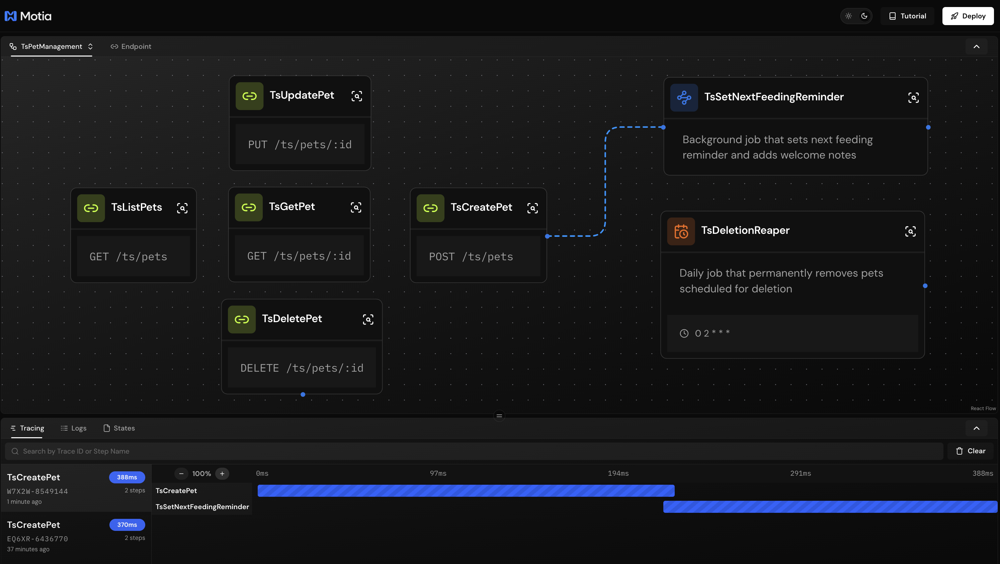
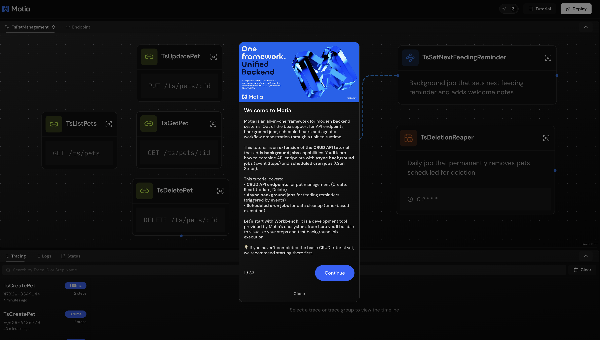
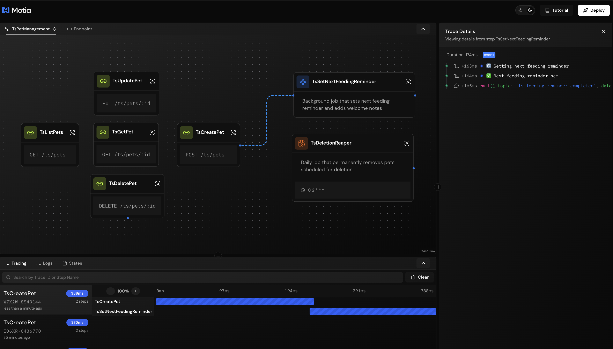

## What You'll Build

A pet management system with background jobs that handle:

- **Event Step** - Async job that sets feeding reminders when pets are created
- **Cron Step** - Scheduled job that runs daily to clean up deleted pets


---

## Getting Started

Clone the example repository:

```bash
git clone https://github.com/MotiaDev/build-your-first-app.git
cd build-your-first-app
git checkout background-jobs
```

Install dependencies:

```bash
npm install
```

Start the Workbench:

```bash
npm run dev
```

Your Workbench will be available at `http://localhost:3000`.

---

## Project Structure

<Folder name="my-pet-api" defaultOpen>
  <Folder name="steps" defaultOpen>
    <Folder name="typescript">
      <File name="create-pet.step.ts" />
      <File name="set-next-feeding-reminder.job.step.ts" />
      <File name="deletion-reaper.cron.step.ts" />
      <File name="ts-store.ts" />
    </Folder>
    <Folder name="javascript">
      <File name="create-pet.step.js" />
      <File name="set-next-feeding-reminder.job.step.js" />
      <File name="deletion-reaper.cron.step.js" />
      <File name="js-store.js" />
    </Folder>
    <Folder name="python">
      <File name="create_pet_step.py" />
      <File name="set_next_feeding_reminder.job_step.py" />
      <File name="deletion_reaper.cron_step.py" />
    </Folder>
  </Folder>
  <Folder name="services">
    <File name="pet_store.py" />
    <File name="types.py" />
  </Folder>
  <File name="package.json" />
  <File name="requirements.txt" />
  <File name="types.d.ts" />
</Folder>

<Callout type="info">
Files like `features.json` and `tutorial.tsx` are only for the interactive tutorial and are not part of Motia's project structure.
</Callout>

All code examples in this guide are available in the [build-your-first-app](https://github.com/MotiaDev/build-your-first-app/tree/background-jobs) repository.

You can follow this guide to learn how to build background jobs with Motia step by step, or you can clone the repository and dive into our Interactive Tutorial to learn by doing directly in the Workbench.



---

## Understanding Background Jobs

Background jobs let you handle time-consuming tasks without blocking your API responses. When a user creates a pet, they get an immediate response while tasks like sending emails or processing data happen in the background.

Motia provides two types of background jobs:

- **Event Steps** - Triggered by events from your API endpoints
- **Cron Steps** - Run on a schedule (like daily cleanup tasks)

---

## Creating Your First Event Step

Let's create a background job that sets feeding reminders when a pet is created. First, we need to emit an event from our API endpoint.

### Step 1: Emit Events from API

<Callout type="info">
View on GitHub:
- [TypeScript](https://github.com/MotiaDev/build-your-first-app/blob/background-jobs/steps/typescript/create-pet.step.ts)
- [Python](https://github.com/MotiaDev/build-your-first-app/blob/background-jobs/steps/python/create_pet_step.py)
- [JavaScript](https://github.com/MotiaDev/build-your-first-app/blob/background-jobs/steps/javascript/create-pet.step.js)
</Callout>

<Tabs items={['TypeScript', 'Python', 'JavaScript']}>
  <Tab value="TypeScript">
    ```typescript title="steps/typescript/create-pet.step.ts"
    import { ApiRouteConfig, Handlers } from 'motia'
    import { z } from 'zod'
    import { TSStore } from './ts-store'

    const createPetSchema = z.object({
      name: z.string().min(1, 'Name is required'),
      species: z.enum(['dog', 'cat', 'bird', 'other']),
      ageMonths: z.number().int().min(0),
    })

    export const config: ApiRouteConfig = {
      name: 'CreatePet',
      type: 'api',
      path: '/pets',
      method: 'POST',
      bodySchema: createPetSchema,
      // Declare what events this endpoint can emit
      emits: ['ts.feeding.reminder.enqueued'],
      flows: ['PetManagement'],
    }

    export const handler: Handlers['CreatePet'] = async (req, { emit, logger }) => {
      const data = createPetSchema.parse(req.body)
      const pet = TSStore.create(data)

      logger.info('Pet created', { petId: pet.id })

      // Emit event to trigger background job
      await emit({
        topic: 'ts.feeding.reminder.enqueued',
        data: {
          petId: pet.id,
          enqueuedAt: Date.now()
        }
      })

      return { status: 201, body: pet }
    }
    ```
  </Tab>
  <Tab value="Python">
    ```python title="steps/python/create_pet_step.py"
    import sys
    import os
    import time
    sys.path.insert(0, os.path.join(os.path.dirname(__file__), '..', '..'))
    from services import pet_store

    config = {
        "name": "CreatePet",
        "type": "api",
        "path": "/pets",
        "method": "POST",
        "emits": ["py.feeding.reminder.enqueued"]
    }

    async def handler(req, ctx=None):
        b = req.get("body") or {}
        name = b.get("name")
        species = b.get("species")
        age = b.get("ageMonths")

        if not isinstance(name, str) or not name.strip():
            return {"status": 400, "body": {"message": "Invalid name"}}
        if species not in ["dog", "cat", "bird", "other"]:
            return {"status": 400, "body": {"message": "Invalid species"}}

        try:
            age_val = int(age)
        except Exception:
            return {"status": 400, "body": {"message": "Invalid ageMonths"}}

        pet = pet_store.create(name, species, age_val)
        
        # Emit event to trigger background job
        if ctx and ctx.emit:
            await ctx.emit({
                "topic": "py.feeding.reminder.enqueued",
                "data": {
                    "petId": pet["id"],
                    "enqueuedAt": int(time.time() * 1000)
                }
            })

        return {"status": 201, "body": pet}
    ```
  </Tab>
  <Tab value="JavaScript">
    ```javascript title="steps/javascript/create-pet.step.js"
    const { create } = require('./js-store')

    const config = {
      name: 'CreatePet',
      type: 'api',
      path: '/pets',
      method: 'POST',
      emits: ['js.feeding.reminder.enqueued']
    }

    const handler = async (req, { emit }) => {
      const b = req.body || {}
      const name = typeof b.name === 'string' && b.name.trim()
      const speciesOk = ['dog', 'cat', 'bird', 'other'].includes(b.species)
      const ageOk = Number.isFinite(b.ageMonths)

      if (!name || !speciesOk || !ageOk) {
        return { status: 400, body: { message: 'Invalid payload' } }
      }

      const pet = create({ name, species: b.species, ageMonths: Number(b.ageMonths) })

      // Emit event to trigger background job
      if (emit) {
        await emit({
          topic: 'js.feeding.reminder.enqueued',
          data: {
            petId: pet.id,
            enqueuedAt: Date.now()
          }
        })
      }

      return { status: 201, body: pet }
    }

    module.exports = { config, handler }
    ```
  </Tab>
</Tabs>

The API endpoint now emits an event after creating a pet. The response returns immediately while the background job processes asynchronously.

---

### Step 2: Create the Event Step

Now let's create the background job that listens for this event and sets feeding reminders.

<Callout type="info">
View on GitHub:
- [TypeScript](https://github.com/MotiaDev/build-your-first-app/blob/background-jobs/steps/typescript/set-next-feeding-reminder.job.step.ts)
- [Python](https://github.com/MotiaDev/build-your-first-app/blob/background-jobs/steps/python/set_next_feeding_reminder.job_step.py)
- [JavaScript](https://github.com/MotiaDev/build-your-first-app/blob/background-jobs/steps/javascript/set-next-feeding-reminder.job.step.js)
</Callout>

<Tabs items={['TypeScript', 'Python', 'JavaScript']}>
  <Tab value="TypeScript">
    ```typescript title="steps/typescript/set-next-feeding-reminder.job.step.ts"
    import { TSStore } from './ts-store'

    export const config = {
      type: 'event',
      name: 'TsSetNextFeedingReminder',
      description: 'Background job that sets next feeding reminder and adds welcome notes',
      // Subscribe to the event emitted by CreatePet
      subscribes: ['ts.feeding.reminder.enqueued'],
      emits: ['ts.feeding.reminder.completed'],
      flows: ['TsPetManagement']
    }

    export const handler = async (input: any, context?: any) => {
      const { emit, logger } = context || {}
      const { petId, enqueuedAt } = input

      if (logger) {
        logger.info('Setting next feeding reminder', { petId, enqueuedAt })
      }

      try {
        // Calculate next feeding time (24 hours from now)
        const nextFeedingAt = Date.now() + (24 * 60 * 60 * 1000)
        
        // Update pet with feeding schedule and welcome notes
        const updates = {
          notes: 'Welcome to our pet store! We\'ll take great care of this pet.',
          nextFeedingAt: nextFeedingAt
        }

        const updatedPet = TSStore.update(petId, updates)
        
        if (!updatedPet) {
          if (logger) {
            logger.error('Failed to set feeding reminder - pet not found', { petId })
          }
          return
        }

        if (logger) {
          logger.info('Next feeding reminder set', { 
            petId, 
            notes: updatedPet.notes?.substring(0, 50) + '...',
            nextFeedingAt: new Date(nextFeedingAt).toISOString()
          })
        }

        if (emit) {
          await emit({
            topic: 'ts.feeding.reminder.completed',
            data: { 
              petId, 
              completedAt: Date.now(),
              processingTimeMs: Date.now() - enqueuedAt
            }
          })
        }

      } catch (error: any) {
        if (logger) {
          logger.error('Feeding reminder job error', { petId, error: error.message })
        }
      }
    }
    ```
  </Tab>
  <Tab value="Python">
    ```python title="steps/python/set_next_feeding_reminder.job_step.py"
    import sys
    import os
    import time
    sys.path.insert(0, os.path.join(os.path.dirname(__file__), '..', '..'))
    from services import pet_store

    config = {
        "type": "event",
        "name": "PySetNextFeedingReminder",
        "description": "Background job that sets next feeding reminder and adds welcome notes",
        "subscribes": ["py.feeding.reminder.enqueued"],
        "emits": ["py.feeding.reminder.completed"]
    }

    async def handler(input_data, context):
        pet_id = input_data.get("petId")
        enqueued_at = input_data.get("enqueuedAt")

        if context.logger:
            context.logger.info("Setting next feeding reminder", {
                "petId": pet_id,
                "enqueuedAt": enqueued_at
            })

        try:
            # Calculate next feeding time (24 hours from now)
            next_feeding_at = int(time.time() * 1000) + (24 * 60 * 60 * 1000)
            
            # Update pet with feeding schedule and welcome notes
            updates = {
                "notes": "Welcome to our pet store! We'll take great care of this pet.",
                "nextFeedingAt": next_feeding_at
            }

            updated_pet = pet_store.update(pet_id, updates)
            
            if not updated_pet:
                if context.logger:
                    context.logger.error("Failed to set feeding reminder - pet not found", {
                        "petId": pet_id
                    })
                return

            if context.logger:
                context.logger.info("Next feeding reminder set", {
                    "petId": pet_id,
                    "notes": updated_pet.get("notes", "")[:50] + "...",
                    "nextFeedingAt": next_feeding_at
                })

            if context.emit:
                await context.emit({
                    "topic": "py.feeding.reminder.completed",
                    "data": {
                        "petId": pet_id,
                        "completedAt": int(time.time() * 1000),
                        "processingTimeMs": int(time.time() * 1000) - enqueued_at
                    }
                })

        except Exception as error:
            if context.logger:
                context.logger.error("Feeding reminder job error", {
                    "petId": pet_id,
                    "error": str(error)
                })
    ```
  </Tab>
  <Tab value="JavaScript">
    ```javascript title="steps/javascript/set-next-feeding-reminder.job.step.js"
    const { update } = require('./js-store')

    const config = {
      type: 'event',
      name: 'JsSetNextFeedingReminder',
      description: 'Background job that sets next feeding reminder and adds welcome notes',
      subscribes: ['js.feeding.reminder.enqueued'],
      emits: ['js.feeding.reminder.completed']
    }

    const handler = async (input, { emit, logger }) => {
      const { petId, enqueuedAt } = input

      if (logger) {
        logger.info('Setting next feeding reminder', { petId, enqueuedAt })
      }

      try {
        // Calculate next feeding time (24 hours from now)
        const nextFeedingAt = Date.now() + (24 * 60 * 60 * 1000)
        
        // Update pet with feeding schedule and welcome notes
        const updates = {
          notes: 'Welcome to our pet store! We\'ll take great care of this pet.',
          nextFeedingAt: nextFeedingAt
        }

        const updatedPet = update(petId, updates)
        
        if (!updatedPet) {
          if (logger) {
            logger.error('Failed to set feeding reminder - pet not found', { petId })
          }
          return
        }

        if (logger) {
          logger.info('Next feeding reminder set', { 
            petId, 
            notes: updatedPet.notes?.substring(0, 50) + '...',
            nextFeedingAt: new Date(nextFeedingAt).toISOString()
          })
        }

        if (emit) {
          await emit({
            topic: 'js.feeding.reminder.completed',
            data: { 
              petId, 
              completedAt: Date.now(),
              processingTimeMs: Date.now() - enqueuedAt
            }
          })
        }

      } catch (error) {
        if (logger) {
          logger.error('Feeding reminder job error', { petId, error: error.message })
        }
      }
    }

    module.exports = { config, handler }
    ```
  </Tab>
</Tabs>

### How Event Steps Work

Event Steps have a few key differences from API Steps:

- **type** is set to `'event'` instead of `'api'`
- **subscribes** lists the events this job listens for
- **handler** receives the event data as the first argument

When you create a pet, the API returns immediately. The background job picks up the event and processes it asynchronously.

---

## Testing Your Background Job

Create a pet and watch the background job execute:

```bash
# Create a pet
curl -X POST http://localhost:3000/pets \
  -H "Content-Type: application/json" \
  -d '{"name": "Max", "species": "dog", "ageMonths": 24}'
```

Check the logs in Workbench to see both the API call and the background job execution:


You'll see:
1. "Pet created" log from the API endpoint
2. "Setting next feeding reminder" log from the background job
3. "Next feeding reminder set" log when the job completes

---

## Creating a Scheduled Cron Job

Now let's create a cron job that runs daily to clean up soft-deleted pets. This demonstrates how to handle scheduled maintenance tasks.

<Callout type="info">
View on GitHub:
- [TypeScript](https://github.com/MotiaDev/build-your-first-app/blob/background-jobs/steps/typescript/deletion-reaper.cron.step.ts)
- [Python](https://github.com/MotiaDev/build-your-first-app/blob/background-jobs/steps/python/deletion_reaper.cron_step.py)
- [JavaScript](https://github.com/MotiaDev/build-your-first-app/blob/background-jobs/steps/javascript/deletion-reaper.cron.step.js)
</Callout>

<Tabs items={['TypeScript', 'Python', 'JavaScript']}>
  <Tab value="TypeScript">
    ```typescript title="steps/typescript/deletion-reaper.cron.step.ts"
    import { TSStore } from './ts-store'

    export const config = {
      type: 'cron',
      name: 'TsDeletionReaper',
      description: 'Daily job that permanently removes pets scheduled for deletion',
      cron: '0 2 * * *', // Daily at 2:00 AM
      emits: ['ts.pet.purged', 'ts.reaper.completed'],
      flows: ['TsPetManagement']
    }

    export const handler = async ({ emit, logger }: any) => {
      if (logger) {
        logger.info('Deletion Reaper started - scanning for pets to purge')
      }

      try {
        const petsToReap = TSStore.findDeletedPetsReadyToPurge()
        
        if (petsToReap.length === 0) {
          if (logger) {
            logger.info('Deletion Reaper completed - no pets to purge')
          }
          
          if (emit) {
            await emit({
              topic: 'ts.reaper.completed',
              data: { 
                scannedAt: Date.now(),
                purgedCount: 0,
                message: 'No pets ready for purging'
              }
            })
          }
          return
        }

        let purgedCount = 0
        
        for (const pet of petsToReap) {
          const success = TSStore.remove(pet.id)
          
          if (success) {
            purgedCount++
            
            if (logger) {
              logger.info('Pet permanently purged', { 
                petId: pet.id, 
                name: pet.name,
                deletedAt: new Date(pet.deletedAt!).toISOString(),
                purgeAt: new Date(pet.purgeAt!).toISOString()
              })
            }

            if (emit) {
              await emit({
                topic: 'ts.pet.purged',
                data: { 
                  petId: pet.id, 
                  name: pet.name,
                  species: pet.species,
                  deletedAt: pet.deletedAt,
                  purgedAt: Date.now()
                }
              })
            }
          } else {
            if (logger) {
              logger.warn('Failed to purge pet', { petId: pet.id, name: pet.name })
            }
          }
        }

        if (logger) {
          logger.info('Deletion Reaper completed', { 
            totalScanned: petsToReap.length,
            purgedCount,
            failedCount: petsToReap.length - purgedCount
          })
        }

        if (emit) {
          await emit({
            topic: 'ts.reaper.completed',
            data: { 
              scannedAt: Date.now(),
              purgedCount,
              totalScanned: petsToReap.length
            }
          })
        }

      } catch (error: any) {
        if (logger) {
          logger.error('Deletion Reaper error', { error: error.message })
        }
      }
    }
    ```
  </Tab>
  <Tab value="Python">
    ```python title="steps/python/deletion_reaper.cron_step.py"
    import sys
    import os
    import time
    sys.path.insert(0, os.path.join(os.path.dirname(__file__), '..', '..'))
    from services import pet_store

    config = {
        "type": "cron",
        "name": "PyDeletionReaper",
        "description": "Daily job that permanently removes pets scheduled for deletion",
        "cron": "0 2 * * *",  # Daily at 2:00 AM
        "emits": ["py.pet.purged", "py.reaper.completed"]
    }

    async def handler(context):
        if context.logger:
            context.logger.info("Deletion Reaper started - scanning for pets to purge")

        try:
            pets_to_reap = pet_store.find_deleted_pets_ready_to_purge()
            
            if len(pets_to_reap) == 0:
                if context.logger:
                    context.logger.info("Deletion Reaper completed - no pets to purge")
                
                if context.emit:
                    await context.emit({
                        "topic": "py.reaper.completed",
                        "data": {
                            "scannedAt": int(time.time() * 1000),
                            "purgedCount": 0,
                            "message": "No pets ready for purging"
                        }
                    })
                return

            purged_count = 0
            
            for pet in pets_to_reap:
                success = pet_store.remove(pet["id"])
                
                if success:
                    purged_count += 1
                    
                    if context.logger:
                        context.logger.info("Pet permanently purged", {
                            "petId": pet["id"],
                            "name": pet["name"],
                            "deletedAt": pet.get("deletedAt"),
                            "purgeAt": pet.get("purgeAt")
                        })

                    if context.emit:
                        await context.emit({
                            "topic": "py.pet.purged",
                            "data": {
                                "petId": pet["id"],
                                "name": pet["name"],
                                "species": pet["species"],
                                "deletedAt": pet.get("deletedAt"),
                                "purgedAt": int(time.time() * 1000)
                            }
                        })
                else:
                    if context.logger:
                        context.logger.warn("Failed to purge pet", {
                            "petId": pet["id"],
                            "name": pet["name"]
                        })

            if context.logger:
                context.logger.info("Deletion Reaper completed", {
                    "totalScanned": len(pets_to_reap),
                    "purgedCount": purged_count,
                    "failedCount": len(pets_to_reap) - purged_count
                })

            if context.emit:
                await context.emit({
                    "topic": "py.reaper.completed",
                    "data": {
                        "scannedAt": int(time.time() * 1000),
                        "purgedCount": purged_count,
                        "totalScanned": len(pets_to_reap)
                    }
                })

        except Exception as error:
            if context.logger:
                context.logger.error("Deletion Reaper error", {"error": str(error)})
    ```
  </Tab>
  <Tab value="JavaScript">
    ```javascript title="steps/javascript/deletion-reaper.cron.step.js"
    const { findDeletedPetsReadyToPurge, remove } = require('./js-store')

    const config = {
      type: 'cron',
      name: 'JsDeletionReaper',
      description: 'Daily job that permanently removes pets scheduled for deletion',
      cron: '0 2 * * *', // Daily at 2:00 AM
      emits: ['js.pet.purged', 'js.reaper.completed']
    }

    const handler = async ({ emit, logger }) => {
      if (logger) {
        logger.info('Deletion Reaper started - scanning for pets to purge')
      }

      try {
        const petsToReap = findDeletedPetsReadyToPurge()
        
        if (petsToReap.length === 0) {
          if (logger) {
            logger.info('Deletion Reaper completed - no pets to purge')
          }
          
          if (emit) {
            await emit({
              topic: 'js.reaper.completed',
              data: { 
                scannedAt: Date.now(),
                purgedCount: 0,
                message: 'No pets ready for purging'
              }
            })
          }
          return
        }

        let purgedCount = 0
        
        for (const pet of petsToReap) {
          const success = remove(pet.id)
          
          if (success) {
            purgedCount++
            
            if (logger) {
              logger.info('Pet permanently purged', { 
                petId: pet.id, 
                name: pet.name,
                deletedAt: new Date(pet.deletedAt).toISOString(),
                purgeAt: new Date(pet.purgeAt).toISOString()
              })
            }

            if (emit) {
              await emit({
                topic: 'js.pet.purged',
                data: { 
                  petId: pet.id, 
                  name: pet.name,
                  species: pet.species,
                  deletedAt: pet.deletedAt,
                  purgedAt: Date.now()
                }
              })
            }
          } else {
            if (logger) {
              logger.warn('Failed to purge pet', { petId: pet.id, name: pet.name })
            }
          }
        }

        if (logger) {
          logger.info('Deletion Reaper completed', { 
            totalScanned: petsToReap.length,
            purgedCount,
            failedCount: petsToReap.length - purgedCount
          })
        }

        if (emit) {
          await emit({
            topic: 'js.reaper.completed',
            data: { 
              scannedAt: Date.now(),
              purgedCount,
              totalScanned: petsToReap.length
            }
          })
        }

      } catch (error) {
        if (logger) {
          logger.error('Deletion Reaper error', { error: error.message })
        }
      }
    }

    module.exports = { config, handler }
    ```
  </Tab>
</Tabs>

### Understanding Cron Steps

Cron Steps run on a schedule defined by a cron expression:

- **type** is set to `'cron'`
- **cron** defines when the job runs (e.g., `'0 2 * * *'` = daily at 2 AM)
- **handler** receives only the context (no input data like Event Steps)

Common cron patterns:
- `'*/5 * * * *'` - Every 5 minutes
- `'0 * * * *'` - Every hour
- `'0 0 * * *'` - Daily at midnight
- `'0 9 * * 1'` - Every Monday at 9 AM

---

## Monitoring Background Jobs

Workbench provides tools to monitor your background jobs:

### Tracing

See the complete execution flow from API call to background job:



Each trace shows:
- When the API endpoint was called
- When events were emitted
- When background jobs started and completed
- Total processing time

---

🎉 **Congratulations!** You've successfully created background jobs with Motia. Your pet store now handles async tasks efficiently without blocking API responses.

---
## What's Next?

You now have a complete backend system with API endpoints and background jobs! But there's more power in Motia when you combine everything into workflows.

In the next guide, we'll build complete **workflow orchestrations** that connect multiple Steps together:

- **Queue-Based Job Processing** - SetNextFeedingReminder triggered by pet creation, processing asynchronously without blocking API responses
- **Scheduled Maintenance Tasks** - Deletion Reaper running daily at 2 AM to permanently remove soft-deleted pets past their purge date
- **Pet Lifecycle Orchestration** - Staff-driven workflow managing pet status transitions from creation through quarantine, health checks, and adoption
- **Event-Driven State Management** - Centralized orchestrator ensuring consistent pet status changes with automatic progressions and staff decision points

Let's continue building by creating workflows that orchestrate your APIs and background jobs into powerful, event-driven systems.

<Cards>
  <Card href="/docs/getting-started/build-your-first-motia-app/workflows" title="Next: Workflows">
    Create workflow orchestrations that connect multiple Steps together
  </Card>
</Cards>

