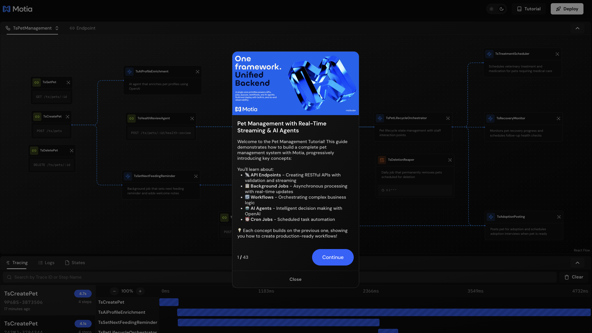
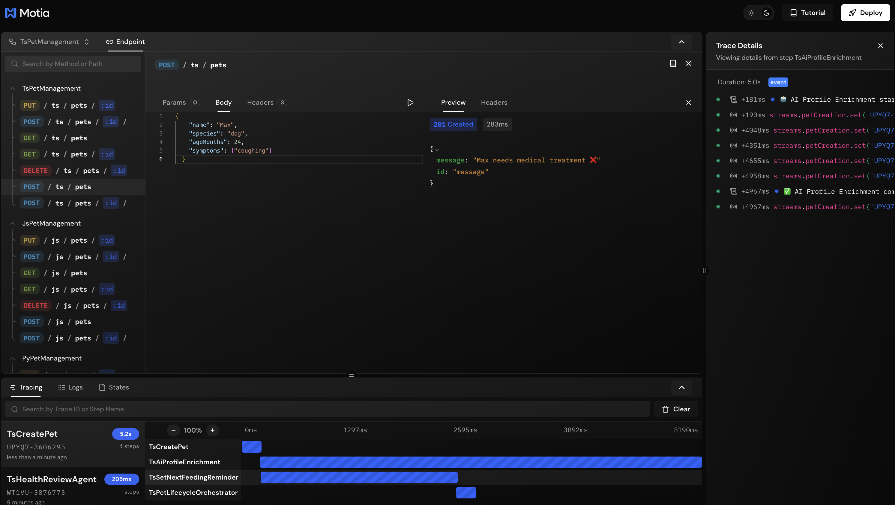

## What You'll Build

A pet management system with real-time streaming that provides live updates to clients:

- **Stream Configuration** - Define stream schemas for type-safe updates
- **API with Streaming** - APIs that initialize streams and return immediately
- **Background Job Streaming** - Jobs that push real-time progress updates
- **Agentic Step Streaming** - AI enrichment with live progress updates
- **Multi-Step Streaming** - Multiple steps updating the same stream


---

## Getting Started

Clone the example repository:

```bash
git clone https://github.com/MotiaDev/build-your-first-app.git
cd build-your-first-app
git checkout stream-ai-agents
```

Install dependencies:

```bash
npm install
```

Set up your OpenAI API key in `.env`:

```bash
OPENAI_API_KEY=your_api_key_here
```

Start the Workbench:

```bash
npm run dev
```

Your Workbench will be available at `http://localhost:3000`.

---

## Project Structure

<Folder name="my-pet-api" defaultOpen>
  <Folder name="steps" defaultOpen>
    <Folder name="typescript">
      <File name="create-pet.step.ts" />
      <File name="pet-creation.stream.ts" />
      <File name="set-next-feeding-reminder.job.step.ts" />
      <File name="ai-profile-enrichment.step.ts" />
      <File name="health-review-agent.step.ts" />
      <File name="pet-lifecycle-orchestrator.step.ts" />
      <File name="ts-store.ts" />
    </Folder>
    <Folder name="javascript">
      <File name="create-pet.step.js" />
      <File name="pet-creation.stream.js" />
      <File name="set-next-feeding-reminder.job.step.js" />
      <File name="ai-profile-enrichment.step.js" />
      <File name="health-review-agent.step.js" />
      <File name="pet-lifecycle-orchestrator.step.js" />
      <File name="js-store.js" />
    </Folder>
    <Folder name="python">
      <File name="create_pet_step.py" />
      <File name="pet_creation.stream.py" />
      <File name="set_next_feeding_reminder.job_step.py" />
      <File name="ai_profile_enrichment_step.py" />
      <File name="health_review_agent_step.py" />
      <File name="pet_lifecycle_orchestrator_step.py" />
    </Folder>
  </Folder>
  <Folder name="services">
    <File name="pet_store.py" />
    <File name="types.py" />
  </Folder>
  <File name=".env" />
  <File name="package.json" />
  <File name="requirements.txt" />
  <File name="types.d.ts" />
</Folder>

<Callout type="info">
Files like `features.json` and `tutorial.tsx` are only for the interactive tutorial and are not part of Motia's project structure.
</Callout>

All code examples in this guide are available in the [build-your-first-app](https://github.com/MotiaDev/build-your-first-app/tree/main) repository.

You can follow this guide to learn how to build real-time streaming with Motia step by step, or you can clone the repository and dive into our Interactive Tutorial to learn by doing directly in the Workbench.



---

## Understanding Real-Time Streaming

You've built APIs that return immediately, background jobs that process asynchronously, workflows that orchestrate complex logic, and agentic workflows that make intelligent decisions. But how do you give users real-time feedback while all this async processing happens in the background?

That's where **streaming** comes in. Motia provides streams as part of the context in any step handler - you can use them anywhere in your code. Streams use Server-Sent Events (SSE) to push live updates directly to clients as your workflow progresses.

In our pet shelter example:
- The API initializes a stream and returns immediately with a stream ID
- Background jobs push updates as they process (quarantine entry, health checks)
- Agentic steps stream enrichment progress (bio generation, breed analysis)
- Clients get live feedback throughout the entire workflow

The power is in the simplicity - `streams` is available in your handler's context, just like `emit`, `logger`, and `state`. Any step can update any stream, creating a unified real-time experience without complex orchestration.

---

## Creating Your First Stream

### Step 1: Define the Stream Configuration

First, define a stream configuration file. This makes the stream available in the `context.streams` object for all your step handlers.

<Callout type="info">
View on GitHub:
- [TypeScript](https://github.com/MotiaDev/build-your-first-app/blob/main/steps/typescript/pet-creation.stream.ts)
- [Python](https://github.com/MotiaDev/build-your-first-app/blob/main/steps/python/pet_creation.stream.py)
- [JavaScript](https://github.com/MotiaDev/build-your-first-app/blob/main/steps/javascript/pet-creation.stream.js)
</Callout>

<Tabs items={['TypeScript', 'Python', 'JavaScript']}>
  <Tab value="TypeScript">
    ```typescript title="steps/typescript/pet-creation.stream.ts"
    import { StreamConfig } from 'motia'
    import { z } from 'zod'

    export const config: StreamConfig = {
      /**
       * This will be available as context.streams.petCreation in the FlowContext
       */
      name: 'petCreation',
      
      /**
       * Schema defines the structure of stream updates
       */
      schema: z.object({ 
        message: z.string()
      }),

      /**
       * Use default storage for the stream
       */
      baseConfig: {
        storageType: 'default',
      },
    }
    ```
  </Tab>
  <Tab value="Python">
    ```python title="steps/python/pet_creation.stream.py"
    config = {
        "name": "petCreation",
        "schema": {
            "type": "object",
            "properties": {
                "message": {"type": "string"}
            },
            "required": ["message"]
        },
        "baseConfig": {
            "storageType": "default"
        }
    }
    ```
  </Tab>
  <Tab value="JavaScript">
    ```javascript title="steps/javascript/pet-creation.stream.js"
    const { z } = require('zod')

    const config = {
      name: 'petCreation',
      
      schema: z.object({ 
        message: z.string()
      }),

      baseConfig: {
        storageType: 'default',
      },
    }

    module.exports = { config }
    ```
  </Tab>
</Tabs>

### How Stream Configuration Works

Stream configuration is simple:

- **name** - Identifier for accessing the stream (e.g., `context.streams.petCreation`)
- **schema** - Zod schema defining what data can be pushed to the stream
- **baseConfig** - Storage settings (default uses in-memory storage)

Once you create this configuration file, the stream is automatically available as `streams.petCreation` in the context of any step handler. It's just like `emit`, `logger`, or `state` - part of the tools available in your handler.

---

## Step 2: Initialize Streams from APIs

Now let's update the pet creation API to initialize a stream and return it immediately to the client.

<Callout type="info">
View on GitHub:
- [TypeScript](https://github.com/MotiaDev/build-your-first-app/blob/main/steps/typescript/create-pet.step.ts)
- [Python](https://github.com/MotiaDev/build-your-first-app/blob/main/steps/python/create_pet_step.py)
- [JavaScript](https://github.com/MotiaDev/build-your-first-app/blob/main/steps/javascript/create-pet.step.js)
</Callout>

<Tabs items={['TypeScript', 'Python', 'JavaScript']}>
  <Tab value="TypeScript">
    ```typescript title="steps/typescript/create-pet.step.ts"
    // steps/typescript/create-pet.step.ts
    import { ApiRouteConfig, Handlers } from 'motia';
    import { z } from 'zod';
    import { TSStore } from './ts-store';

    const createPetSchema = z.object({
      name: z.string().min(1, 'Name is required').trim(),
      species: z.enum(['dog', 'cat', 'bird', 'other']),
      ageMonths: z.number().int().min(0, 'Age must be a positive number'),
      weightKg: z.number().positive().optional(),
      symptoms: z.array(z.string()).optional()
    });

    export const config: ApiRouteConfig = {
      type: 'api',
      name: 'TsCreatePet',
      path: '/ts/pets',
      method: 'POST',
      emits: ['ts.pet.created', 'ts.feeding.reminder.enqueued'],
      flows: ['TsPetManagement']
    };

    export const handler: Handlers['TsCreatePet'] = async (req, { emit, logger, streams, traceId }) => {
      try {
        const validatedData = createPetSchema.parse(req.body);

        const pet = TSStore.create({
          name: validatedData.name,
          species: validatedData.species,
          ageMonths: validatedData.ageMonths,
          weightKg: validatedData.weightKg,
          symptoms: validatedData.symptoms
        });

        if (logger) {
          logger.info('🐾 Pet created', { petId: pet.id, name: pet.name, species: pet.species, status: pet.status });
        }

        // Create & return the initial stream record (following working pattern)
        const result = await streams.petCreation.set(traceId, 'message', { 
          message: `Pet ${pet.name} (ID: ${pet.id}) created successfully - Species: ${pet.species}, Age: ${pet.ageMonths} months, Status: ${pet.status}` 
        });

        if (emit) {
          await emit({
            topic: 'ts.pet.created',
            data: { petId: pet.id, event: 'pet.created', name: pet.name, species: validatedData.species, traceId }
          } as any);

          await emit({
            topic: 'ts.feeding.reminder.enqueued',
            data: { petId: pet.id, enqueuedAt: Date.now(), traceId }
          } as any);
        }

        return { 
          status: 201, 
          body: result 
        };

      } catch (error) {
        if (error instanceof z.ZodError) {
          return {
            status: 400,
            body: {
              message: 'Validation error',
              errors: error.errors
            }
          };
        }

        return {
          status: 500,
          body: { message: 'Internal server error' }
        };
      }
    };
    ```
  </Tab>
  <Tab value="Python">
    ```python title="steps/python/create_pet_step.py"
    import asyncio

    config = {
        "type": "api",
        "name": "PyCreatePet",
        "path": "/py/pets",
        "method": "POST",
        "emits": ["py.pet.created", "py.feeding.reminder.enqueued"],
        "flows": ["PyPetManagement"]
    }

    async def handler(req, ctx=None):
        logger = getattr(ctx, 'logger', None) if ctx else None
        emit = getattr(ctx, 'emit', None) if ctx else None
        streams = getattr(ctx, 'streams', None) if ctx else None
        trace_id = getattr(ctx, 'traceId', None) if ctx else None
        
        try:
            import sys
            import os
            import time
            sys.path.append(os.path.join(os.path.dirname(__file__), '..'))
            from services import pet_store
        except ImportError:
            # Fallback for import issues
            return {"status": 500, "body": {"message": "Import error"}}
        
        b = (req.get("body") or {})
        name = b.get("name")
        species = b.get("species")
        age = b.get("ageMonths")
        weight_kg = b.get("weightKg")
        symptoms = b.get("symptoms")
        
        if not isinstance(name, str) or not name.strip():
            return {"status": 400, "body": {"message": "Invalid name"}}
        if species not in ["dog","cat","bird","other"]:
            return {"status": 400, "body": {"message": "Invalid species"}}
        try:
            age_val = int(age)
        except Exception:
            return {"status": 400, "body": {"message": "Invalid ageMonths"}}
        
        # Create the pet
        pet = pet_store.create(name, species, age_val, weight_kg=weight_kg, symptoms=symptoms)
        
        if logger:
            logger.info('🐾 Pet created', {
                'petId': pet['id'], 
                'name': pet['name'], 
                'species': pet['species'], 
                'status': pet['status']
            })

        # Create & return the initial stream record (following working pattern)
        result = await streams.petCreation.set(trace_id, 'message', { 
            'message': f"Pet {pet['name']} (ID: {pet['id']}) created successfully - Species: {pet['species']}, Age: {pet['ageMonths']} months, Status: {pet['status']}"
        })
        
        if emit:
            await emit({
                'topic': 'py.pet.created',
                'data': {'petId': pet['id'], 'event': 'pet.created', 'name': pet['name'], 'species': pet['species'], 'traceId': trace_id}
            })
            
            # Enqueue feeding reminder background job
            await emit({
                'topic': 'py.feeding.reminder.enqueued',
                'data': {'petId': pet['id'], 'enqueuedAt': int(time.time() * 1000), 'traceId': trace_id}
            })
        
        # Return the stream result so it can be tracked in Workbench
        return {
            "status": 201,
            "body": result
        }
    ```
  </Tab>
  <Tab value="JavaScript">
    ```javascript title="steps/javascript/create-pet.step.js"
    const { create } = require('./js-store')

    exports.config = {
      type: 'api',
      name: 'JsCreatePet',
      path: '/js/pets',
      method: 'POST',
      emits: ['js.pet.created', 'js.feeding.reminder.enqueued'],
      flows: ['JsPetManagement']
    }

    exports.handler = async (req, context) => {
      const { emit, logger, streams, traceId } = context || {}
      const b = req.body || {}
      const name = typeof b.name === 'string' && b.name.trim()
      const speciesOk = ['dog','cat','bird','other'].includes(b.species)
      const ageOk = Number.isFinite(b.ageMonths)
      
      if (!name || !speciesOk || !ageOk) {
        return { status: 400, body: { message: 'Invalid payload: {name, species, ageMonths}' } }
      }

      // Create the pet
      const pet = create({ 
        name, 
        species: b.species, 
        ageMonths: Number(b.ageMonths),
        weightKg: typeof b.weightKg === 'number' ? b.weightKg : undefined,
        symptoms: Array.isArray(b.symptoms) ? b.symptoms : undefined
      })
      
      if (logger) {
        logger.info('🐾 Pet created', { petId: pet.id, name: pet.name, species: pet.species, status: pet.status })
      }

      // Create & return the initial stream record (following working pattern)
      const result = await streams.petCreation.set(traceId, 'message', { 
        message: `Pet ${pet.name} (ID: ${pet.id}) created successfully - Species: ${pet.species}, Age: ${pet.ageMonths} months, Status: ${pet.status}` 
      })

      if (emit) {
        await emit({
          topic: 'js.pet.created',
          data: { petId: pet.id, event: 'pet.created', name: pet.name, species: pet.species, traceId }
        })
        
        // Enqueue feeding reminder background job
        await emit({
          topic: 'js.feeding.reminder.enqueued',
          data: { petId: pet.id, enqueuedAt: Date.now(), traceId }
        })
      }

      return { 
        status: 201, 
        body: result 
      }
    }
    ```
  </Tab>
</Tabs>

### How API Stream Initialization Works

The key changes from a regular API:

1. **Access streams from context** - `streams` is available in the FlowContext
2. **Create initial stream message** - `await streams.petCreation.set(traceId, 'message', data)`
3. **Return the stream result** - Contains stream ID and initial message
4. **Background jobs update the same stream** - Using the same traceId

The API returns immediately with a stream ID. Clients can connect to this stream via SSE to receive real-time updates as background jobs process.

---

## Step 3: Stream Updates from Background Jobs

Now let's update the feeding reminder job to push real-time updates to the stream as it processes.

<Callout type="info">
View on GitHub:
- [TypeScript](https://github.com/MotiaDev/build-your-first-app/blob/main/steps/typescript/set-next-feeding-reminder.job.step.ts)
- [Python](https://github.com/MotiaDev/build-your-first-app/blob/main/steps/python/set_next_feeding_reminder.job_step.py)
- [JavaScript](https://github.com/MotiaDev/build-your-first-app/blob/main/steps/javascript/set-next-feeding-reminder.job.step.js)
</Callout>

<Tabs items={['TypeScript', 'Python', 'JavaScript']}>
  <Tab value="TypeScript">
    ```typescript title="steps/typescript/set-next-feeding-reminder.job.step.ts"
    // steps/typescript/set-next-feeding-reminder.job.step.ts
    import { EventConfig, Handlers } from 'motia';
    import { TSStore } from './ts-store';

    export const config = {
      type: 'event',
      name: 'TsSetNextFeedingReminder',
      description: 'Background job that sets next feeding reminder and adds welcome notes',
      subscribes: ['ts.feeding.reminder.enqueued'],
      emits: ['ts.feeding.reminder.completed'],
      flows: ['TsPetManagement']
    };

    export const handler: Handlers['TsSetNextFeedingReminder'] = async (input, { emit, logger, streams, traceId }) => {
      const { petId, enqueuedAt } = input;

      if (logger) {
        logger.info('🔄 Setting next feeding reminder', { petId, enqueuedAt });
      }

      try {
        // Calculate next feeding time (24 hours from now)
        const nextFeedingAt = Date.now() + (24 * 60 * 60 * 1000);
        
        // Fill in non-critical details and change status to in_quarantine
        const updates = {
          notes: 'Welcome to our pet store! We\'ll take great care of this pet.',
          nextFeedingAt: nextFeedingAt,
          status: 'in_quarantine' as const
        };

        const updatedPet = TSStore.update(petId, updates);
        
        if (!updatedPet) {
          if (logger) {
            logger.error('❌ Failed to set feeding reminder - pet not found', { petId });
          }
          return;
        }

        if (logger) {
          logger.info('✅ Next feeding reminder set', { 
            petId, 
            notes: updatedPet.notes?.substring(0, 50) + '...',
            nextFeedingAt: new Date(nextFeedingAt).toISOString()
          });
        }

        // Stream status updates using the simple pattern
        if (streams?.petCreation && traceId) {
          await streams.petCreation.set(traceId, 'message', { 
            message: `Pet ${updatedPet.name} entered quarantine period` 
          });

          // Check symptoms and stream appropriate updates
          if (!updatedPet.symptoms || updatedPet.symptoms.length === 0) {
            await new Promise(resolve => setTimeout(resolve, 1000));
            await streams.petCreation.set(traceId, 'message', { 
              message: `Health check passed for ${updatedPet.name} - no symptoms found` 
            });

            await new Promise(resolve => setTimeout(resolve, 1000));
            await streams.petCreation.set(traceId, 'message', { 
              message: `${updatedPet.name} is healthy and ready for adoption! ✅` 
            });
          } else {
            await new Promise(resolve => setTimeout(resolve, 1000));
            await streams.petCreation.set(traceId, 'message', { 
              message: `Health check failed for ${updatedPet.name} - symptoms detected: ${updatedPet.symptoms.join(', ')}` 
            });

            await new Promise(resolve => setTimeout(resolve, 1000));
            await streams.petCreation.set(traceId, 'message', { 
              message: `${updatedPet.name} needs medical treatment ❌` 
            });
          }
        }

        if (emit) {
          (emit as any)({
            topic: 'ts.feeding.reminder.completed',
            data: { 
              petId, 
              event: 'feeding.reminder.completed',
              completedAt: Date.now(),
              processingTimeMs: Date.now() - enqueuedAt
            }
          });
        }

      } catch (error: any) {
        if (logger) {
          logger.error('❌ Feeding reminder job error', { petId, error: error.message });
        }
      }
    };
    ```
  </Tab>
  <Tab value="Python">
    ```python title="steps/python/set_next_feeding_reminder.job_step.py"
    import asyncio

    config = {
        "type": "event",
        "name": "PySetNextFeedingReminder",
        "description": "Sets the next feeding reminder for a pet and updates its status",
        "subscribes": ["py.feeding.reminder.enqueued"],
        "emits": ["py.feeding.reminder.completed"],
        "flows": ["PyPetManagement"]
    }

    async def handler(input_data, ctx=None):
        logger = getattr(ctx, 'logger', None) if ctx else None
        emit = getattr(ctx, 'emit', None) if ctx else None
        streams = getattr(ctx, 'streams', None) if ctx else None
        trace_id = getattr(ctx, 'traceId', None) if ctx else None
        
        try:
            import sys
            import os
            import time
            sys.path.append(os.path.join(os.path.dirname(__file__), '..'))
            from services import pet_store
        except ImportError:
            if logger:
                logger.error('❌ Failed to set feeding reminder - import error')
            return

        pet_id = input_data.get('petId')
        enqueued_at = input_data.get('enqueuedAt')

        if logger:
            logger.info('🔄 Setting next feeding reminder', {'petId': pet_id, 'enqueuedAt': enqueued_at})

        try:
            # Calculate next feeding time (24 hours from now)
            next_feeding_at = int(time.time() * 1000) + (24 * 60 * 60 * 1000)
            
            # Fill in non-critical details
            updates = {
                'notes': 'Welcome to our pet store! We\'ll take great care of this pet.',
                'nextFeedingAt': next_feeding_at,
                'status': 'in_quarantine'  # Set status to in_quarantine here
            }

            updated_pet = pet_store.update(pet_id, updates)
            
            if not updated_pet:
                if logger:
                    logger.error('❌ Failed to set feeding reminder - pet not found', {'petId': pet_id})
                return

            if logger:
                notes_preview = updated_pet.get('notes', '')[:50] + '...' if updated_pet.get('notes') else ''
                logger.info('✅ Next feeding reminder set', {
                    'petId': pet_id,
                    'notes': notes_preview,
                    'nextFeedingAt': time.strftime('%Y-%m-%dT%H:%M:%S.000Z', time.gmtime(next_feeding_at / 1000))
                })

            # Stream status updates using the simple pattern
            if streams and streams.petCreation and trace_id:
                await streams.petCreation.set(trace_id, 'message', { 
                    'message': f"Pet {updated_pet['name']} entered quarantine period" 
                })

                # Check symptoms and stream appropriate updates
                if not updated_pet.get('symptoms') or len(updated_pet['symptoms']) == 0:
                    await asyncio.sleep(1.0)
                    await streams.petCreation.set(trace_id, 'message', { 
                        'message': f"Health check passed for {updated_pet['name']} - no symptoms found" 
                    })

                    await asyncio.sleep(1.0)
                    await streams.petCreation.set(trace_id, 'message', { 
                        'message': f"{updated_pet['name']} is healthy and ready for adoption! ✅" 
                    })
                else:
                    await asyncio.sleep(1.0)
                    await streams.petCreation.set(trace_id, 'message', { 
                        'message': f"Health check failed for {updated_pet['name']} - symptoms detected: {', '.join(updated_pet['symptoms'])}" 
                    })

                    await asyncio.sleep(1.0)
                    await streams.petCreation.set(trace_id, 'message', { 
                        'message': f"{updated_pet['name']} needs medical treatment ❌" 
                    })

            if emit:
                await emit({
                    'topic': 'py.feeding.reminder.completed',
                    'data': {
                        'petId': pet_id,
                        'event': 'feeding.reminder.completed',
                        'completedAt': int(time.time() * 1000),
                        'processingTimeMs': int(time.time() * 1000) - enqueued_at
                    }
                })

        except Exception as error:
            if logger:
                logger.error('❌ Feeding reminder job error', {'petId': pet_id, 'error': str(error)})
    ```
  </Tab>
  <Tab value="JavaScript">
    ```javascript title="steps/javascript/set-next-feeding-reminder.job.step.js"
    const { update } = require('./js-store')

    exports.config = {
      type: 'event',
      name: 'JsSetNextFeedingReminder',
      description: 'Sets the next feeding reminder for a pet and updates its status',
      subscribes: ['js.feeding.reminder.enqueued'],
      emits: ['js.feeding.reminder.completed'],
      flows: ['JsPetManagement']
    }

    exports.handler = async (input, context) => {
      const { emit, logger, streams, traceId } = context || {}
      const { petId, enqueuedAt } = input

      if (logger) {
        logger.info('🔄 Setting next feeding reminder', { petId, enqueuedAt })
      }

      try {
        // Calculate next feeding time (24 hours from now)
        const nextFeedingAt = Date.now() + (24 * 60 * 60 * 1000)
        
        // Fill in non-critical details
        const updates = {
          notes: 'Welcome to our pet store! We\'ll take great care of this pet.',
          nextFeedingAt: nextFeedingAt,
          status: 'in_quarantine' // Set status to in_quarantine here
        }

        const updatedPet = update(petId, updates)
        
        if (!updatedPet) {
          if (logger) {
            logger.error('❌ Failed to set feeding reminder - pet not found', { petId })
          }
          return
        }

        if (logger) {
          logger.info('✅ Next feeding reminder set', { 
            petId, 
            notes: updatedPet.notes?.substring(0, 50) + '...',
            nextFeedingAt: new Date(nextFeedingAt).toISOString()
          })
        }

        // Stream status updates using the simple pattern
        if (streams?.petCreation && traceId) {
          await streams.petCreation.set(traceId, 'message', { 
            message: `Pet ${updatedPet.name} entered quarantine period` 
          })

          // Check symptoms and stream appropriate updates
          if (!updatedPet.symptoms || updatedPet.symptoms.length === 0) {
            await new Promise(resolve => setTimeout(resolve, 1000))
            await streams.petCreation.set(traceId, 'message', { 
              message: `Health check passed for ${updatedPet.name} - no symptoms found` 
            })

            await new Promise(resolve => setTimeout(resolve, 1000))
            await streams.petCreation.set(traceId, 'message', { 
              message: `${updatedPet.name} is healthy and ready for adoption! ✅` 
            })
          } else {
            await new Promise(resolve => setTimeout(resolve, 1000))
            await streams.petCreation.set(traceId, 'message', { 
              message: `Health check failed for ${updatedPet.name} - symptoms detected: ${updatedPet.symptoms.join(', ')}` 
            })

            await new Promise(resolve => setTimeout(resolve, 1000))
            await streams.petCreation.set(traceId, 'message', { 
              message: `${updatedPet.name} needs medical treatment ❌` 
            })
          }
        }

        if (emit) {
          await emit({
            topic: 'js.feeding.reminder.completed',
            data: { 
              petId, 
              event: 'feeding.reminder.completed',
              completedAt: Date.now(),
              processingTimeMs: Date.now() - enqueuedAt
            }
          })
        }

      } catch (error) {
        if (logger) {
          logger.error('❌ Feeding reminder job error', { petId, error: error.message })
        }
      }
    }
    ```
  </Tab>
</Tabs>

### How Background Job Streaming Works

Background jobs can push multiple updates to a stream:

- **Access the stream** - `streams.petCreation` is available in context
- **Push updates** - `await streams.petCreation.set(traceId, 'message', data)`
- **Use the same traceId** - Links updates to the original API request
- **Send multiple updates** - Each `set()` call sends immediately to connected clients

The background job processes asynchronously, pushing updates at each stage. Clients connected to the stream receive these updates in real-time via SSE.

---

## Step 4: Agentic Step Streaming

Agentic steps can also stream progress updates as they generate content. This provides live feedback during potentially long-running AI operations.

<Callout type="info">
View on GitHub:
- [TypeScript](https://github.com/MotiaDev/build-your-first-app/blob/main/steps/typescript/ai-profile-enrichment.step.ts)
- [Python](https://github.com/MotiaDev/build-your-first-app/blob/main/steps/python/ai_profile_enrichment_step.py)
- [JavaScript](https://github.com/MotiaDev/build-your-first-app/blob/main/steps/javascript/ai-profile-enrichment.step.js)
</Callout>

<Tabs items={['TypeScript', 'Python', 'JavaScript']}>
  <Tab value="TypeScript">
    ```typescript title="steps/typescript/ai-profile-enrichment.step.ts"
    // steps/typescript/ai-profile-enrichment.step.ts
    import { EventConfig, Handlers } from 'motia';
    import { TSStore, PetProfile } from './ts-store';

    export const config = {
      type: 'event',
      name: 'TsAiProfileEnrichment',
      description: 'Agentic step that enriches pet profiles using OpenAI',
      subscribes: ['ts.pet.created'],
      emits: [],
      flows: ['TsPetManagement']
    };

    export const handler: Handlers['TsAiProfileEnrichment'] = async (input, { logger, streams, traceId }) => {
      const { petId, name, species } = input;

      if (logger) {
        logger.info('🤖 AI Profile Enrichment started', { petId, name, species });
      }

      // Stream enrichment started event
      if (streams && traceId) {
        await (streams as any).petCreation.set(traceId, 'enrichment_started', { 
          message: `AI enrichment started for ${name}`
        } as any);
      }

      try {
        const apiKey = process.env.OPENAI_API_KEY;
        if (!apiKey) {
          throw new Error('OPENAI_API_KEY environment variable is not set');
        }

        const prompt = `Generate a pet profile for adoption purposes. Pet details:
- Name: ${name}
- Species: ${species}

Please provide a JSON response with these fields:
- bio: A warm, engaging 2-3 sentence description that would appeal to potential adopters
- breedGuess: Your best guess at the breed or breed mix (be specific but realistic)
- temperamentTags: An array of 3-5 personality traits (e.g., "friendly", "energetic", "calm")
- adopterHints: Practical advice for potential adopters (family type, living situation, care needs)

Keep it positive, realistic, and adoption-focused.`;

        const enrichmentFields = ['bio', 'breedGuess', 'temperamentTags', 'adopterHints'];
        const enrichedProfile: any = {};

        const response = await fetch('https://api.openai.com/v1/chat/completions', {
          method: 'POST',
          headers: {
            'Authorization': `Bearer ${apiKey}`,
            'Content-Type': 'application/json',
          },
          body: JSON.stringify({
            model: 'gpt-3.5-turbo',
            messages: [
              {
                role: 'system',
                content: 'You are a pet adoption specialist who creates compelling, accurate pet profiles. Always respond with valid JSON only.'
              },
              {
                role: 'user',
                content: prompt
              }
            ],
            max_tokens: 500,
            temperature: 0.7,
          }),
        });

        if (!response.ok) {
          throw new Error(`OpenAI API error: ${response.status} ${response.statusText}`);
        }

        const data = await response.json();
        const aiResponse = data.choices[0]?.message?.content;

        if (!aiResponse) {
          throw new Error('No response from OpenAI API');
        }

        let profile: PetProfile;
        try {
          profile = JSON.parse(aiResponse);
        } catch (parseError) {
          profile = {
            bio: `${name} is a wonderful ${species} looking for a loving home. This pet has a unique personality and would make a great companion.`,
            breedGuess: species === 'dog' ? 'Mixed Breed' : species === 'cat' ? 'Domestic Shorthair' : 'Mixed Breed',
            temperamentTags: ['friendly', 'loving', 'loyal'],
            adopterHints: `${name} would do well in a caring home with patience and love.`
          };
          
          if (logger) {
            logger.warn('⚠️ AI response parsing failed, using fallback profile', { petId, parseError: parseError instanceof Error ? parseError.message : String(parseError) });
          }
        }

        const updatedPet = TSStore.updateProfile(petId, profile);
        
        if (!updatedPet) {
          throw new Error(`Pet not found: ${petId}`);
        }

        if (logger) {
          logger.info('✅ AI Profile Enrichment completed', { 
            petId, 
            profile: {
              bio: profile.bio.substring(0, 50) + '...',
              breedGuess: profile.breedGuess,
              temperamentTags: profile.temperamentTags,
              adopterHints: profile.adopterHints.substring(0, 50) + '...'
            }
          });
        }

        // Stream each field as it's processed
        for (const field of enrichmentFields) {
          await new Promise(resolve => setTimeout(resolve, 300));
          
          const value = profile[field as keyof PetProfile];
          
          if (streams && traceId) {
            await (streams as any).petCreation.set(traceId, `progress_${field}`, { 
              message: `Generated ${field} for ${name}`
            } as any);
          }
        }

        // Stream enrichment completed event
        if (streams && traceId) {
          await (streams as any).petCreation.set(traceId, 'completed', { 
            message: `AI enrichment completed for ${name}`
          } as any);
        }

      } catch (error: any) {
        if (logger) {
          logger.error('❌ AI Profile Enrichment failed', { 
            petId, 
            error: error.message 
          });
        }

        const fallbackProfile: PetProfile = {
          bio: `${name} is a lovely ${species} with a unique personality, ready to find their forever home.`,
          breedGuess: species === 'dog' ? 'Mixed Breed' : species === 'cat' ? 'Domestic Shorthair' : 'Mixed Breed',
          temperamentTags: ['friendly', 'adaptable'],
          adopterHints: `${name} is looking for a patient and loving family.`
        };

        TSStore.updateProfile(petId, fallbackProfile);

        // Stream fallback profile completion
        if (streams && traceId) {
          await (streams as any).petCreation.set(traceId, 'completed', { 
            message: `AI enrichment completed with fallback profile for ${name}`
          } as any);
        }
      }
    };
    ```
  </Tab>
  <Tab value="Python">
    ```python title="steps/python/ai_profile_enrichment_step.py"
    # steps/python/ai_profile_enrichment_step.py
    import json
    import os
    import asyncio
    import urllib.request
    import urllib.parse
    import urllib.error
    import time

    config = {
        "type": "event",
        "name": "PyAiProfileEnrichment",
        "description": "AI agent that enriches pet profiles using OpenAI",
        "subscribes": ["py.pet.created"],
        "emits": [],
        "flows": ["PyPetManagement"]
    }

    async def handler(input_data, ctx=None):
        logger = getattr(ctx, 'logger', None) if ctx else None
        emit = getattr(ctx, 'emit', None) if ctx else None
        streams = getattr(ctx, 'streams', None) if ctx else None
        trace_id = getattr(ctx, 'traceId', None) if ctx else None
        
        pet_id = input_data.get('petId')
        name = input_data.get('name')
        species = input_data.get('species')

        if logger:
            logger.info('🤖 AI Profile Enrichment started', {'petId': pet_id, 'name': name, 'species': species})

        # Stream enrichment started event
        if streams and streams.petCreation and trace_id:
            await streams.petCreation.set(trace_id, 'enrichment_started', { 
                'message': f'AI enrichment started for {name}'
            })

        try:
            # Import pet store
            import sys
            import os
            sys.path.append(os.path.join(os.path.dirname(__file__), '..'))
            from services import pet_store

            # Get OpenAI API key from environment
            api_key = os.getenv('OPENAI_API_KEY')
            if not api_key:
                raise Exception('OPENAI_API_KEY environment variable is not set')

            # Create AI prompt for pet profile generation
            prompt = f'''Generate a pet profile for adoption purposes. Pet details:
- Name: {name}
- Species: {species}

Please provide a JSON response with these fields:
- bio: A warm, engaging 2-3 sentence description that would appeal to potential adopters
- breedGuess: Your best guess at the breed or breed mix (be specific but realistic)
- temperamentTags: An array of 3-5 personality traits (e.g., "friendly", "energetic", "calm")
- adopterHints: Practical advice for potential adopters (family type, living situation, care needs)

Keep it positive, realistic, and adoption-focused.'''

            # Call OpenAI API using urllib
            request_data = {
                'model': 'gpt-3.5-turbo',
                'messages': [
                    {
                        'role': 'system',
                        'content': 'You are a pet adoption specialist who creates compelling, accurate pet profiles. Always respond with valid JSON only.'
                    },
                    {
                        'role': 'user',
                        'content': prompt
                    }
                ],
                'max_tokens': 500,
                'temperature': 0.7,
            }
            
            request_json = json.dumps(request_data).encode('utf-8')
            
            request = urllib.request.Request(
                'https://api.openai.com/v1/chat/completions',
                data=request_json,
                headers={
                    'Authorization': f'Bearer {api_key}',
                    'Content-Type': 'application/json',
                }
            )
            
            try:
                with urllib.request.urlopen(request) as response:
                    if response.status != 200:
                        raise Exception(f'OpenAI API error: {response.status} {response.reason}')
                    
                    response_data = response.read().decode('utf-8')
                    data = json.loads(response_data)
                    ai_response = data.get('choices', [{}])[0].get('message', {}).get('content')

                    if not ai_response:
                        raise Exception('No response from OpenAI API')
            except urllib.error.HTTPError as e:
                raise Exception(f'OpenAI API HTTP error: {e.code} {e.reason}')
            except urllib.error.URLError as e:
                raise Exception(f'OpenAI API URL error: {e.reason}')

            # Parse AI response
            try:
                profile = json.loads(ai_response)
            except json.JSONDecodeError as parse_error:
                # Fallback profile if AI response is not valid JSON
                profile = {
                    'bio': f'{name} is a wonderful {species} looking for a loving home. This pet has a unique personality and would make a great companion.',
                    'breedGuess': 'Mixed Breed' if species == 'dog' else 'Domestic Shorthair' if species == 'cat' else 'Mixed Breed',
                    'temperamentTags': ['friendly', 'loving', 'loyal'],
                    'adopterHints': f'{name} would do well in a caring home with patience and love.'
                }
                
                if logger:
                    logger.warn('⚠️ AI response parsing failed, using fallback profile', {'petId': pet_id, 'parseError': str(parse_error)})

            # Update pet with AI-generated profile
            updated_pet = pet_store.update_profile(pet_id, profile)
            
            if not updated_pet:
                raise Exception(f'Pet not found: {pet_id}')

            if logger:
                logger.info('✅ AI Profile Enrichment completed', {
                    'petId': pet_id,
                    'profile': {
                        'bio': profile['bio'][:50] + '...',
                        'breedGuess': profile['breedGuess'],
                        'temperamentTags': profile['temperamentTags'],
                        'adopterHints': profile['adopterHints'][:50] + '...'
                    }
                })

            # Stream each field as it's processed
            enrichment_fields = ['bio', 'breedGuess', 'temperamentTags', 'adopterHints']
            for field in enrichment_fields:
                await asyncio.sleep(0.3)
                
                value = profile.get(field)
                
                if streams and streams.petCreation and trace_id:
                    await streams.petCreation.set(trace_id, f'progress_{field}', { 
                        'message': f'Generated {field} for {name}'
                    })

            # Stream enrichment completed event
            if streams and streams.petCreation and trace_id:
                await streams.petCreation.set(trace_id, 'completed', { 
                    'message': f'AI enrichment completed for {name}'
                })

        except Exception as error:
            if logger:
                logger.error('❌ AI Profile Enrichment failed', {
                    'petId': pet_id,
                    'error': str(error)
                })

            # Create fallback profile on error
            fallback_profile = {
                'bio': f'{name} is a lovely {species} with a unique personality, ready to find their forever home.',
                'breedGuess': 'Mixed Breed' if species == 'dog' else 'Domestic Shorthair' if species == 'cat' else 'Mixed Breed',
                'temperamentTags': ['friendly', 'adaptable'],
                'adopterHints': f'{name} is looking for a patient and loving family.'
            }

            # Still update with fallback profile
            try:
                import sys
                import os
                sys.path.append(os.path.join(os.path.dirname(__file__), '..'))
                from services import pet_store
                pet_store.update_profile(pet_id, fallback_profile)
            except:
                pass

            # Stream fallback profile completion
            if streams and streams.petCreation and trace_id:
                await streams.petCreation.set(trace_id, 'completed', { 
                    'message': f'AI enrichment completed with fallback profile for {name}'
                })
    ```
  </Tab>
  <Tab value="JavaScript">
    ```javascript title="steps/javascript/ai-profile-enrichment.step.js"
    // steps/javascript/ai-profile-enrichment.step.js
    const { updateProfile } = require('./js-store');

    exports.config = {
      type: 'event',
      name: 'JsAiProfileEnrichment',
      description: 'AI agent that enriches pet profiles using OpenAI',
      subscribes: ['js.pet.created'],
      emits: [],
      flows: ['JsPetManagement']
    };

    exports.handler = async (input, context) => {
      const { logger, streams, traceId } = context || {};
      const { petId, name, species } = input;

      if (logger) {
        logger.info('🤖 AI Profile Enrichment started', { petId, name, species });
      }

      // Stream enrichment started event
      if (streams && traceId) {
        await streams.petCreation.set(traceId, 'enrichment_started', { 
          message: `AI enrichment started for ${name}`
        });
      }

      try {
        const apiKey = process.env.OPENAI_API_KEY;
        if (!apiKey) {
          throw new Error('OPENAI_API_KEY environment variable is not set');
        }

        const prompt = `Generate a pet profile for adoption purposes. Pet details:
- Name: ${name}
- Species: ${species}

Please provide a JSON response with these fields:
- bio: A warm, engaging 2-3 sentence description that would appeal to potential adopters
- breedGuess: Your best guess at the breed or breed mix (be specific but realistic)
- temperamentTags: An array of 3-5 personality traits (e.g., "friendly", "energetic", "calm")
- adopterHints: Practical advice for potential adopters (family type, living situation, care needs)

Keep it positive, realistic, and adoption-focused.`;

        const response = await fetch('https://api.openai.com/v1/chat/completions', {
          method: 'POST',
          headers: {
            'Authorization': `Bearer ${apiKey}`,
            'Content-Type': 'application/json',
          },
          body: JSON.stringify({
            model: 'gpt-3.5-turbo',
            messages: [
              {
                role: 'system',
                content: 'You are a pet adoption specialist who creates compelling, accurate pet profiles. Always respond with valid JSON only.'
              },
              {
                role: 'user',
                content: prompt
              }
            ],
            max_tokens: 500,
            temperature: 0.7,
          }),
        });

        if (!response.ok) {
          throw new Error(`OpenAI API error: ${response.status} ${response.statusText}`);
        }

        const data = await response.json();
        const aiResponse = data.choices[0]?.message?.content;

        if (!aiResponse) {
          throw new Error('No response from OpenAI API');
        }

        let profile;
        try {
          profile = JSON.parse(aiResponse);
        } catch (parseError) {
          profile = {
            bio: `${name} is a wonderful ${species} looking for a loving home. This pet has a unique personality and would make a great companion.`,
            breedGuess: species === 'dog' ? 'Mixed Breed' : species === 'cat' ? 'Domestic Shorthair' : 'Mixed Breed',
            temperamentTags: ['friendly', 'loving', 'loyal'],
            adopterHints: `${name} would do well in a caring home with patience and love.`
          };
          
          if (logger) {
            logger.warn('⚠️ AI response parsing failed, using fallback profile', { petId, parseError: parseError.message });
          }
        }

        const updatedPet = updateProfile(petId, profile);
        
        if (!updatedPet) {
          throw new Error(`Pet not found: ${petId}`);
        }

        if (logger) {
          logger.info('✅ AI Profile Enrichment completed', { 
            petId, 
            profile: {
              bio: profile.bio.substring(0, 50) + '...',
              breedGuess: profile.breedGuess,
              temperamentTags: profile.temperamentTags,
              adopterHints: profile.adopterHints.substring(0, 50) + '...'
            }
          });
        }

        // Stream each field as it's processed
        const enrichmentFields = ['bio', 'breedGuess', 'temperamentTags', 'adopterHints'];
        for (const field of enrichmentFields) {
          await new Promise(resolve => setTimeout(resolve, 300));
          
          const value = profile[field];
          
          if (streams && traceId) {
            await streams.petCreation.set(traceId, `progress_${field}`, { 
              message: `Generated ${field} for ${name}`
            });
          }
        }

        // Stream enrichment completed event
        if (streams && traceId) {
          await streams.petCreation.set(traceId, 'completed', { 
            message: `AI enrichment completed for ${name}`
          });
        }

      } catch (error) {
        if (logger) {
          logger.error('❌ AI Profile Enrichment failed', { 
            petId, 
            error: error.message 
          });
        }

        const fallbackProfile = {
          bio: `${name} is a lovely ${species} with a unique personality, ready to find their forever home.`,
          breedGuess: species === 'dog' ? 'Mixed Breed' : species === 'cat' ? 'Domestic Shorthair' : 'Mixed Breed',
          temperamentTags: ['friendly', 'adaptable'],
          adopterHints: `${name} is looking for a patient and loving family.`
        };

        updateProfile(petId, fallbackProfile);

        // Stream fallback profile completion
        if (streams && traceId) {
          await streams.petCreation.set(traceId, 'completed', { 
            message: `AI enrichment completed with fallback profile for ${name}`
          });
        }
      }
    };
    ```
  </Tab>
</Tabs>

### How Agentic Step Streaming Works

Agentic steps stream progress as they work:

1. **Stream start notification** - Let users know AI processing has begun
2. **Progress updates** - Stream each stage of generation (bio, breed, temperament, etc.)
3. **Stream completion** - Notify when AI processing is done
4. **Error streaming** - Stream errors gracefully with fallback messages

This transforms a potentially slow AI operation into an engaging real-time experience.

---

## Testing Streaming in Action

The best way to test streams is through **Workbench**.

### Test 1: Create a Pet with Streaming

Open Workbench and navigate to the Endpoints section, then test the Pet Creation endpoint:

<Callout type="tip">
**Prefer using curl?**

```bash
curl -X POST http://localhost:3000/ts/pets \
  -H "Content-Type: application/json" \
  -d '{
    "name": "Max",
    "species": "dog",
    "ageMonths": 24,
    "symptoms": ["coughing"]
  }'
```
</Callout>

You'll get an immediate response with the stream result. The API returns right away while background jobs process asynchronously.

### Test 2: Monitor Stream Updates in Workbench

After creating a pet, check the Tracing view in Workbench:

1. Automatically switched to the **Tracing** tab so you can see the stream updates in real-time
2. Click on the most recent trace
3. Watch the timeline as steps execute
4. See stream updates appear in real-time in the timeline



You'll observe:
- Pet creation completes immediately
- Feeding reminder job streams quarantine updates
- AI enrichment streams progress updates
- All updates visible in the trace timeline

### Test 3: Create Pet with Symptoms

Test the conditional streaming logic by creating a pet with symptoms:

```bash
curl -X POST http://localhost:3000/ts/pets \
  -H "Content-Type: application/json" \
  -d '{
    "name": "Luna",
    "species": "cat",
    "ageMonths": 18,
    "symptoms": ["sneezing", "watery eyes"]
  }'
```

Watch the logs to see different stream messages based on the symptoms detected.

### Test 4: Create Pet Without Symptoms

Compare the streaming behavior with a healthy pet:

```bash
curl -X POST http://localhost:3000/ts/pets \
  -H "Content-Type: application/json" \
  -d '{
    "name": "Buddy",
    "species": "dog",
    "ageMonths": 12
  }'
```

The stream will show health check passed messages instead of treatment needed messages.

### Observing Stream Updates

Watch the Workbench console logs to see the real-time stream updates as they're pushed:

```
🐾 Pet created { petId: '1', name: 'Max', species: 'dog', status: 'new' }
📋 Setting next feeding reminder { petId: '1' }
🤖 AI Profile Enrichment started { petId: '1', name: 'Max' }
✅ Next feeding reminder set { petId: '1' }
✅ AI Profile Enrichment completed { petId: '1' }
```

Each emoji-prefixed log corresponds to a stream update being pushed to connected clients.

---

🎉 **Congratulations!** You've built a complete real-time streaming system with Motia. Your pet management system now provides live feedback to users while complex workflows execute in the background.

---

## What's Next?

You've now mastered the complete Motia stack:

- **API Endpoints** - Build RESTful APIs with validation
- **Background Jobs** - Process async tasks efficiently  
- **Workflows** - Orchestrate complex business logic
- **Agentic Workflows** - Make intelligent decisions with AI
- **Real-Time Streaming** - Provide live updates using streams in any step handler

This is the **complete progression** from simple APIs to intelligent, real-time systems!

**Key Takeaway:** Streams are just another tool in your step handler's context - use them wherever you need real-time updates!

Here are some ideas to extend your streaming implementation:

- **Add stream analytics** - Track how many clients are connected, message delivery rates
- **Implement stream persistence** - Use Redis adapter for stream storage across restarts
- **Create stream multiplexing** - Multiple streams per workflow for different update types
- **Build progress bars** - Use structured progress data (0-100%) instead of just messages
- **Add stream authentication** - Ensure only authorized clients can access streams

Explore more examples in the [Motia Examples Repository](https://github.com/MotiaDev/motia-examples).

