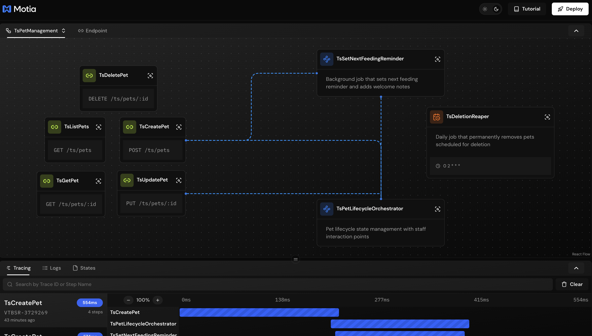
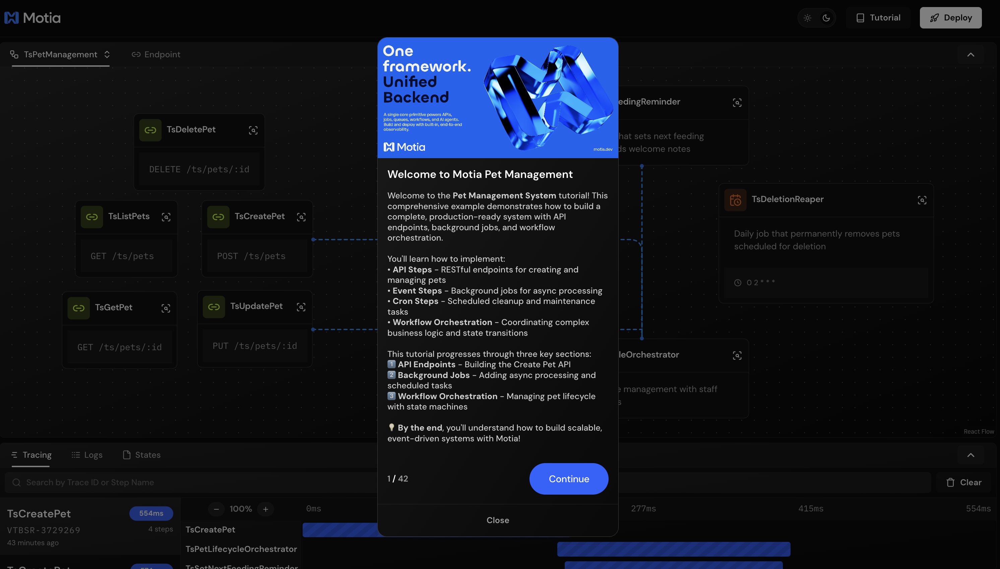
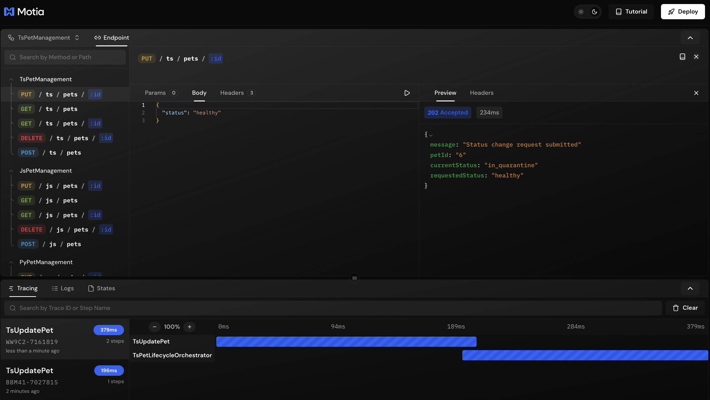
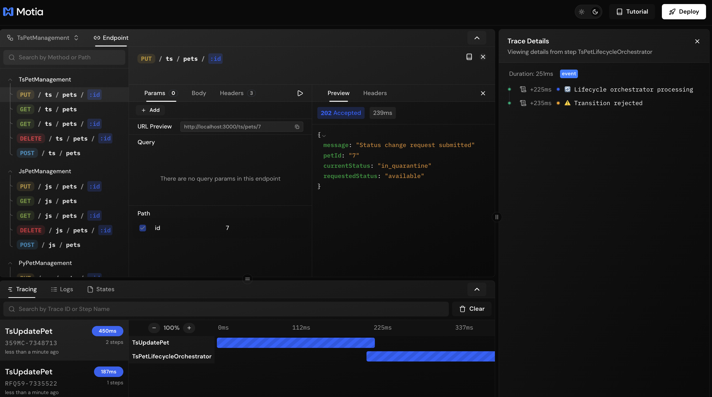
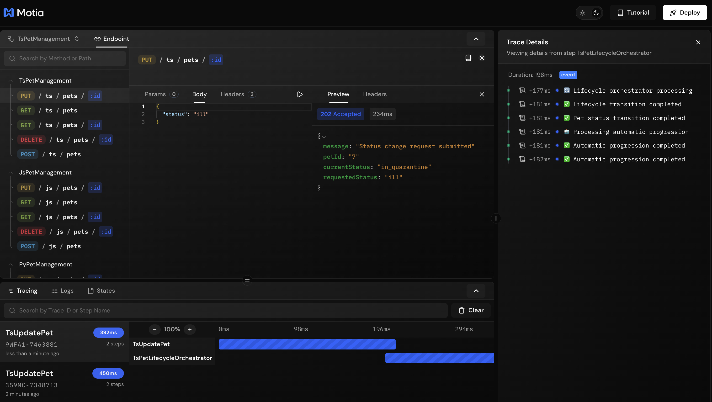
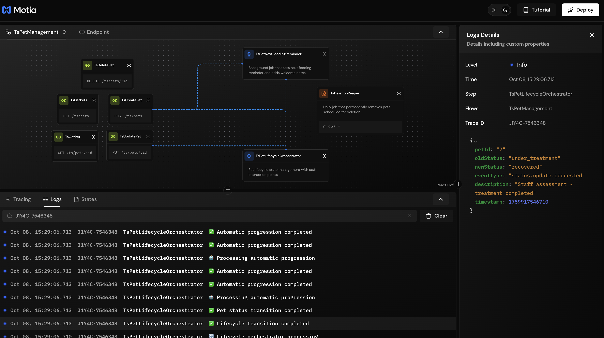

## What You'll Build

A pet lifecycle management system that automatically guides pets through their journey at your shelter:

- **Automated Status Transitions** - Pets move through stages automatically when conditions are met
- **Staff Decision Points** - Critical checkpoints where staff make the calls
- **Smart Progressions** - Some transitions trigger follow-up actions automatically
- **Validation Rules** - Prevents invalid status changes to keep data consistent


---

## Getting Started

Clone the example repository:

```bash
git clone https://github.com/MotiaDev/build-your-first-app.git
cd build-your-first-app
git checkout workflow-orchestration
```

Install dependencies:

```bash
npm install
```

Start the Workbench:

```bash
npm run dev
```

Your Workbench will be available at `http://localhost:3000`.

---

## Project Structure

<Folder name="my-pet-api" defaultOpen>
  <Folder name="steps" defaultOpen>
    <Folder name="typescript">
      <File name="create-pet.step.ts" />
      <File name="set-next-feeding-reminder.job.step.ts" />
      <File name="pet-lifecycle-orchestrator.step.ts" />
      <File name="ts-store.ts" />
    </Folder>
    <Folder name="javascript">
      <File name="create-pet.step.js" />
      <File name="set-next-feeding-reminder.job.step.js" />
      <File name="pet-lifecycle-orchestrator.step.js" />
      <File name="js-store.js" />
    </Folder>
    <Folder name="python">
      <File name="create_pet_step.py" />
      <File name="set_next_feeding_reminder.job_step.py" />
      <File name="pet_lifecycle_orchestrator_step.py" />
    </Folder>
  </Folder>
  <Folder name="services">
    <File name="pet_store.py" />
    <File name="types.py" />
  </Folder>
  <File name="package.json" />
  <File name="requirements.txt" />
  <File name="types.d.ts" />
</Folder>

<Callout type="info">
Files like `features.json` and `tutorial.tsx` are only for the interactive tutorial and are not part of Motia's project structure.
</Callout>

All code examples in this guide are available in the [build-your-first-app](https://github.com/MotiaDev/build-your-first-app/tree/workflow-orchestration) repository.

You can follow this guide to learn how to build workflow orchestration with Motia step by step, or you can clone the repository and dive into our Interactive Tutorial to learn by doing directly in the Workbench.



---

## Understanding Workflows

So far, you've built API endpoints that respond to requests and background jobs that handle async tasks. But what about coordinating complex business processes that involve multiple steps and decision points?

That's where workflows come in. It's the conductor of your system - making sure things happen in the right order, at the right time, and only when it makes sense.

In our pet shelter example, a pet goes through many stages:
- New arrivals need health checks
- Healthy pets become available for adoption
- Sick pets need treatment before they're ready
- Adoption applications require staff approval

A workflow manages all these transitions, enforcing the rules and keeping everything consistent.

---

## The Pet Lifecycle Journey

When you create a pet, it starts as `new`. Once the feeding reminder job completes, it automatically moves to `in_quarantine`. Staff then checks on it and marks it `healthy`, which automatically progresses to `available`. When someone wants to adopt, it goes `pending`, then finally `adopted`.

The key here is some transitions happen automatically (like `healthy` → `available`), while others need staff approval (like `in_quarantine` → `healthy`).

**What about sick pets?**

If staff finds a pet is `ill`, it automatically moves to `under_treatment`. When staff marks it `recovered`, it chains through automatic transitions: `recovered` → `healthy` → `available`.

This mix of automatic progressions and human decision points is what makes workflows powerful - the system handles the routine stuff while keeping people in control of important calls.

---

## Creating the Workflow

<Callout type="info">
View on GitHub:
- [TypeScript](https://github.com/MotiaDev/build-your-first-app/blob/workflow-orchestration/steps/typescript/pet-lifecycle-orchestrator.step.ts)
- [Python](https://github.com/MotiaDev/build-your-first-app/blob/workflow-orchestration/steps/python/pet_lifecycle_orchestrator_step.py)
- [JavaScript](https://github.com/MotiaDev/build-your-first-app/blob/workflow-orchestration/steps/javascript/pet-lifecycle-orchestrator.step.js)
</Callout>

### Step 1: Define Your Transition Rules

First, map out all the valid transitions in your system. Each rule specifies:
- Which statuses can transition
- Where they transition to
- What event triggers the transition
- A description for logging

<Tabs items={['TypeScript', 'Python', 'JavaScript']}>
  <Tab value="TypeScript">
    ```typescript title="steps/typescript/pet-lifecycle-orchestrator.step.ts"
    type TransitionRule = {
      from: string[];
      to: string;
      event: string;
      description: string;
    };

    const TRANSITION_RULES: TransitionRule[] = [
      {
        from: ["new"],
        to: "in_quarantine",
        event: "feeding.reminder.completed",
        description: "Pet moved to quarantine after feeding setup"
      },
      {
        from: ["in_quarantine"],
        to: "healthy",
        event: "status.update.requested",
        description: "Staff health check - pet cleared from quarantine"
      },
      {
        from: ["healthy"],
        to: "available",
        event: "status.update.requested",
        description: "Staff decision - pet ready for adoption"
      },
      {
        from: ["healthy", "in_quarantine", "available"],
        to: "ill",
        event: "status.update.requested",
        description: "Staff assessment - pet identified as ill"
      },
      {
        from: ["ill"],
        to: "under_treatment",
        event: "status.update.requested",
        description: "Staff decision - treatment started"
      },
      {
        from: ["under_treatment"],
        to: "recovered",
        event: "status.update.requested",
        description: "Staff assessment - treatment completed"
      },
      {
        from: ["recovered"],
        to: "healthy",
        event: "status.update.requested",
        description: "Staff clearance - pet fully recovered"
      },
      {
        from: ["available"],
        to: "pending",
        event: "status.update.requested",
        description: "Adoption application received"
      },
      {
        from: ["pending"],
        to: "adopted",
        event: "status.update.requested",
        description: "Adoption completed"
      },
      {
        from: ["pending"],
        to: "available",
        event: "status.update.requested",
        description: "Adoption application rejected/cancelled"
      }
    ];
    ```
  </Tab>
  <Tab value="Python">
    ```python title="steps/python/pet_lifecycle_orchestrator_step.py"
    TRANSITION_RULES = [
        {
            "from": ["new"],
            "to": "in_quarantine",
            "event": "feeding.reminder.completed",
            "description": "Pet moved to quarantine after feeding setup"
        },
        {
            "from": ["in_quarantine"],
            "to": "healthy",
            "event": "status.update.requested",
            "description": "Staff health check - pet cleared from quarantine"
        },
        {
            "from": ["healthy"],
            "to": "available",
            "event": "status.update.requested",
            "description": "Staff decision - pet ready for adoption"
        },
        {
            "from": ["healthy", "in_quarantine", "available"],
            "to": "ill",
            "event": "status.update.requested",
            "description": "Staff assessment - pet identified as ill"
        },
        {
            "from": ["ill"],
            "to": "under_treatment",
            "event": "status.update.requested",
            "description": "Staff decision - treatment started"
        },
        {
            "from": ["under_treatment"],
            "to": "recovered",
            "event": "status.update.requested",
            "description": "Staff assessment - treatment completed"
        },
        {
            "from": ["recovered"],
            "to": "healthy",
            "event": "status.update.requested",
            "description": "Staff clearance - pet fully recovered"
        },
        {
            "from": ["available"],
            "to": "pending",
            "event": "status.update.requested",
            "description": "Adoption application received"
        },
        {
            "from": ["pending"],
            "to": "adopted",
            "event": "status.update.requested",
            "description": "Adoption completed"
        },
        {
            "from": ["pending"],
            "to": "available",
            "event": "status.update.requested",
            "description": "Adoption application rejected/cancelled"
        }
    ]
    ```
  </Tab>
  <Tab value="JavaScript">
    ```javascript title="steps/javascript/pet-lifecycle-orchestrator.step.js"
    const TRANSITION_RULES = [
      {
        from: ["new"],
        to: "in_quarantine",
        event: "feeding.reminder.completed",
        description: "Pet moved to quarantine after feeding setup"
      },
      {
        from: ["in_quarantine"],
        to: "healthy",
        event: "status.update.requested",
        description: "Staff health check - pet cleared from quarantine"
      },
      {
        from: ["healthy"],
        to: "available",
        event: "status.update.requested",
        description: "Staff decision - pet ready for adoption"
      },
      {
        from: ["healthy", "in_quarantine", "available"],
        to: "ill",
        event: "status.update.requested",
        description: "Staff assessment - pet identified as ill"
      },
      {
        from: ["ill"],
        to: "under_treatment",
        event: "status.update.requested",
        description: "Staff decision - treatment started"
      },
      {
        from: ["under_treatment"],
        to: "recovered",
        event: "status.update.requested",
        description: "Staff assessment - treatment completed"
      },
      {
        from: ["recovered"],
        to: "healthy",
        event: "status.update.requested",
        description: "Staff clearance - pet fully recovered"
      },
      {
        from: ["available"],
        to: "pending",
        event: "status.update.requested",
        description: "Adoption application received"
      },
      {
        from: ["pending"],
        to: "adopted",
        event: "status.update.requested",
        description: "Adoption completed"
      },
      {
        from: ["pending"],
        to: "available",
        event: "status.update.requested",
        description: "Adoption application rejected/cancelled"
      }
    ];
    ```
  </Tab>
</Tabs>

### Step 2: Configure the Event Step

The orchestrator is an Event Step that listens for lifecycle events:

<Tabs items={['TypeScript', 'Python', 'JavaScript']}>
  <Tab value="TypeScript">
    ```typescript
    export const config = {
      type: 'event',
      name: 'TsPetLifecycleOrchestrator',
      description: 'Pet lifecycle state management with staff interaction points',
      subscribes: [
        'ts.pet.created',
        'ts.feeding.reminder.completed',
        'ts.pet.status.update.requested'
      ],
      emits: [],
      flows: ['TsPetManagement']
    };
    ```
  </Tab>
  <Tab value="Python">
    ```python
    config = {
        "type": "event",
        "name": "PyPetLifecycleOrchestrator",
        "description": "Pet lifecycle state management with staff interaction points",
        "subscribes": [
            "py.pet.created",
            "py.feeding.reminder.completed",
            "py.pet.status.update.requested"
        ],
        "emits": [],
        "flows": ["PyPetManagement"]
    }
    ```
  </Tab>
  <Tab value="JavaScript">
    ```javascript
    const config = {
      type: 'event',
      name: 'JsPetLifecycleOrchestrator',
      description: 'Pet lifecycle state management with staff interaction points',
      subscribes: [
        'js.pet.created',
        'js.feeding.reminder.completed',
        'js.pet.status.update.requested'
      ],
      emits: [],
      flows: ['JsPetManagement']
    };
    ```
  </Tab>
</Tabs>

### Step 3: Implement the Orchestration Logic

Now for the handler that processes transitions:

<Tabs items={['TypeScript', 'Python', 'JavaScript']}>
  <Tab value="TypeScript">
    ```typescript
    export const handler = async (input: any, context?: any) => {
      const { emit, logger } = context || {};
      const { petId, event: eventType, requestedStatus, automatic } = input;

      if (logger) {
        const logMessage = automatic 
          ? '🤖 Automatic progression' 
          : '🔄 Lifecycle orchestrator processing';
        logger.info(logMessage, { petId, eventType, requestedStatus, automatic });
      }

      try {
        // Get the pet from the store
        const pet = TSStore.get(petId);
        if (!pet) {
          if (logger) {
            logger.error('❌ Pet not found for lifecycle transition', { petId, eventType });
          }
          return;
        }

        // Find the right transition rule
        let rule;
        if (eventType === 'status.update.requested' && requestedStatus) {
          rule = TRANSITION_RULES.find(r => 
            r.event === eventType && 
            r.from.includes(pet.status) && 
            r.to === requestedStatus
          );
        } else {
          rule = TRANSITION_RULES.find(r => 
            r.event === eventType && r.from.includes(pet.status)
          );
        }

        // Reject if no valid rule found
        if (!rule) {
          const reason = eventType === 'status.update.requested' 
            ? `Invalid transition: cannot change from ${pet.status} to ${requestedStatus}`
            : `No transition rule found for ${eventType} from ${pet.status}`;
            
          if (logger) {
            logger.warn('⚠️ Transition rejected', { 
              petId, 
              currentStatus: pet.status, 
              requestedStatus,
              eventType,
              reason
            });
          }
          return;
        }

        // Check for idempotency (already in target status)
        if (pet.status === rule.to) {
          if (logger) {
            logger.info('✅ Already in target status', { 
              petId, 
              status: pet.status,
              eventType
            });
          }
          return;
        }

        // Apply the transition
        const oldStatus = pet.status;
        const updatedPet = TSStore.updateStatus(petId, rule.to);
        
        if (!updatedPet) {
          if (logger) {
            logger.error('❌ Failed to update pet status', { 
              petId, 
              oldStatus, 
              newStatus: rule.to 
            });
          }
          return;
        }

        if (logger) {
          logger.info('✅ Lifecycle transition completed', {
            petId,
            oldStatus,
            newStatus: rule.to,
            eventType,
            description: rule.description,
            timestamp: Date.now()
          });
        }

        // Check for automatic progressions
        await processAutomaticProgression(petId, rule.to, emit, logger);

      } catch (error: any) {
        if (logger) {
          logger.error('❌ Lifecycle orchestrator error', { 
            petId, 
            eventType, 
            error: error.message 
          });
        }
      }
    };
    ```
  </Tab>
  <Tab value="Python">
    ```python
    async def handler(input_data, ctx=None):
        logger = getattr(ctx, 'logger', None) if ctx else None
        emit = getattr(ctx, 'emit', None) if ctx else None
        
        try:
            import sys
            import os
            import time
            sys.path.append(os.path.join(os.path.dirname(__file__), '..'))
            from services import pet_store
        except ImportError:
            if logger:
                logger.error('❌ Lifecycle orchestrator failed - import error')
            return

        pet_id = input_data.get('petId')
        event_type = input_data.get('event')
        requested_status = input_data.get('requestedStatus')
        automatic = input_data.get('automatic', False)

        if logger:
            log_message = '🤖 Automatic progression' if automatic else '🔄 Lifecycle orchestrator processing'
            logger.info(log_message, {'petId': pet_id, 'eventType': event_type, 'requestedStatus': requested_status, 'automatic': automatic})

        try:
            # Get the pet from the store
            pet = pet_store.get(pet_id)
            if not pet:
                if logger:
                    logger.error('❌ Pet not found for lifecycle transition', {'petId': pet_id, 'eventType': event_type})
                return

            # Find the right transition rule
            rule = None
            if event_type == 'status.update.requested' and requested_status:
                for r in TRANSITION_RULES:
                    if (r['event'] == event_type and 
                        pet['status'] in r['from'] and 
                        r['to'] == requested_status):
                        rule = r
                        break
            else:
                for r in TRANSITION_RULES:
                    if r['event'] == event_type and pet['status'] in r['from']:
                        rule = r
                        break

            # Reject if no valid rule found
            if not rule:
                reason = (f"Invalid transition: cannot change from {pet['status']} to {requested_status}" 
                         if event_type == 'status.update.requested' 
                         else f"No transition rule found for {event_type} from {pet['status']}")
                
                if logger:
                    logger.warn('⚠️ Transition rejected', {
                        'petId': pet_id,
                        'currentStatus': pet['status'],
                        'requestedStatus': requested_status,
                        'eventType': event_type,
                        'reason': reason
                    })
                
                if emit:
                    await emit({
                        'topic': 'py.lifecycle.transition.rejected',
                        'data': {
                            'petId': pet_id,
                            'currentStatus': pet['status'],
                            'requestedStatus': requested_status,
                            'eventType': event_type,
                            'reason': reason,
                            'timestamp': int(time.time() * 1000)
                        }
                    })
                return

            # Check for idempotency
            if pet['status'] == rule['to']:
                if logger:
                    logger.info('✅ Already in target status', {
                        'petId': pet_id,
                        'status': pet['status'],
                        'eventType': event_type
                    })
                return

            # Apply the transition
            old_status = pet['status']
            updated_pet = pet_store.update_status(pet_id, rule['to'])
            
            if not updated_pet:
                if logger:
                    logger.error('❌ Failed to update pet status', {'petId': pet_id, 'oldStatus': old_status, 'newStatus': rule['to']})
                return

            if logger:
                logger.info('✅ Lifecycle transition completed', {
                    'petId': pet_id,
                    'oldStatus': old_status,
                    'newStatus': rule['to'],
                    'eventType': event_type,
                    'description': rule['description'],
                    'timestamp': int(time.time() * 1000)
                })

            if emit:
                await emit({
                    'topic': 'py.lifecycle.transition.completed',
                    'data': {
                        'petId': pet_id,
                        'oldStatus': old_status,
                        'newStatus': rule['to'],
                        'eventType': event_type,
                        'description': rule['description'],
                        'timestamp': int(time.time() * 1000)
                    }
                })

                # Check for automatic progressions after successful transition
                await check_automatic_progressions(pet_id, rule['to'], emit, logger)

        except Exception as error:
            if logger:
                logger.error('❌ Lifecycle orchestrator error', {'petId': pet_id, 'eventType': event_type, 'error': str(error)})
    ```
  </Tab>
  <Tab value="JavaScript">
    ```javascript
    exports.handler = async (input, context) => {
      const { emit, logger } = context || {};
      const { petId, event: eventType, requestedStatus, automatic } = input;

      if (logger) {
        const logMessage = automatic ? '🤖 Automatic progression' : '🔄 Lifecycle orchestrator processing';
        logger.info(logMessage, { petId, eventType, requestedStatus, automatic });
      }

      try {
        const pet = get(petId);
        if (!pet) {
          if (logger) {
            logger.error('❌ Pet not found for lifecycle transition', { petId, eventType });
          }
          return;
        }

        // For status update requests, find the rule based on requested status
        let rule;
        if (eventType === 'status.update.requested' && requestedStatus) {
          rule = TRANSITION_RULES.find(r => 
            r.event === eventType && 
            r.from.includes(pet.status) && 
            r.to === requestedStatus
          );
        } else {
          // For other events (like feeding.reminder.completed)
          rule = TRANSITION_RULES.find(r => 
            r.event === eventType && r.from.includes(pet.status)
          );
        }

        if (!rule) {
          const reason = eventType === 'status.update.requested' 
            ? `Invalid transition: cannot change from ${pet.status} to ${requestedStatus}`
            : `No transition rule found for ${eventType} from ${pet.status}`;
            
          if (logger) {
            logger.warn('⚠️ Transition rejected', { 
              petId, 
              currentStatus: pet.status, 
              requestedStatus,
              eventType,
              reason
            });
          }
          
          if (emit) {
            await emit({
              topic: 'js.lifecycle.transition.rejected',
              data: {
                petId,
                currentStatus: pet.status,
                requestedStatus,
                eventType,
                reason,
                timestamp: Date.now()
              }
            });
          }
          return;
        }

        // Check for idempotency
        if (pet.status === rule.to) {
          if (logger) {
            logger.info('✅ Already in target status', { 
              petId, 
              status: pet.status,
              eventType
            });
          }
          return;
        }

        // Apply the transition
        const oldStatus = pet.status;
        const updatedPet = updateStatus(petId, rule.to);
        
        if (!updatedPet) {
          if (logger) {
            logger.error('❌ Failed to update pet status', { petId, oldStatus, newStatus: rule.to });
          }
          return;
        }

        if (logger) {
          logger.info('✅ Lifecycle transition completed', {
            petId,
            oldStatus,
            newStatus: rule.to,
            eventType,
            description: rule.description,
            timestamp: Date.now()
          });
        }

        if (emit) {
          await emit({
            topic: 'js.lifecycle.transition.completed',
            data: {
              petId,
              oldStatus,
              newStatus: rule.to,
              eventType,
              description: rule.description,
              timestamp: Date.now()
            }
          });

          // Check for automatic progressions after successful transition
          await processAutomaticProgression(petId, rule.to, emit, logger);
        }

      } catch (error) {
        if (logger) {
          logger.error('❌ Lifecycle orchestrator error', { petId, eventType, error: error.message });
        }
      }
    };
    ```
  </Tab>
</Tabs>

### Step 4: Add Automatic Progressions

Some transitions should trigger follow-up actions automatically:

<Tabs items={['TypeScript', 'Python', 'JavaScript']}>
  <Tab value="TypeScript">
    ```typescript
    async function processAutomaticProgression(
      petId: string, 
      currentStatus: string, 
      emit: any, 
      logger: any
    ) {
      // Define which statuses automatically progress
      const automaticProgressions: Record<string, { to: string, description: string }> = {
        'healthy': { 
          to: 'available', 
          description: 'Automatic progression - pet ready for adoption' 
        },
        'ill': { 
          to: 'under_treatment', 
          description: 'Automatic progression - treatment started' 
        },
        'recovered': { 
          to: 'healthy', 
          description: 'Automatic progression - recovery complete' 
        }
      };

      const progression = automaticProgressions[currentStatus];
      if (progression) {
        if (logger) {
          logger.info('🤖 Processing automatic progression', { 
            petId, 
            currentStatus, 
            nextStatus: progression.to 
          });
        }

        // Find the transition rule
        const rule = TRANSITION_RULES.find(r => 
          r.event === 'status.update.requested' && 
          r.from.includes(currentStatus) && 
          r.to === progression.to
        );

        if (rule) {
          // Apply the automatic transition
          const oldStatus = currentStatus;
          const updatedPet = TSStore.updateStatus(petId, rule.to);
          
          if (updatedPet) {
            if (logger) {
              logger.info('✅ Automatic progression completed', {
                petId,
                oldStatus,
                newStatus: rule.to,
                description: progression.description,
                timestamp: Date.now()
              });
            }

            // Check for further automatic progressions (chaining)
            await processAutomaticProgression(petId, rule.to, emit, logger);
          } else if (logger) {
            logger.error('❌ Failed to apply automatic progression', { 
              petId, 
              oldStatus, 
              newStatus: rule.to 
            });
          }
        } else if (logger) {
          logger.warn('⚠️ No transition rule found for automatic progression', { 
            petId, 
            currentStatus, 
            targetStatus: progression.to 
          });
        }
      }
    }
    ```
  </Tab>
  <Tab value="Python">
    ```python title="steps/python/pet_lifecycle_orchestrator_step.py"
    async def check_automatic_progressions(pet_id, current_status, emit, logger):
        # Define automatic progressions
        automatic_progressions = {
            'healthy': {'to': 'available', 'description': 'Automatic progression - pet ready for adoption'},
            'ill': {'to': 'under_treatment', 'description': 'Automatic progression - treatment started'},
            'recovered': {'to': 'healthy', 'description': 'Automatic progression - recovery complete'}
        }

        progression = automatic_progressions.get(current_status)
        if progression:
            if logger:
                logger.info('🤖 Orchestrator triggering automatic progression', {
                    'petId': pet_id,
                    'currentStatus': current_status,
                    'nextStatus': progression['to']
                })

            # Emit automatic progression event with delay
            import asyncio
            async def delayed_emit():
                await asyncio.sleep(1.5)  # Slightly longer delay to ensure current transition completes
                # Get fresh pet status to ensure we have the latest state
                try:
                    import sys
                    import os
                    sys.path.append(os.path.join(os.path.dirname(__file__), '..'))
                    from services import pet_store
                    fresh_pet = pet_store.get(pet_id)
                    if fresh_pet and fresh_pet['status'] == current_status:
                        await emit({
                            'topic': 'py.pet.status.update.requested',
                            'data': {
                                'petId': pet_id,
                                'event': 'status.update.requested',
                                'requestedStatus': progression['to'],
                                'currentStatus': fresh_pet['status'],
                                'automatic': True
                            }
                        })
                    elif logger:
                        logger.warn('⚠️ Automatic progression skipped - pet status changed', {
                            'petId': pet_id,
                            'expectedStatus': current_status,
                            'actualStatus': fresh_pet['status'] if fresh_pet else None
                        })
                except Exception as e:
                    if logger:
                        logger.error('❌ Automatic progression error', {'petId': pet_id, 'error': str(e)})
            
            asyncio.create_task(delayed_emit())
    ```
  </Tab>  <Tab value="JavaScript">
    ```javascript title="steps/javascript/pet-lifecycle-orchestrator.step.js"
    async function processAutomaticProgression(petId, currentStatus, emit, logger) {
      // Define automatic progressions
      const automaticProgressions = {
        'healthy': { to: 'available', description: 'Automatic progression - pet ready for adoption' },
        'ill': { to: 'under_treatment', description: 'Automatic progression - treatment started' },
        'recovered': { to: 'healthy', description: 'Automatic progression - recovery complete' }
      };

      const progression = automaticProgressions[currentStatus];
      if (progression) {
        if (logger) {
          logger.info('🤖 Processing automatic progression', { 
            petId, 
            currentStatus, 
            nextStatus: progression.to 
          });
        }

        // Find the transition rule for automatic progression
        const rule = TRANSITION_RULES.find(r => 
          r.event === 'status.update.requested' && 
          r.from.includes(currentStatus) && 
          r.to === progression.to
        );

        if (rule) {
          // Apply the automatic transition immediately
          const oldStatus = currentStatus;
          const updatedPet = updateStatus(petId, rule.to);
          
          if (updatedPet) {
            if (logger) {
              logger.info('✅ Automatic progression completed', {
                petId,
                oldStatus,
                newStatus: rule.to,
                description: progression.description,
                timestamp: Date.now()
              });
            }

            if (emit) {
              await emit({
                topic: 'js.lifecycle.transition.completed',
                data: {
                  petId,
                  oldStatus,
                  newStatus: rule.to,
                  eventType: 'status.update.requested',
                  description: progression.description,
                  automatic: true,
                  timestamp: Date.now()
                }
              });

              // Check for further automatic progressions (for chaining like recovered → healthy → available)
              await processAutomaticProgression(petId, rule.to, emit, logger);
            }
          } else if (logger) {
            logger.error('❌ Failed to apply automatic progression', { petId, oldStatus, newStatus: rule.to });
          }
        } else if (logger) {
          logger.warn('⚠️ No transition rule found for automatic progression', { 
            petId, 
            currentStatus, 
            targetStatus: progression.to 
          });
        }
      }
    }
    ```
  </Tab>
</Tabs>

---

## Testing Your Orchestrator

The best way to test your orchestrator is through **Workbench**. It lets you send requests, watch the workflow execute in real-time, and see all the logs in one place.

### Create a Pet

Open Workbench and test the CreatePet endpoint:


You'll see in the logs:
```
🐾 Pet created { petId: '1', name: 'Max', species: 'dog', status: 'new' }
🔄 Setting next feeding reminder { petId: '1' }
✅ Next feeding reminder set { petId: '1' }
🔄 Lifecycle orchestrator processing { petId: '1', eventType: 'feeding.reminder.completed' }
✅ Lifecycle transition completed { oldStatus: 'new', newStatus: 'in_quarantine' }
```

<Callout type="tip">
**Prefer using curl?** You can also test with command line:

```bash
curl -X POST http://localhost:3000/ts/pets \
  -H "Content-Type: application/json" \
  -d '{"name": "Max", "species": "dog", "ageMonths": 24}'
```
</Callout>

### Staff Health Check

Test the UpdatePet endpoint in Workbench to mark the pet as healthy:



Watch the automatic progression:
```
👤 Staff requesting status change { petId: '1', requestedStatus: 'healthy' }
🔄 Lifecycle orchestrator processing { petId: '1', eventType: 'status.update.requested' }
✅ Lifecycle transition completed { oldStatus: 'in_quarantine', newStatus: 'healthy' }
🤖 Processing automatic progression { petId: '1', currentStatus: 'healthy', nextStatus: 'available' }
✅ Automatic progression completed { oldStatus: 'healthy', newStatus: 'available' }
```

<Callout type="tip">
**Using curl?**

```bash
curl -X PUT http://localhost:3000/ts/pets/1 \
  -H "Content-Type: application/json" \
  -d '{"status": "healthy"}'
```
</Callout>

### Test Invalid Transitions

Try to skip a step in Workbench:



The orchestrator rejects it:
```
⚠️ Transition rejected { 
  currentStatus: 'in_quarantine', 
  requestedStatus: 'available',
  reason: 'Invalid transition: cannot change from in_quarantine to available'
}
```

<Callout type="tip">
**Using curl?**

```bash
curl -X PUT http://localhost:3000/ts/pets/1 \
  -H "Content-Type: application/json" \
  -d '{"status": "available"}'
```
</Callout>

### Test the Illness Workflow

Mark a pet as ill in Workbench:



Watch the automatic treatment start:
```
✅ Lifecycle transition completed { oldStatus: 'healthy', newStatus: 'ill' }
🤖 Processing automatic progression { currentStatus: 'ill', nextStatus: 'under_treatment' }
✅ Automatic progression completed { oldStatus: 'ill', newStatus: 'under_treatment' }
```

<Callout type="tip">
**Using curl?**

```bash
curl -X PUT http://localhost:3000/ts/pets/1 \
  -H "Content-Type: application/json" \
  -d '{"status": "ill"}'
```
</Callout>

Then mark the pet as recovered in Workbench:


Watch the chained automatic progressions:
```
✅ Lifecycle transition completed { oldStatus: 'under_treatment', newStatus: 'recovered' }
🤖 Processing automatic progression { currentStatus: 'recovered', nextStatus: 'healthy' }
✅ Automatic progression completed { oldStatus: 'recovered', newStatus: 'healthy' }
🤖 Processing automatic progression { currentStatus: 'healthy', nextStatus: 'available' }
✅ Automatic progression completed { oldStatus: 'healthy', newStatus: 'available' }
```

<Callout type="tip">
**Using curl?**

```bash
curl -X PUT http://localhost:3000/ts/pets/1 \
  -H "Content-Type: application/json" \
  -d '{"status": "recovered"}'
```
</Callout>

---

## Monitoring Your Orchestrator

Use the Workbench to visualize the entire flow:

### Tracing

See how events flow through your system:


Each trace shows:
- The initial API call
- Background job processing
- Orchestrator transitions
- Automatic progressions
- Total time for each step

### Logs

Filter by pet ID to see the complete lifecycle:



The logs tell the story of each pet's journey through your shelter.
---

🎉 **Congratulations!** You've built a complete workflow orchestrator that manages complex business logic while keeping your code clean and maintainable.

---

## What's Next?

Your pet shelter now has a complete backend system:
- API endpoints for CRUD operations
- Background jobs for async processing
- Workflow orchestration for complex business logic

Here are some ideas to extend your orchestrator:

- Add more status transitions (like quarantine extensions)
- Implement role-based permissions (only vets can mark pets as healthy)
- Add time-based transitions (auto-move to available after X days)
- Create analytics on transition patterns